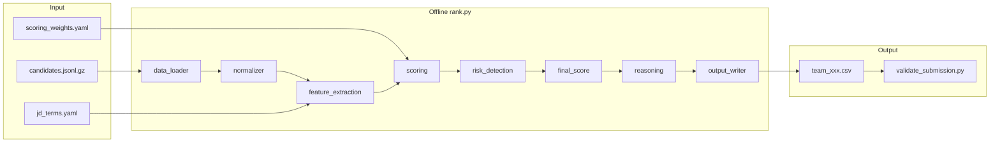

# RedRob Rule-Based Candidate Ranking — Implementation Plan

## Current State

The repo has a **partial vector-encoding pipeline** (`[precompute.py](precompute.py)`, `[pipeline/](pipeline/)`) that will **not** be used for the submission path per your architecture choice. What exists and can be reused:


| Asset                                                        | Reuse                                                      |
| ------------------------------------------------------------ | ---------------------------------------------------------- |
| `[data/candidate_schema.json](data/candidate_schema.json)`   | Schema reference for parser                                |
| `[data/sample_candidates.json](data/sample_candidates.json)` | 50-candidate dev/test set                                  |
| `[validate_submission.py](validate_submission.py)`           | Final CSV gate — keep as-is                                |
| `[pipeline/extraction.py](pipeline/extraction.py)`           | Reference for text field assembly (copy logic into `src/`) |


**Missing for submission:** full dataset (`data/candidates.jsonl.gz`), all `src/` modules, YAML configs, CSV output, reasoning, README, metadata, demo.

---

## Target Architecture




**Design principles (from PO pack):**

- Evidence over keywords: career descriptions weighted higher than skill-list mentions
- Production signals trump buzzwords
- Behavioral signals modulate but never override core engineering fit
- Deterministic, no network, CPU-only, under 5 minutes on 100K rows

---

## Repository Structure (new)

```
RedRob/
├── rank.py                      # CLI entry: load → score → rank → CSV
├── prepare.py                   # Optional: convert sample JSON → JSONL for demo
├── requirements.txt             # Trim to rule-based deps (see below)
├── README.md
├── submission_metadata.yaml
├── config/
│   ├── scoring_weights.yaml     # 45/25/20/10 + risk caps
│   └── jd_terms.yaml            # must-have, nice-to-have, disqualifiers, title maps
├── src/
│   ├── data_loader.py           # JSONL + .gz streaming
│   ├── normalizer.py            # Flat CandidateRecord dataclass
│   ├── feature_extraction.py    # Text + structured features
│   ├── scoring.py               # Sub-score functions
│   ├── risk_detection.py        # Honeypot / keyword-stuff penalties
│   ├── reasoning.py             # Template-based explanations
│   ├── output_writer.py         # CSV writer with tie-break
│   └── utils.py                 # text clean, date parsing, safe getters
├── outputs/
│   └── submission.csv           # Generated artifact (gitignored or committed per choice)
├── demo/
│   └── app.py                   # Streamlit sandbox
└── tests/
    ├── test_loader.py
    ├── test_scoring.py
    └── test_output_format.py
```

Existing `[pipeline/](pipeline/)` and `[precompute.py](precompute.py)` remain in repo but are **not invoked** by `rank.py`. README will document the rule-based path only.

---

## Scoring Model

### Final formula (from PO pack §7.2)

```
final_score = 0.45 * technical + 0.25 * career + 0.20 * behavioral + 0.10 * logistics - risk_penalty
```

All sub-scores normalized to **0–100** before weighting. `risk_penalty` capped at 0–40.

### Technical Fit (45%) — `[src/scoring.py](src/scoring.py)`

Two evidence channels with different weights:

1. **Career evidence (70% of technical):** match `[config/jd_terms.yaml](config/jd_terms.yaml)` high-value terms in `career_history[].description` with production-context multipliers (`deployed`, `production`, `shipped`, `at scale`, `real users`).
2. **Skills evidence (30% of technical):** match JD terms in `skills[].name` with proficiency weight (`expert=1.0`, `advanced=0.8`, etc.) and `duration_months` sanity.

**Term tiers in `jd_terms.yaml`:**

- **Tier A (retrieval/ranking core):** embeddings, vector search, dense retrieval, hybrid retrieval, BM25, FAISS, Pinecone, Qdrant, ranking, recommendation, information retrieval, NDCG, MRR, MAP
- **Tier B (engineering foundation):** Python, PyTorch, sentence-transformers, fine-tuning, LLM reranking, A/B testing
- **Tier C (limited credit):** NLP, search (without retrieval context), computer vision, speech — capped contribution unless paired with Tier A

**Anti-patterns (zero/negative within technical):** skills-only buzzword hits with no career mention; "ChatGPT user", "AI enthusiast", "LangChain tutorial" without production context.

### Career Fit (25%)


| Signal                | Logic                                                                                    |
| --------------------- | ---------------------------------------------------------------------------------------- |
| Years of experience   | Peak at 5–9 (`profile.years_of_experience`); linear decay outside                        |
| Title relevance       | Match current + past titles against engineering title list in config                     |
| Non-technical penalty | Marketing Manager, HR, Sales, Accountant, etc. → heavy penalty                           |
| Product vs consulting | Product/platform company sizes/industries → bonus; pure IT-services consulting → penalty |
| Hands-on evidence     | Career descriptions with build/deploy/own language → bonus                               |


### Behavioral Fit (20%) — from `redrob_signals`

Normalize each signal to 0–1, weighted sum:

- `open_to_work_flag` (+)
- Recency of `last_active_date` (decay after 90 days)
- `recruiter_response_rate` (+), `avg_response_time_hours` (inverse)
- `interview_completion_rate`, `github_activity_score` (if ≥ 0)
- `saved_by_recruiters_30d`, `verified_email` + `verified_phone`

**Cap:** behavioral sub-score cannot boost a candidate with technical < 20 above rank ~200 (prevents "behavioral rescue").

### Logistics Fit (10%)

- `notice_period_days`: shorter is better; 120+ days penalized
- `willing_to_relocate`: bonus for founding-team mobility
- `preferred_work_mode`: hybrid/flexible/remote slight bonus
- `expected_salary_range_inr_lpa`: no penalty unless min > max (handled in risk)

### Risk Penalty — `[src/risk_detection.py](src/risk_detection.py)`


| Flag                              | Detection                                                         | Penalty |
| --------------------------------- | ----------------------------------------------------------------- | ------- |
| Salary inconsistency              | `min > max`                                                       | +15     |
| Keyword stuffing                  | ≥8 Tier-A skill hits, 0 career Tier-A hits, non-engineering title | +20     |
| Title/skill mismatch              | HR/Marketing title + expert ML skills                             | +25     |
| Low completeness + high buzzwords | `profile_completeness_score` < 40 and skill density high          | +10     |
| Unrealistic skill duration        | `duration_months` > `years_of_experience * 12` for expert skills  | +10     |
| Low assessments                   | avg `skill_assessment_scores` < 30 when present                   | +5      |
| Honeypot heuristics               | impossible YoE/title combos, empty career with stuffed skills     | +30     |


Candidates with `risk_penalty >= 35` are still scored but unlikely to reach top 100.

---

## Module Implementation Details

### `[src/data_loader.py](src/data_loader.py)`

- Stream `jsonl` / `jsonl.gz` line-by-line (memory-safe for 100K)
- Yield raw dicts; skip malformed lines with logged warning
- Support `--input` and `--limit` for demo runs

### `[src/normalizer.py](src/normalizer.py)`

- `@dataclass CandidateRecord` with typed fields: profile, career_history, skills, education, redrob_signals, `combined_text`
- Safe defaults for missing optional fields (`certifications`, `languages`)
- Preserve `candidate_id` exactly

### `[src/feature_extraction.py](src/feature_extraction.py)`

- Build `combined_text`: lowercase, headline + summary + titles + career descriptions + skill names + education
- Precompute booleans: `has_production_language`, `is_engineering_title`, `tier_a_career_hits`, `tier_a_skill_hits`, `years_in_range`, etc.
- All regex/keyword matching done once per candidate

### `[src/reasoning.py](src/reasoning.py)`

Template assembly from extracted facts (no LLM, no hallucination):

```python
# Pattern: strength + JD link + optional concern
f"Strong fit: {top_skills} with {years}y experience; career shows {production_phrase}. "
f"{'Open to work, responsive recruiter.' if behavioral_good else 'Limited platform activity.'}"
```

Pick top 2 matched Tier-A terms from career (not skills) for specificity. Include concern clause when risk flags fired.

### `[src/output_writer.py](src/output_writer.py)`

- Write `candidate_id,rank,score,reasoning` header
- Sort by `(-final_score, candidate_id)` for deterministic tie-break (matches validator rule)
- Assign ranks 1–100
- Format scores to consistent precision (e.g. 4 decimal places)

### `[rank.py](rank.py)` CLI

```bash
python rank.py \
  --input data/candidates.jsonl.gz \
  --output outputs/team_xxx.csv \
  --config-dir config/
```

Pipeline: load all → extract features → score → sort → top 100 → reason → write. Target runtime: **< 3 min** on 100K with pure Python (no embeddings).

---

## Config Files

### `[config/jd_terms.yaml](config/jd_terms.yaml)`

```yaml
must_have:
  retrieval: [embeddings, vector search, dense retrieval, ...]
  infra: [faiss, pinecone, qdrant, ...]
  eval: [ndcg, mrr, map, a/b test]
must_have_core: [python]
nice_to_have: [fine-tuning, llm reranking, ...]
disqualifier_titles: [marketing manager, hr manager, ...]
engineering_titles: [ai engineer, ml engineer, search engineer, ...]
production_phrases: [production, deployed, shipped, at scale, real users]
buzzword_only: [chatgpt, ai enthusiast, langchain tutorial]
```

### `[config/scoring_weights.yaml](config/scoring_weights.yaml)`

```yaml
components:
  technical: 0.45
  career: 0.25
  behavioral: 0.20
  logistics: 0.10
risk:
  max_penalty: 40
behavioral_rescue:
  min_technical: 20
```

---

## Sprint Execution (maps to PO pack §6)

### Sprint 1 (MVP — top 100 CSV)

1. `data_loader` + `normalizer` + `feature_extraction`
2. Technical + career scoring (behavioral/logistics stubbed to 0)
3. `rank.py` sort + `output_writer`
4. Run on `[data/sample_candidates.json](data/sample_candidates.json)` (via `prepare.py` → JSONL)
5. Validate format with `[validate_submission.py](validate_submission.py)` (pad to 100 with lower scores if sample < 100 for local test only)

### Sprint 2 (quality + risk)

1. Full behavioral + logistics scorers
2. `risk_detection` engine
3. `reasoning` generator
4. Tune weights against sample profiles (keyword-stuffers should sink, engineers should rise)
5. Run on full `candidates.jsonl.gz` when available

### Sprint 3 (packaging)

1. Full `[README.md](README.md)`: setup, methodology, constraints, reproduce command, validation command
2. `[submission_metadata.yaml](submission_metadata.yaml)`: team name, repo URL, sandbox link, AI tools declaration
3. `[demo/app.py](demo/app.py)`: Streamlit — upload JSONL or use bundled sample, show top-N table, download CSV
4. `[tests/](tests/)`: loader edge cases, score monotonicity, output format
5. Trim `[requirements.txt](requirements.txt)` to: `pyyaml`, `streamlit` (demo only), stdlib otherwise

---

## Data Acquisition

Full dataset is **gitignored** (`[.gitignore](.gitignore)` lines for `data/candidates.jsonl.gz`). Before final run:

1. Download/obtain `candidates.jsonl.gz` from hackathon organizers
2. Place at `data/candidates.jsonl.gz`
3. Verify record count (~100K) with a one-liner count

---

## Validation Checklist


| Check                     | How                                                    |
| ------------------------- | ------------------------------------------------------ |
| Exactly 100 rows          | `validate_submission.py`                               |
| Scores non-increasing     | validator                                              |
| Tie-break by candidate_id | validator                                              |
| No network during rank    | run with `networksetup` off or document offline test   |
| Runtime < 5 min           | `time python rank.py ...` on full data                 |
| Top 10 manual review      | inspect reasoning + profiles for obvious non-engineers |
| Honeypot rate < 10%       | manual spot-check top 100                              |


---

## Key Risks and Mitigations


| Risk                                                | Mitigation                                                                                                             |
| --------------------------------------------------- | ---------------------------------------------------------------------------------------------------------------------- |
| Keyword-stuffers in top 10                          | Career-weighted technical scoring + title penalty + stuffing detector                                                  |
| Missing plain-language experts (no "RAG" buzzwords) | Include plain-language production phrases in `jd_terms.yaml` (recommendation systems, search relevance, ranking model) |
| 100K runtime                                        | Stream loader, precompile regex patterns, avoid pandas                                                                 |
| Sample has only 50 candidates                       | Demo uses 50; full submission requires full dataset                                                                    |
| Behavioral rescue                                   | Hard cap: low technical candidates cannot rank solely on signals                                                       |


---

## Dependencies (trimmed `requirements.txt`)

```
pyyaml>=6.0
streamlit>=1.30.0   # demo only
```

No `sentence-transformers`, `faiss`, `torch`, or `lightgbm` in the submission path.