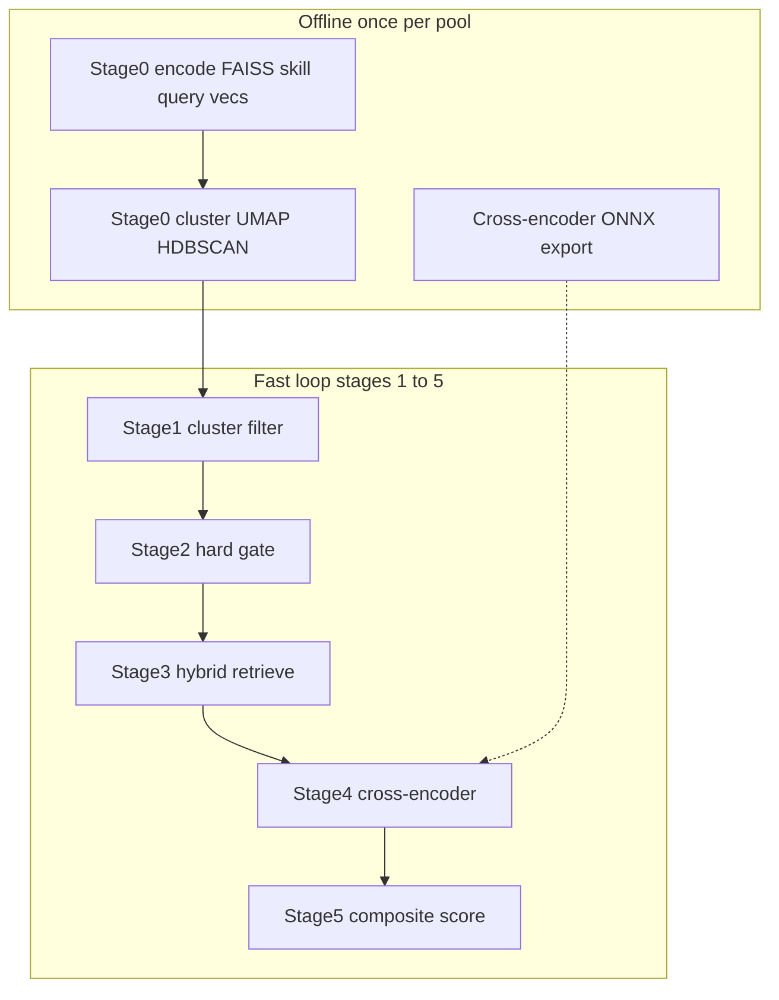

# RedRob — Precision Candidate Ranking Pipeline

Hackathon submission system for ranking ~100,000 AI-engineering candidates against a senior retrieval/ranking JD. The main track (**INSTRUCTOR / Track A**) is a six-stage funnel: offline embedding precompute, cluster filtering, hard tabular gate, hybrid retrieval, cross-encoder reranking, and a deterministic seven-layer composite scorer. Output is a top-100 CSV with per-candidate reasoning.

| Track | Model | Vector dim | Role |
|-------|-------|------------|------|
| **INSTRUCTOR (Track A)** | `hkunlp/instructor-large` via ONNX CUDA | 2304 (3×768 blocks) | Full Stage 0–5 pipeline → `team_xxx.csv` |
| **Naive baseline** | `BAAI/bge-small-en-v1.5` | 384 | Simple precompute + rank for comparison |

### REST API

The pipeline is also available as a **FastAPI** backend under [`backend/`](backend/). See [`backend/README.md`](backend/README.md) for setup, curl examples, and route reference.

```bash
uvicorn backend.main:app --host 0.0.0.0 --port 8000 --reload
```

OpenAPI docs: http://localhost:8000/docs

---

## 1) How to Run

### A. Offline precompute — what, why, and how

Everything below runs **outside** `run_pipeline.py`. Stages 1–5 only **read** these artifacts; they do not rebuild embeddings or clusters unless you re-run the offline steps.

```text
Dependency order (run top → bottom):

  [once per machine]     onnx/export_to_onnx.py
                              ↓
  [once per pool]        stage0/run.py          ← vectors + FAISS + skill scores + Stage 3 query vectors
                              ↓
  [once per pool]        stage0/run_cluster.py  ← UMAP + HDBSCAN
                              ↓
  [fast loop]            run_pipeline.py        ← stages 1–5

  [once per machine]     stage0/run_cross_encoder.py   ← independent; needed before Stage 4
```

#### Checklist before `run_pipeline.py`

| Step | Command | Required? | When to skip |
|------|---------|-----------|--------------|
| 1. INSTRUCTOR ONNX | `cd onnx && python export_to_onnx.py` | Yes (Stage 0 precompute) | `onnx/models/instructor-large-encoder.onnx` already exists |
| 2. Vector precompute | `python tracks/instructor/stage0/run.py` | Yes (Stages 1–3) | All files in `artifacts/runtime/stage0/` present |
| 3. Cluster precompute | `python tracks/instructor/stage0/run_cluster.py` | Yes (Stage 1) | `cluster_labels.npy` etc. in `artifacts/runtime/stage1/` |
| 4. Cross-encoder ONNX | `python tracks/instructor/stage0/run_cross_encoder.py` | Yes (Stage 4) | `models/cross_encoder/model.onnx` exists |
| 5. Ranking pipeline | `python tracks/instructor/run_pipeline.py` | — | — |

---

#### Step 1 — INSTRUCTOR ONNX export (once per machine)

| | |
|---|---|
| **Command** | `cd onnx && pip install -r requirements.txt && python export_to_onnx.py` |
| **Script** | [`onnx/export_to_onnx.py`](onnx/export_to_onnx.py) |
| **GPU?** | No (CPU export with PyTorch + `InstructorEmbedding`) |
| **Outputs** | `onnx/models/instructor-large-encoder.onnx`, `dense_weight.npy`, `tokenizer/`, `config.txt` |

**What it does:** Downloads `hkunlp/instructor-large`, exports the T5 **encoder** to ONNX. Instruction masking, mean pooling, dense projection, and L2 normalization still run in Python at inference time ([`tracks/instructor/core/onnx_embedder.py`](tracks/instructor/core/onnx_embedder.py)).

**Why it's needed:** Step 2 (`run.py`) calls `load_embedder()` for vector encoding, skill scoring, and Stage 3 query-vector precompute. Stage 3 at runtime loads precomputed `.npy` query vectors only (no ONNX).

**Smoke test:** `python onnx/run_encode.py` (expects CUDA `onnxruntime-gpu`).

---

#### Step 2 — Vector + FAISS + skill scores + Stage 3 query vectors (once per candidate pool)

| | |
|---|---|
| **Command** | `python tracks/instructor/stage0/run.py` |
| **Core logic** | [`tracks/instructor/stage0/precompute.py`](tracks/instructor/stage0/precompute.py), [`skill_precompute.py`](tracks/instructor/stage0/skill_precompute.py), [`stage3_query_precompute.py`](tracks/instructor/stage0/stage3_query_precompute.py) |
| **Prerequisite** | Step 1 (ONNX weights) |
| **GPU?** | Yes — `onnxruntime-gpu` + CUDA |
| **Default input** | `data/candidates.jsonl` (~100K pool) |
| **Default output** | `artifacts/runtime/stage0/` |

**What it does:**

1. Streams every candidate from the JSONL (or JSON array) file.
2. Builds a passage per candidate (career descriptions + summary; see [`core/extraction.py`](tracks/instructor/core/extraction.py)).
3. **3-pass INSTRUCTOR encoding** — same passage under retrieval / infra / eval instructions → three 768-d blocks concatenated to **2304-d** ([`core/encode.py`](tracks/instructor/core/encode.py)).
4. Builds a **FAISS** `IndexFlatIP` over all vectors + `id_map.json` (row index → `CAND_*` id).
5. Saves `candidate_vectors.npy` and precomputed **JD query vector** `jd_query_vec.npy`.
6. Computes global **skill_weighted_score** per candidate (IDF + tier relevance + depth) → `candidate_features.parquet`.
7. ONNX-encodes Stage 3 Q1/Q2/Q3 query texts → `stage3_query_vectors/q{1,2,3}_vec.npy` + `stage3_query_manifest.json` (re-run when `stage3:` q texts or subspace weights change).

**Why it's needed:**

| Artifact | Used by |
|----------|---------|
| `candidate_index.faiss` + `id_map.json` | Stage 1 (anchor similarity), Stage 3 (dense Q1/Q2) |
| `candidate_vectors.npy` | Stage 1 clustering, Stage 3 Q3 penalty |
| `jd_query_vec.npy` | Stage 1 cluster ranking (JD anchor) |
| `candidate_features.parquet` | Stage 3 skill track (L3) |
| `stage3_query_vectors/*.npy` + manifest | Stage 3 dense Q1/Q2/Q3 (no runtime encoding) |

**Edit before run** ([`tracks/instructor/stage0/run.py`](tracks/instructor/stage0/run.py)):

```python
from tracks.shared.paths import SAMPLE5K_PATH  # or SAMPLE10K_PATH, etc.

CANDIDATES_PATH = CANDIDATES_JSONL_PATH   # default: full 100K pool
OUTPUT_DIR = RUNTIME_STAGE0_DIR           # default: artifacts/runtime/stage0/
```

Use a smaller JSON/JSONL file (e.g. `data/sample5k.json`) for dev — there is **no built-in limit**; the script processes the entire file you point at.

**Outputs** (`artifacts/runtime/stage0/`):

- `candidate_index.faiss` — FAISS index, dim 2304
- `id_map.json` — FAISS row → `candidate_id`
- `candidate_vectors.npy` — `(N, 2304)` float32
- `jd_query_vec.npy` — block-weighted JD query vector
- `candidate_features.parquet` — `candidate_id`, `skill_weighted_score` (global, normalized)
- `stage3_query_vectors/q1_vec.npy`, `q2_vec.npy`, `q3_vec.npy` — pre-encoded Stage 3 queries
- `stage3_query_manifest.json` — config hash for query-vector invalidation
- `skill_idf.json` — optional debug artifact from skill precompute

**Typical runtime:** Dominated by 3 encode passes × N candidates (hours at 100K on GPU).

---

#### Step 3 — Cluster precompute (once per candidate pool, after Step 2)

| | |
|---|---|
| **Command** | `python tracks/instructor/stage0/run_cluster.py` |
| **Core logic** | [`tracks/instructor/stage0/cluster_precompute.py`](tracks/instructor/stage0/cluster_precompute.py) → [`stage1/pipeline.py`](tracks/instructor/stage1/pipeline.py) |
| **Prerequisite** | Step 2 (`candidate_index.faiss` in `STAGE0_PATH`) |
| **GPU?** | No (UMAP + HDBSCAN on CPU) |
| **Default paths** | Input: `artifacts/runtime/stage0/` → Output: `artifacts/runtime/stage1/` |

**What it does:**

1. Reconstructs all candidate vectors from the FAISS index.
2. **UMAP** reduction: 2304-d → 12-d (cosine metric).
3. **HDBSCAN** clustering in reduced space (`min_cluster_size = max(15, 1.5% × N)`).
4. Writes cluster labels and manifest to `artifacts/runtime/stage1/`.

**Why it's needed:** Stage 1 does **cluster-atomic filtering** — it ranks clusters by median JD similarity and walks whole clusters until a floor count is met. Without these `.npy` files, `run_pipeline.py` cannot run Stage 1.

**Edit before run** ([`tracks/instructor/stage0/run_cluster.py`](tracks/instructor/stage0/run_cluster.py)):

```python
STAGE0_PATH = RUNTIME_STAGE0_DIR    # must match Step 2 output
STAGE1_PATH = RUNTIME_STAGE1_DIR
OVERWRITE = False                   # set True to rebuild existing clusters
```

If cluster artifacts already exist and `OVERWRITE = False`, the script raises `Stage1ClusterArtifactsExistError` — that means Step 3 is **already done**; skip to `run_pipeline.py`.

**Outputs** (`artifacts/runtime/stage1/` — Phase A only):

- `candidate_vectors.npy` — copy of vectors `(N, 2304)`
- `cluster_labels.npy` — HDBSCAN label per candidate (`-1` = noise)
- `umap_reduced_12d.npy` — UMAP embedding
- `cluster_manifest.json` — hyperparameters and `n_candidates`

Phase B filter outputs (`filtered_ids.json`, etc.) are written by Stage 1 inside `run_pipeline.py` or by [`stage1/run_filter.py`](tracks/instructor/stage1/run_filter.py) standalone.

---

#### Step 4 — Cross-encoder ONNX export (once per machine, before Stage 4)

| | |
|---|---|
| **Command** | `pip install -r models/requirements.txt && python tracks/instructor/stage0/run_cross_encoder.py` |
| **Alt** | `python models/export_cross_encoder.py` (shim to same code) |
| **Core logic** | [`tracks/instructor/stage0/cross_encoder_export.py`](tracks/instructor/stage0/cross_encoder_export.py) |
| **Prerequisite** | None (independent of candidate pool) |
| **GPU?** | No |
| **Default output** | `models/cross_encoder/` |

**What it does:** Exports `cross-encoder/ms-marco-MiniLM-L-6-v2` (or `stage4.model_id` from `config.yaml`) to ONNX + saves tokenizer.

**Why it's needed:** Stage 4 scores `(JD, candidate)` pairs with this model. `run_pipeline.py` does not export it for you.

**Outputs:**

- `models/cross_encoder/model.onnx`
- `models/cross_encoder/tokenizer/`

`SKIP_IF_EXISTS = True` by default in `run_cross_encoder.py` — safe to re-run.

---

#### Step 5 — Fast ranking loop (repeat anytime)

After Steps 1–4 artifacts exist on disk:

```bash
python tracks/instructor/run_pipeline.py
```

Runs Stage 1 filter → Stage 2 gate → Stage 3 retrieve → Stage 4 rerank → Stage 5 score. Does **not** re-encode 100K candidates or rebuild clusters.

**Or run stages individually** (same behavior, useful for debugging):

```bash
python tracks/instructor/stage1/run_filter.py   # optional; pipeline runs filter in-memory too
python tracks/instructor/stage2/run.py
python tracks/instructor/stage3/run.py
python tracks/instructor/stage4/run.py
python tracks/instructor/stage5/run.py
```

**Programmatic API** (for external wrappers, e.g. resume-ranking integration):

```python
from tracks.instructor.pipeline import RankingPipelineConfig, run_ranking_pipeline

result = run_ranking_pipeline()
print(result.final_csv_path, result.total_elapsed_seconds)
# Per-stage timings: result.timings
```

**`run_pipeline.py` CLI flags:**

| Flag | Purpose |
|------|---------|
| `--config PATH` | `config.yaml` location (default: repo root) |
| `--runtime-dir DIR` | Set all `artifacts/runtime/stageN` paths from one parent |
| `--stage0`, `--stage1`, `--out-stage2` … | Override individual stage directories |
| `--candidates PATH` | Candidates JSONL |
| `--seed N` | Stage 1 filter random seed |
| `--quiet` | Suppress per-stage summaries (timing table still prints) |

**Configuration:** [`config.yaml`](config.yaml) at repo root drives stages 2–5 (`stage2:`, `stage3:`, `stage4:`, `stage5:` blocks). Stage 0–1 constants live in [`tracks/instructor/core/config.py`](tracks/instructor/core/config.py).

#### What to re-run when something changes

| If you change… | Re-run from… |
|----------------|--------------|
| `candidates.jsonl` or INSTRUCTOR encoding | Step 2 `run.py` → Step 3 `run_cluster.py` → `run_pipeline.py` |
| UMAP/HDBSCAN parameters only | Step 3 `run_cluster.py` (`OVERWRITE = True`) → `run_pipeline.py` |
| `stage2:` config (gates, honeypot rules) | `run_pipeline.py` (stages 2–5) or stage 2 onward |
| `stage3:` queries, weights, cutoff | stages 3–5 |
| Cross-encoder model or `keep_n` | Step 4 if model changed; then stages 4–5 |
| `stage5:` formula / weights only | stage 5 |

#### Environment notes

- **INSTRUCTOR embedder** (Steps 2 & Stage 3): `pip install -r requirements.txt` — needs `onnxruntime-gpu` and CUDA. Do not install CPU `onnxruntime` alongside GPU build.
- **ONNX export** (Step 1): separate env under `onnx/requirements.txt` (PyTorch + `InstructorEmbedding`).
- **Cross-encoder export** (Step 4): `models/requirements.txt`.

---

### B. Naive baseline (comparison track)

```bash
python -m tracks.naive.precompute
python -m tracks.naive.rank
```

### Tests

```bash
pytest tests/test_stage1_rank.py
python tests/run_filtering_test.py
python tests/run_clustering_test.py
python tests/retrieval_test.py
```

### Legacy note

[`rank.py`](rank.py) is an older **CPU-only retrieval dev script** (loads precomputed FAISS + optional Stage 1 filter). It is **not** the competition submission path. Use `run_pipeline.py` or stages 1–5 for the full ranking procedure.

---

## 2) Code Directory Explanation

```
redrob/
├── config.yaml                         # stage2–5 parameters (JD-aligned rules and weights)
├── rank.py                             # legacy CPU retrieval dev tool
├── tracks/
│   ├── instructor/
│   │   ├── core/                       # shared embedding, index, I/O (Stage 0 + runtime loads)
│   │   │   ├── config.py               # dimensions, instructions, filenames, stage1 constants
│   │   │   ├── onnx_embedder.py        # CUDA INSTRUCTOR ONNX session
│   │   │   ├── encode.py               # 3-pass block encoding, JD query vector
│   │   │   ├── extraction.py           # role-contextualized passages from JSONL
│   │   │   ├── index.py                # FAISS IndexFlatIP build
│   │   │   └── io.py                   # load index, id_map, vectors, iterate candidates
│   │   ├── pipeline.py                 # run_ranking_pipeline() API
│   │   ├── run_pipeline.py             # stages 1–5 CLI orchestrator
│   │   ├── stage0/                     # offline precompute runners
│   │   ├── stage1/                     # cluster filter (phase B); clustering logic in stage1/
│   │   ├── stage2/                     # hard tabular gate + feature enrichment
│   │   ├── stage3/                     # hybrid multi-query retrieval
│   │   ├── stage4/                     # cross-encoder rerank
│   │   └── stage5/                     # 7-layer composite scorer → CSV
│   ├── naive/                          # BGE-small baseline
│   └── shared/paths.py                 # RUNTIME_STAGE0_DIR … RUNTIME_STAGE5_DIR
├── artifacts/runtime/stage{0..5}/      # pipeline outputs by stage
├── models/cross_encoder/               # Stage 4 ONNX (model.onnx, tokenizer/)
├── models/export_cross_encoder.py      # backward-compat shim → stage0/run_cross_encoder.py
├── onnx/                               # INSTRUCTOR export tooling
├── docs/final_consolidated_plan.md     # JD coverage contract + Stage 5 spec
├── honeypot/                           # honeypot generation utilities
├── tests/                              # clustering, filtering, retrieval tests
└── data/candidates.jsonl               # candidate pool (may be gitignored locally)
```

### Per-stage modules

| Stage | Purpose | Key modules | Runner(s) |
|-------|---------|-------------|-----------|
| **0** | Offline encode, FAISS, skill scores, query vectors, cross-encoder export, cluster precompute | `precompute.py`, `skill_precompute.py`, `stage3_query_precompute.py`, `cross_encoder_export.py`, `cluster_precompute.py` | `run.py`, `run_cluster.py`, `run_cross_encoder.py` |
| **1** | JD-anchor cluster filter (~100K → ~6K) | `pipeline.py`, `clustering/`, `filtering/`, `artifacts.py` | `run_filter.py` (`run_cluster.py` is shim → stage0) |
| **2** | Hard gate + tabular features (~6K → ~3–4K) | `gate.py`, `checks/*`, `honeypot_rules.py`, `config.py` | `run.py` |
| **3** | Hybrid retrieval (~3–4K → 300–600) | `retrieve.py`, `fusion.py`, `dense_retrieve.py`, `sparse_retrieve.py`, `query_encode.py` | `run.py` |
| **4** | Cross-encoder rerank (300–600 → 300) | `rerank.py`, `score.py`, `pairs.py` | `run.py` |
| **5** | Composite score + reasoning (300 → top 100 CSV) | `layers.py`, `must_have.py`, `signals.py`, `reasoning.py`, `score.py` | `run.py` |

### Artifact handoff chain

```
artifacts/runtime/stage0/     (FAISS, vectors, skill features, query vectors, jd_query_vec)
        ↓
artifacts/runtime/stage1/     filtered_ids.json, cluster_rankings.json
        ↓
artifacts/runtime/stage2/     stage2_gated.parquet
        ↓
artifacts/runtime/stage3/     stage3_retrieved.parquet
        ↓
artifacts/runtime/stage4/     stage4_reranked.parquet
        ↓
artifacts/runtime/stage5/     team_xxx.csv, stage5_scored.parquet
```

### Funnel shrinkage (typical)

```
~100,000 candidates
  → Stage 1 cluster filter      ~6,000
  → Stage 2 hard gate         ~3,000–4,000
  → Stage 3 hybrid retrieve     300–600
  → Stage 4 cross-encoder       300
  → Stage 5 composite score     top 100 CSV
```

---

## 3) Concepts and Tech Stack

### Pipeline philosophy

**Precision-first funnel:** hard disqualifiers and honeypots fire early (Stage 2); semantic matching narrows the pool (Stages 1 and 3); expensive cross-encoder runs only on hundreds of pairs (Stage 4); final ranking is a **transparent, decomposable formula** (Stage 5) — not a black-box trained model. Every scoreable JD requirement maps to a stage; see [docs/final_consolidated_plan.md](docs/final_consolidated_plan.md) for the full coverage matrix.

### Architecture overview



### Tech stack

| Layer | Technology |
|-------|------------|
| Embeddings | INSTRUCTOR-large (`hkunlp/instructor-large`) via ONNX Runtime **CUDA** |
| Dense index | FAISS `IndexFlatIP`, 2304-d concatenated blocks |
| Skill track (L3) | Precomputed `skill_weighted_score` from `candidate_features.parquet` |
| Dimensionality reduction | UMAP (12-d, cosine) |
| Clustering | HDBSCAN (`min_cluster_size = max(15, 1.5% × N)`) |
| Reranking | MS MARCO MiniLM cross-encoder (`cross-encoder/ms-marco-MiniLM-L-6-v2`) ONNX **CPU** |
| Tabular / features | Polars DataFrames, Parquet artifacts |
| Candidate store | JSONL (`data/candidates.jsonl`) |
| Configuration | YAML (`config.yaml`) |
| Final scoring | NumPy deterministic composite (no LightGBM, no training labels) |

### Innovative design choices (by stage)

- **Stage 0 — Block-weighted multi-instruction vectors:** Each candidate is encoded under three task-specific instructions (retrieval, infra, eval). Blocks are L2-normalized separately and concatenated into one 2304-d vector — one FAISS index, three semantic facets. Global `skill_weighted_score` and Stage 3 Q1/Q2/Q3 query vectors are precomputed here; Stage 3 is a pure runner with no ONNX.

- **Stage 1 — Cluster-atomic filtering:** Clusters are ranked by **median** anchor similarity to the JD vector; whole clusters are admitted until a floor (default 100) is met — not per-candidate top-K within the pool. HDBSCAN noise points are a last resort.

- **Stage 2 — Hard gate vs soft flags:** Honeypots, experience band, title family, consulting-only, research-only, and shallow-AI profiles are **hard removed**. Availability, stale coding, career-shape, and logistics signals are **computed but not removed** — penalties apply in Stage 5. Escape hatches exist for shallow-AI (pre-LLM production ML) and consulting-only (prior product roles).

- **Stage 3 — Q3 as negative semantic query:** Anti-pattern text (title-chasing, LangChain tutorials, consulting-only, etc.) is encoded as Q3 and **subtracted** from reciprocal-rank fusion via inner-product similarity — not a separate exclusion list. Search is restricted to Stage 2 survivor IDs via FAISS `IDSelectorBatch`.

- **Stage 4 — Retrieve-then-rerank:** Cross-encoder scores only 300–600 `(JD, candidate)` pairs. Candidate text prefers precomputed `technical_summary_sentence` when available; falls back to full passage from JSONL. Large rank swings (|stage3_rank − stage4_rank| ≥ 50) are logged for audit.

- **Stage 5 — Seven-layer decomposable scorer:** Every intermediate column (`core_floored`, `shaped`, `penalized`, `bonused`, `final_score`, etc.) is persisted. The `reasoning` column in the submission CSV references actual penalty/bonus fields — full explainability for defend-your-work interviews.

---

## 4) Deeper Concepts and Mathematics

### 4.1 Block-weighted INSTRUCTOR encoding

**Candidate vector** (from [`tracks/instructor/core/encode.py`](tracks/instructor/core/encode.py)):

For each candidate passage \(p\), encode under three instructions \(I_r, I_i, I_e\) (retrieval, infra, eval):

\[
\mathbf{b}_x = \mathrm{L2norm}\bigl(\mathrm{Enc}(I_x, p)\bigr) \in \mathbb{R}^{768}, \quad x \in \{r, i, e\}
\]

\[
\mathbf{v}_c = [\mathbf{b}_r \,\|\, \mathbf{b}_i \,\|\, \mathbf{b}_e] \in \mathbb{R}^{2304}
\]

**JD anchor vector** (used in Stage 1 cluster ranking):

\[
\mathbf{q}_{jd} = w_r \cdot \mathrm{L2norm}(\mathrm{Enc}(I_r, t_r)) \,\|\, w_i \cdot \mathrm{L2norm}(\mathrm{Enc}(I_i, t_i)) \,\|\, w_e \cdot \mathrm{L2norm}(\mathrm{Enc}(I_e, t_e))
\]

Default weights \((w_r, w_i, w_e) = (0.5, 0.3, 0.2)\).

**Similarity:** FAISS `IndexFlatIP` on \(\mathbf{v}_c\) — inner product after per-block normalization approximates a weighted cosine across facets.

Passages are built from role-contextualized career segments ([`core/extraction.py`](tracks/instructor/core/extraction.py)), truncated from the **end** to preserve leading content (480 tokens).

### 4.2 Stage 1 cluster filter

From [`tracks/instructor/stage1/filtering/rank.py`](tracks/instructor/stage1/filtering/rank.py):

1. **Anchor similarity** per candidate: \(s_i = \mathbf{v}_i \cdot \mathbf{q}_{jd}\)
2. **Cluster score:** median of \(\{s_i : i \in \text{cluster } k\}\)
3. **Ranking:** clusters sorted by median \(s\) descending (tie-break by label)
4. **Floor walk:** add **entire clusters** in rank order until \(|\text{filtered}| \geq \text{floor}\) (default 100); noise label \(-1\) only if real clusters are exhausted

UMAP reduces 2304-d vectors to 12-d (cosine, `n_neighbors=20`); HDBSCAN assigns cluster labels in that space.

### 4.3 Stage 2 hard tabular gate

From [`tracks/instructor/stage2/gate.py`](tracks/instructor/stage2/gate.py) and [`config.yaml`](config.yaml) `stage2:`:

**Hard-remove order** (first match wins):

1. **Honeypot** — timeline rules R1–R5 + skill rules H3–H5 ([`honeypot_rules.py`](tracks/instructor/stage2/honeypot_rules.py))
2. **Experience** — remove if years \(\notin [\text{hard\_min} - \text{tolerance},\, \text{hard\_max} + \text{tolerance}]\) (default band 4–10 with `hard_min=5`, `hard_max=9`, `soft_tolerance=1`)
3. **Title** — non-engineering titles with high JD-keyword density → keyword stuffer remove
4. **Consulting-only** — 0% product-company employers
5. **Research-only** — research-heavy without production escape
6. **Shallow AI** — recent LangChain-only without pre-LLM production ML escape

**Soft flags** (survive gate, used in Stage 5): `stale_coding`, `short_hop_count`, `avg_tenure_per_employer`, `location_tier`, `notice_period_days`, availability signals, `dist_to_centroid` (L2 to cluster centroid in 12-d UMAP space).

### 4.4 Stage 3 hybrid fusion

From [`tracks/instructor/stage3/fusion.py`](tracks/instructor/stage3/fusion.py):

**Three retrieval lists + Q3 penalty:**

| Query | Role | Mechanism |
|-------|------|-----------|
| Q1 | Must-have retrieval/infra/eval | Dense FAISS, subspace weights (0.35 / 0.45 / 0.20) |
| Q2 | Career shape / Tier-5 rescue | Dense FAISS, balanced subspace weights |
| L3 | Structured skills | Precomputed `skill_weighted_score`, top-k among Stage 2 survivors |
| Q3 | Anti-patterns | Encoded vector used as **penalty**, not a retrieval list |

**Reciprocal Rank Fusion** (union of Q1, Q2, L3 candidate sets; miss penalty rank = k+1):

\[
\mathrm{RRF}(c) = \frac{1}{k + r_1(c)} + \frac{1}{k + r_2(c)} + \frac{1}{k + r_{\mathrm{skill}}(c)}, \quad k = 60
\]

**Q3 penalty:**

\[
q3\_neg\_sim(c) = \mathbf{v}_c \cdot \mathbf{q}_3
\]

\[
\mathrm{fused}(c) = \mathrm{RRF}(c) - \alpha \cdot q3\_neg\_sim(c), \quad \alpha = 0.5
\]

(`beta_cluster` for centroid distance bonus is 0.0 by default — disabled.)

**Adaptive cutoff:**

\[
\tau = \mu_{\mathrm{fused}} - z \cdot \sigma_{\mathrm{fused}}, \quad z = 1.5
\]

Keep candidates with \(\mathrm{fused} \geq \tau\); clamp output size to \([300, 600]\). If fewer than 300 pass, take top 300 by fused score anyway.

### 4.5 Stage 4 cross-encoder rerank

From [`tracks/instructor/stage4/score.py`](tracks/instructor/stage4/score.py):

\[
\mathrm{score}_{CE}(c) = \mathrm{CrossEncoder}(\text{JD}, \text{passage}_c)
\]

- Model: `cross-encoder/ms-marco-MiniLM-L-6-v2` exported to ONNX
- Batched CPU inference (`batch_size=16`); JD truncated to 256 tokens, candidate to 384
- Sort descending; keep top `keep_n = 300`
- Log rank deltas where \(|\mathrm{rank}_3 - \mathrm{rank}_4| \geq 50\)

### 4.6 Stage 5 seven-layer composite scorer

From [`tracks/instructor/stage5/layers.py`](tracks/instructor/stage5/layers.py) and `config.yaml` `stage5:` defaults. All retrieval scores are **min-max normalized** within the Stage 4 batch before layering.

| Layer | Name | Formula (conceptual) |
|-------|------|----------------------|
| **1** | Core | \(\mathrm{core} = 0.45 \cdot ce + 0.25 \cdot fused + 0.20 \cdot q1 + 0.10 \cdot q2\) |
| **2** | Must-have floor | \(\mathrm{core\_floored} = \mathrm{core} \times \bigl(f_{\min} + (1 - f_{\min}) \cdot \max(kw, q1, assess)\bigr)\), \(f_{\min} = 0.4\) |
| **3** | Career shape | Multiplicative: `product_company_fraction` floor, sweet-spot bonus (×1.08), discounts for `near_band`, `stale_coding`, no production role |
| **4** | Penalties | Subtract: short-hop chasing, Q3 residual, closed-source (low external validation + no GitHub), title ambiguity, consulting-heavy |
| **5** | Optional bonus | Add capped bonus for fine-tuning, LTR, HR-tech, distributed systems, OSS categories (absence is neutral) |
| **6** | Availability | Multiplicative product of recruiter response rate, response speed, profile recency, open-to-work, interview/offer rates, market activity — floor 0.5 |
| **7** | Logistics | Add: `location_tier`, preferred work mode, notice-period smooth penalty beyond 30 days |

\[
\mathrm{final\_score} = \mathrm{bonused} + \mathrm{logistics\_adjustment}
\]

Top `top_n = 100` by `final_score` → `{team_id}.csv` with columns `candidate_id`, `rank`, `score`, `reasoning` (≤500 chars, composed from score decomposition in [`reasoning.py`](tracks/instructor/stage5/reasoning.py)).

For the complete resolution of all 23 behavioral signals (which are scored, which are excluded, and why), see [docs/final_consolidated_plan.md](docs/final_consolidated_plan.md) Part C.

---

## 5) Joining All Modules

### Execution graph

```
run_pipeline.py
    └── pipeline.run_ranking_pipeline()
            ├── stage1.run_stage1_filter()     ← core.io, stage0/stage1 artifacts
            ├── stage2.run()                   ← stage1 JSON + candidates.jsonl + config stage2
            ├── stage3.run()                   ← stage2 parquet + stage0 FAISS/skill/query vectors (no ONNX)
            ├── stage4.run()                   ← stage3 parquet + models/cross_encoder/
            └── stage5.run()                   ← stage4 parquet + candidates.jsonl + config stage5
```

**Stage 0** (not in `run_pipeline.py`) wires:

- `core.onnx_embedder` + `core.encode` + `core.index` → FAISS + skill features + query vectors
- `stage1.pipeline.precompute_stage1_clustering` (via `stage0/cluster_precompute.py`) → cluster `.npy`
- `stage0/cross_encoder_export.py` → `models/cross_encoder/` for Stage 4

### Config as the JD contract

[`config.yaml`](config.yaml) is the single source of truth binding JD intent to code:

- `stage2:` — experience bands, honeypot tolerances, title families, consulting/research/shallow-AI keyword lists
- `stage3:` — Q1/Q2/Q3 query text, subspace weights, RRF/penalty/cutoff parameters
- `stage4:` — JD text for cross-encoder, `keep_n`, batch size
- `stage5:` — core weights, must-have keywords, penalty/bonus/logistics coefficients, `team_id`

Changing config and re-running the **fast loop** (stages 1–5) does not require re-encoding 100K candidates. See [§1 What to re-run when something changes](#what-to-re-run-when-something-changes) for the full matrix.

### Integration hook

`run_ranking_pipeline()` returns `RankingPipelineResult`:

- `stage1` … `stage5` — per-stage result objects with counts and timings
- `timings` — wall-clock per stage
- `total_elapsed_seconds` — full pipeline duration
- `final_csv_path` — submission CSV path

Use `RankingPipelineConfig(print_summaries=False)` for silent embedding in a larger orchestrator.

### Optional artifacts

`candidate_features.parquet` (technical summaries, precomputed signals) is referenced by Stages 4–5 but optional — both stages fall back to building text from `candidates.jsonl` when the parquet is absent.

---

## 6) Conclusion

RedRob implements a **staged, precision-first ranking funnel** for a senior AI retrieval/ranking role:

1. **Semantic coarse filter** (block-weighted INSTRUCTOR + cluster-atomic Stage 1)
2. **Deterministic hard gate** (honeypots, JD disqualifiers, career-shape flags in Stage 2)
3. **Hybrid retrieval** (dense multi-query + skill track + anti-pattern penalty in Stage 3)
4. **Cross-encoder precision** (MS MARCO MiniLM on a shortlist in Stage 4)
5. **Explainable composite scoring** (seven transparent layers → top 100 + reasoning in Stage 5)

**Design tradeoffs:** precision over recall; early hard removes to protect downstream compute; retrieve-then-rerank to bound cross-encoder cost; deterministic formula instead of trained ranker because ground-truth labels are hidden and submission requires decomposable scores.

**Known non-coverage:** culture/vibe signals from the JD (async communication style, disagreement norms) have no reliable profile proxy and are documented as deliberate omissions in [docs/final_consolidated_plan.md](docs/final_consolidated_plan.md).

**Further reading:**

| Document | Contents |
|----------|----------|
| [docs/final_consolidated_plan.md](docs/final_consolidated_plan.md) | JD line-by-line coverage matrix, Stage 5 behavioral signal contract |
| [onnx/README.md](onnx/README.md) | INSTRUCTOR ONNX export details |
| [honeypot/README.md](honeypot/README.md) | Honeypot candidate generation |

**Submission artifact:** `artifacts/runtime/stage5/team_xxx.csv` — 100 ranked candidates with scores and reasoning strings.
