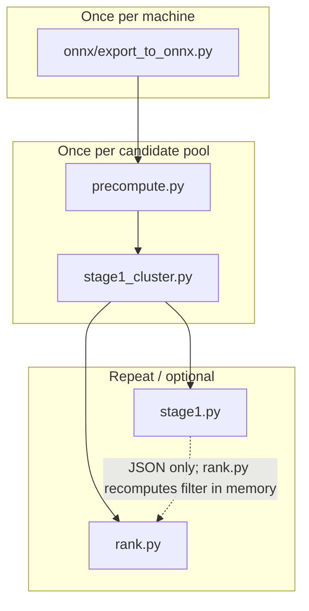

# RedRob Precompute Guide

This document describes **every offline step required to run the project today**: ONNX model export, vector index build, optional Stage 1 clustering/filtering, and retrieval. It is derived from the current source tree (`precompute.py`, `stage1_cluster.py`, `stage1.py`, `rank.py`, `tracks/instructor/`, `tracks/naive/`, `onnx/`).

---

## Overview

RedRob has two retrieval tracks:

| Track | Model | Vector dim | Precompute | Stage 1 | Rank |
|-------|-------|------------|------------|---------|------|
| **Track A (INSTRUCTOR)** | `hkunlp/instructor-large` via ONNX CUDA | 2304 (3×768 blocks) | `python precompute.py` | `stage1_cluster.py` + `stage1.py` | `python rank.py` |
| **Naive baseline** | `BAAI/bge-small-en-v1.5` | 384 | `python -m tracks.naive.precompute` | — | `python -m tracks.naive.rank` |

Track A is the production path. It splits work into:

1. **One-time ONNX export** — T5 encoder + tokenizer + dense projection
2. **GPU vector precompute** — encode all candidates + build FAISS index + JD query vector
3. **Stage 1 Phase A (optional but default in rank)** — UMAP + HDBSCAN clustering artifacts
4. **Stage 1 Phase B (optional standalone)** — rank clusters, filter to floor, write JSON
5. **CPU retrieval** — top-k search on filtered or full pool



**Important:** `rank.py` runs Stage 1 Phase B **in memory** with `write_artifacts=False`. It needs Phase A `.npy` files but does **not** require Phase B JSON files. Running `stage1.py` separately is only needed to inspect or persist filter outputs.

---

## Environment Setup

### Track A — root dependencies

From the project root:

```powershell
pip install -r requirements.txt
```

| Package | Used for |
|---------|----------|
| `onnxruntime-gpu` | GPU encoding in `precompute.py` |
| `transformers`, `numpy`, `protobuf` | Tokenizer + arrays |
| `faiss-cpu` | Index build and CPU retrieval |
| `umap-learn`, `hdbscan`, `scikit-learn` | Stage 1 clustering |
| `polars`, `lightgbm`, `rank_bm25`, `pyarrow` | Listed for downstream rank work; **not used by root `rank.py` today** |

**Do not** install CPU `onnxruntime` alongside `onnxruntime-gpu`. The embedder requires `CUDAExecutionProvider` to be active.

### ONNX export — separate environment (recommended)

Export uses PyTorch and `InstructorEmbedding`, which are **not** in root `requirements.txt`:

```powershell
cd onnx
pip install -r requirements.txt
python export_to_onnx.py
cd ..
```

### Naive baseline — extra package

Naive precompute uses `sentence-transformers`, which is **not** in root `requirements.txt`:

```powershell
pip install sentence-transformers
```

---

## Data Requirements

### Candidate record schema

Each candidate must include (see `data/candidate_schema.json`):

- `candidate_id` — format `CAND_XXXXXXX`
- `profile` — summary, current_title, etc.
- `career_history` — role descriptions used for passage text
- `education`, `skills`, `redrob_signals`

### Files in repo vs local-only

| Path | Status | Purpose |
|------|--------|---------|
| `data/candidate_schema.json` | Tracked | Schema reference |
| `data/sample_candidates.json` | Tracked | Small sample for tests |
| `data/candidates.jsonl` | Gitignored | **Default** input for `precompute.py` |
| `data/candidates.jsonl.gz` | Gitignored | Compressed full pool |
| `data/sample1k.json`, `sample5k.json`, … | Gitignored | Dev/test sample pools |

### Supported input formats (Track A)

`tracks/instructor/io.py` accepts:

- `.json` — JSON array of candidate objects
- `.jsonl` / `.jsonl.gz` — one JSON object per line

Naive precompute expects a **JSON array** at `data/sample1k.json` (hardcoded in `tracks/naive/precompute.py`).

### Passage extraction differences

**Track A** (`tracks/instructor/extraction.py`):

- Joins `career_history[].description` with title/company context
- Adds `profile.summary` and `profile.current_title`
- Truncates to **480 tokens** (`MAX_PASSAGE_TOKENS`)
- Empty passages become `"no relevant experience"`

**Naive** (`tracks/naive/passage.py`):

- `profile.summary` + role descriptions joined with `\n\n`
- Uses BGE prefixes: `passage:` for candidates, `query:` at rank time

---

## Step 0 — ONNX Model Export (once)

| | |
|---|---|
| **Command** | `cd onnx && python export_to_onnx.py` |
| **Config** | `onnx/export_to_onnx.py`: `MODEL_NAME = "hkunlp/instructor-large"`, `OUTPUT_DIR = onnx/models`, `OPSET = 17` |
| **Inputs** | Downloads model weights via `InstructorEmbedding` (network on first run) |
| **Outputs** | See below |
| **GPU required?** | No (export runs on CPU) |

### Output layout (`onnx/models/`, gitignored)

```
onnx/models/
├── instructor-large-encoder.onnx   # T5 encoder only
├── dense_weight.npy                  # 768×768 projection from Instructor stack
├── tokenizer/                        # Saved HuggingFace tokenizer
└── config.txt                        # max_seq_length=512
```

### Why manual export?

INSTRUCTOR-large is a T5-based model. The project exports **only the T5 encoder** to ONNX. Instruction masking, mean pooling over non-instruction tokens, dense projection, and L2 normalization are implemented in Python at inference time (`tracks/instructor/onnx_embedder.py`). See `docs/plans/instructor-large-onnx-setup.md` for background.

### Smoke test (optional)

```powershell
python onnx/run_encode.py
```

Expect console output like `shape: (3, 768)` confirming CUDA ONNX Runtime loads and encodes.

### ONNX artifact paths (runtime)

Defined in `tracks/instructor/config.py`:

| Constant | Path |
|----------|------|
| `INSTRUCTOR_ONNX_ENCODER` | `onnx/models/instructor-large-encoder.onnx` |
| `INSTRUCTOR_ONNX_TOKENIZER` | `onnx/models/tokenizer/` |
| `INSTRUCTOR_ONNX_DENSE` | `onnx/models/dense_weight.npy` |
| `INSTRUCTOR_ONNX_CONFIG` | `onnx/models/config.txt` |

If any are missing, `load_embedder()` raises with: *Run: cd onnx && python export_to_onnx.py*.

---

## Step 1 — Track A Vector Precompute

| | |
|---|---|
| **Command** | `python precompute.py` (from project root) |
| **Depends on** | Step 0 (ONNX artifacts) |
| **GPU required?** | Yes — CUDA via `onnxruntime-gpu` |
| **Typical runtime** | Dominated by 3 encode passes × N candidates |

### Config to edit (`precompute.py`)

```python
CANDIDATES_PATH = CANDIDATES_JSONL_PATH   # default: data/candidates.jsonl
OUTPUT_DIR = ROOT_DIR / "artifacts" / "candidates_full"
```

Point `CANDIDATES_PATH` at your pool file (e.g. `data/sample1k.json`) and `OUTPUT_DIR` at a matching artifacts directory (e.g. `artifacts/sample1k`).

### Tunables (`tracks/instructor/config.py`)

| Constant | Default | Role |
|----------|---------|------|
| `ONNX_BATCH_SIZE` | 32 | GPU batch size (OOM → auto-retries 16, 8, 4) |
| `INDEX_BATCH_SIZE` | 500 | FAISS `index.add` batch size |
| `QUERY_WEIGHTS` | (0.5, 0.3, 0.2) | JD query block weights (retrieval, infra, eval) |
| `PASSAGE_PREP_WORKERS` | `None` → min(8, cpu−1) | Parallel passage building |
| `RETRIEVAL_INSTRUCTION`, `INFRA_INSTRUCTION`, `EVAL_INSTRUCTION` | long strings | Per-block encode instructions |
| `JD_RETRIEVAL_TEXT`, `JD_INFRA_TEXT`, `JD_EVAL_TEXT` | long strings | JD query text per block |

### What happens internally

1. **Passage prep** — each candidate record → truncated passage text
2. **3-pass encoding** (`tracks/instructor/encode.py`):
   - Encode all passages under `RETRIEVAL_INSTRUCTION`
   - Encode again under `INFRA_INSTRUCTION`
   - Encode again under `EVAL_INSTRUCTION`
   - Concatenate 3×768 → **2304-d**, L2-normalize each 768-d block separately
3. **JD query vector** — encode JD text under each instruction; per-block normalize × weights; concatenate
4. **FAISS index** — `IndexFlatIP` (inner product on block-normalized vectors)
5. **Write artifacts** to `OUTPUT_DIR`

### Outputs (per pool)

```
artifacts/<pool>/
├── candidate_index.faiss    # IndexFlatIP, dim=2304
├── id_map.json              # FAISS row index → candidate_id (string keys in JSON)
└── jd_query_vec.npy         # Precomputed 2304-d JD query (block-weighted)
```

### Alternate entry point

`precompute.py` also defines `main_full()` which writes directly to `artifacts/` root using `data/candidates.jsonl`. It is **not** called from `__main__`; use `main()` defaults or call programmatically.

---

## Step 2 — Stage 1 Phase A: Clustering Precompute

| | |
|---|---|
| **Command** | `python stage1_cluster.py` |
| **Depends on** | Step 1 (`candidate_index.faiss`, `id_map.json`) |
| **GPU required?** | No |
| **Typical runtime** | Minutes at 5k–100k candidates (UMAP + HDBSCAN) |

### Config to edit (`stage1_cluster.py`)

```python
ARTIFACTS_PATH = ROOT_DIR / "artifacts" / "candidates_full"
STAGE1_PATH = ARTIFACTS_PATH / "stage1"
OVERWRITE = False
RANDOM_SEED = STAGE1_RANDOM_SEED   # 42
```

Set `ARTIFACTS_PATH` to the **same pool directory** used in Step 1. Set `OVERWRITE=True` to rebuild existing cluster artifacts.

### Tunables (`tracks/instructor/config.py`)

| Constant | Default | Role |
|----------|---------|------|
| `UMAP_CLUSTERING_DIMS` | 12 | UMAP output dimensions |
| `UMAP_N_NEIGHBORS` | 20 | UMAP neighbors |
| `STAGE1_UMAP_N_JOBS` | 1 | `1` = reproducible (sets `random_state`); `-1` = parallel but non-reproducible |
| `STAGE1_HDBSCAN_CORE_DIST_N_JOBS` | -1 | HDBSCAN parallelism |

### Algorithm

1. **Export vectors** from FAISS via `index.reconstruct()` (`tracks/instructor/io.py`)
2. **UMAP** — cosine metric, 12-d reduction (`tracks/instructor/clustering/reduce.py`)
3. **HDBSCAN** — euclidean on reduced space (`tracks/instructor/clustering/assign.py`)
   - `min_cluster_size = max(15, int(0.015 * N))`
   - Label `-1` = noise
4. **Write `.npy` artifacts** (`tracks/instructor/stage1_artifacts.py`)

Implementation entry: `precompute_stage1_clustering()` in `tracks/instructor/stage1.py`.

### Outputs

```
artifacts/<pool>/stage1/
├── candidate_vectors.npy      # (N, 2304) float32 — copied from FAISS
├── cluster_labels.npy         # (N,) int — HDBSCAN labels (-1 = noise)
├── umap_reduced_12d.npy       # (N, 12) float32 — UMAP embedding
└── cluster_manifest.json      # hyperparameters + cluster/noise stats
```

`cluster_manifest.json` records `n_candidates`, `vector_dim`, `random_seed`, UMAP/HDBSCAN settings, and `min_cluster_size`.

---

## Step 3 — Stage 1 Phase B: Cluster Filter (optional standalone)

| | |
|---|---|
| **Command** | `python stage1.py` |
| **Depends on** | Step 2 (Phase A `.npy` files) + Step 1 (`jd_query_vec.npy`, `id_map.json`) |
| **GPU required?** | No |
| **Typical runtime** | Seconds |

### Config to edit (`stage1.py`)

```python
ARTIFACTS_PATH = ROOT_DIR / "artifacts" / "candidates_full"
STAGE1_PATH = ARTIFACTS_PATH / "stage1"
OUTPUT_DIR = STAGE1_PATH
RANDOM_SEED = STAGE1_RANDOM_SEED
```

### Tunables

| Constant | Default | Role |
|----------|---------|------|
| `STAGE1_FLOOR` | 100 | Target minimum filtered candidate count |

### Algorithm

1. Load Phase A artifacts and validate manifest params match config
2. Load `jd_query_vec.npy` as **anchor vector** (or pass custom `anchor_vec`)
3. Compute per-candidate inner product: `vectors @ anchor_vec`
4. **Rank clusters** by **median** similarity (`tracks/instructor/filtering/rank.py`)
5. **Filter** by walking ranked clusters atomically until `floor` candidates collected (`tracks/instructor/filtering/filter.py`)
   - Noise cluster (`-1`) skipped during normal walk
   - If real clusters exhaust before floor, noise points added as last resort
6. Write JSON artifacts

Implementation entry: `run_stage1_filter()` in `tracks/instructor/stage1.py`.

### Outputs

```
artifacts/<pool>/stage1/
├── filtered_ids.json          # Ordered candidate IDs in filtered set
├── filtered_metadata.json     # Per-candidate cluster label + anchor similarity
├── cluster_rankings.json      # Ranked clusters: label, median_sim, size
└── stage1_summary.json        # Counts, floor, random_seed
```

**Note for retrieval:** `rank.py` calls `run_stage1_filter(..., write_artifacts=False)`. Phase B JSON is optional for retrieval; only Phase A `.npy` is required when `use_stage1_filter=True`.

---

## Step 4 — Track A Retrieval (CPU)

| | |
|---|---|
| **Command** | `python rank.py` |
| **Depends on** | Step 1; Step 2 if `use_stage1_filter=True` (default) |
| **GPU required?** | No — FAISS + numpy only |

### Config to edit (`rank.py`)

```python
ARTIFACTS_PATH = ROOT_DIR / "artifacts" / "sample1k"   # ⚠ default differs from precompute!
RESULTS_PATH = ROOT_DIR / "test_output" / "retrieval" / "retrieval_results_sample1k.json"
```

**Align `ARTIFACTS_PATH`** with the pool you built in Steps 1–2. Default mismatch:

| Script | Default pool |
|--------|--------------|
| `precompute.py`, `stage1_cluster.py`, `stage1.py` | `artifacts/candidates_full` |
| `rank.py` | `artifacts/sample1k` |

### Behavior

- Loads `jd_query_vec.npy`
- Optional query weight override via `apply_query_weights()` (re-scales blocks without re-encoding)
- **With Stage 1** (`use_stage1_filter=True`, default):
  - Runs Phase B filter in memory
  - Top-k inner product search on filtered candidate subset only
- **Without Stage 1** (`use_stage1_filter=False`):
  - Full FAISS `IndexFlatIP` search on all candidates
- Writes JSON results to `RESULTS_PATH`
- Default `k=300`; `retrieve_from_text()` is **not implemented** (JD must be precomputed)

---

## Naive Baseline Pipeline

No ONNX, no Stage 1, no precomputed JD vector.

### Step 1 — Naive precompute

```powershell
python -m tracks.naive.precompute
```

| | |
|---|---|
| **Input** | `data/sample1k.json` (hardcoded via `SAMPLE1K_PATH` in `tracks/naive/config.py`) |
| **Model** | `BAAI/bge-small-en-v1.5` (downloaded on first run) |
| **Outputs** | `tracks/naive/artifacts/resume_index.faiss`, `id_map.json`, `passages.jsonl` |

### Step 2 — Naive rank

```powershell
python -m tracks.naive.rank
```

| | |
|---|---|
| **Input** | Naive FAISS index from Step 1 |
| **Query** | `JD_QUERY_TEXT` in `tracks/naive/config.py` — encoded at runtime |
| **Output** | `tracks/naive/artifacts/rank_results.json` (top 50 default) |

---

## Complete Artifact Layout

### Track A (per pool)

```
artifacts/<pool>/
├── candidate_index.faiss       # Step 1
├── id_map.json                 # Step 1
├── jd_query_vec.npy            # Step 1
└── stage1/                     # Steps 2–3
    ├── candidate_vectors.npy   # Phase A
    ├── cluster_labels.npy      # Phase A
    ├── umap_reduced_12d.npy    # Phase A
    ├── cluster_manifest.json   # Phase A
    ├── filtered_ids.json       # Phase B (optional for rank)
    ├── filtered_metadata.json  # Phase B
    ├── cluster_rankings.json   # Phase B
    └── stage1_summary.json     # Phase B
```

All under `artifacts/` are **gitignored** except `.gitkeep` placeholders.

### Naive track

```
tracks/naive/artifacts/
├── resume_index.faiss
├── id_map.json
├── passages.jsonl
└── rank_results.json           # written by rank
```

### Rank output (Track A)

```
outputs/test_runs/retrieval/retrieval_results_<sample>.json
```

---

## End-to-End Command Cheatsheet

### Track A — full production pool

```powershell
# 0. Once: export ONNX
cd onnx
pip install -r requirements.txt
python export_to_onnx.py
cd ..

# 1. Install runtime deps
pip install -r requirements.txt

# 2. Edit precompute.py: CANDIDATES_PATH, OUTPUT_DIR → e.g. artifacts/candidates_full
python precompute.py

# 3. Edit stage1_cluster.py: ARTIFACTS_PATH → same pool
python stage1_cluster.py

# 4. Optional: inspect filter JSON
# Edit stage1.py: ARTIFACTS_PATH → same pool
python stage1.py

# 5. Edit rank.py: ARTIFACTS_PATH → same pool
python rank.py
```

### Track A — dev loop on sample1k

Use `data/sample1k.json` as `CANDIDATES_PATH` and point **all four scripts** at `artifacts/sample1k`.

### Naive baseline

```powershell
pip install -r requirements.txt
pip install sentence-transformers
# Ensure data/sample1k.json exists locally
python -m tracks.naive.precompute
python -m tracks.naive.rank
```

---

## Module Map (Track A internals)

| Module | Role |
|--------|------|
| `tracks/instructor/config.py` | All constants: model paths, dims, instructions, Stage 1 params |
| `tracks/instructor/onnx_embedder.py` | CUDA ONNX Runtime embedder; instruction masking + pooling |
| `tracks/instructor/encode.py` | 3-pass candidate encoding + JD query vector |
| `tracks/instructor/extraction.py` | Candidate record → passage text |
| `tracks/instructor/index.py` | Passage prep, encoding orchestration, FAISS build, artifact write |
| `tracks/instructor/io.py` | Load FAISS index, id_map, vectors, candidates |
| `tracks/instructor/stage1.py` | Phase A/B orchestration + JSON writers |
| `tracks/instructor/stage1_artifacts.py` | Load/save/validate Phase A `.npy` artifacts |
| `tracks/instructor/clustering/reduce.py` | UMAP reduction |
| `tracks/instructor/clustering/assign.py` | HDBSCAN + dynamic `min_cluster_size` |
| `tracks/instructor/filtering/pipeline.py` | Cluster → rank → filter pipeline |
| `tracks/instructor/filtering/rank.py` | Median cluster ranking by anchor IP |
| `tracks/instructor/filtering/filter.py` | Floor-based atomic cluster walk |
| `tracks/shared/paths.py` | `ROOT_DIR`, `DATA_DIR`, sample path constants |

Root scripts are thin CLI wrappers that import from `tracks/instructor/`. **Always run them from the project root** (`python precompute.py`, not `python tracks/instructor/stage1.py` directly).

---

## Tests (same dependencies, not production precompute)

| Command | Requires |
|---------|----------|
| `python tests/retrieval_test.py` | Precompute + rank artifacts for configured pool |
| `python tests/run_clustering_test.py` | Precompute on matching `artifacts/<sample>/` |
| `python tests/run_filtering_test.py` | Precompute; runs Phase A+B programmatically |
| `python tests/test_stage1_rank.py` | Stage 1 unit tests |

---

## Common Pitfalls

1. **Wrong script path** — Run root `stage1.py`, not `tracks/instructor/stage1.py` (library module). Same for other root entry points.

2. **Pool path mismatch** — `precompute.py` defaults to `artifacts/candidates_full`; `rank.py` defaults to `artifacts/sample1k`. Align all scripts to the same pool directory.

3. **Missing ONNX artifacts** — `precompute.py` fails fast if `onnx/models/*` is absent. Run export first.

4. **CPU onnxruntime installed** — Causes CUDA provider to be inactive. Uninstall CPU `onnxruntime`; keep only `onnxruntime-gpu`.

5. **Stage 1 Phase A not run** — `rank.py` with default `use_stage1_filter=True` requires `artifacts/<pool>/stage1/*.npy`. Run `stage1_cluster.py` first, or disable filtering.

6. **Missing local data** — `data/candidates.jsonl` and sample JSONs are gitignored. Download or generate locally before precompute.

7. **Naive missing sentence-transformers** — Not in root `requirements.txt`; install separately.

---

## Related Documentation

| Doc | Content |
|-----|---------|
| `README.md` | Quick start and project layout |
| `docs/plans/track_a_architecture_migration.md` | 2304-d 3-block design rationale |
| `docs/plans/instructor-large-onnx-setup.md` | Why auto ONNX export fails; manual T5 export |
| `docs/plans/stage1_clustering_filtering_implementation_guide.md` | UMAP + HDBSCAN + filter algorithm details |
| `docs/plans/onnx_instructor_implementation.md` | Alternate sentence-transformers ONNX path (not used by current code) |
| `onnx/README.md`, `onnx/implementation.md` | ONNX sprint notes and failure modes |

**Current implementation note:** Track A uses manual T5 encoder export + `tracks/instructor/onnx_embedder.py`. It does **not** use the sentence-transformers ONNX backend described in some older docs.
