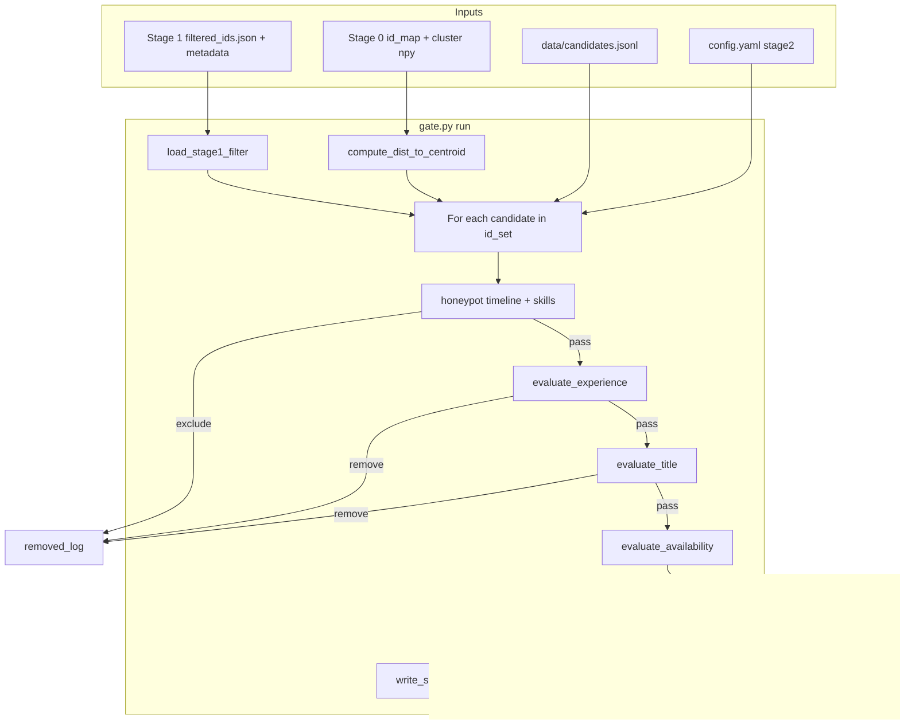

# Stage 2 — Hard Tabular Gate: Implementation Report

This document describes **what** Stage 2 does, **how** it is implemented, and the **code paths** involved. Stage 2 sits between Stage 1 (cluster-based shortlist) and Stage 3 (hybrid retrieval). It applies deterministic, schema-grounded rules to remove honeypots and obvious mismatches while preserving soft signals for downstream ranking.

---

## 1. Purpose and design goals

| Goal | How Stage 2 achieves it |
|------|-------------------------|
| Remove dataset honeypots | Timeline rules (R1–R5) + skill/date rules (H3–H5) |
| Enforce JD experience band (5–9 years, flexible) | Hard remove outside 4–10; flag `near_band` / `in_sweet_spot` inside |
| Catch keyword stuffers | Non-engineering title + high JD keyword density in skills → hard remove |
| Preserve behavioral signals | Availability flags are **never** hard removes — written as columns for Stage 5 |
| Single fast pass | One streaming loop over Stage 1 survivors; no ML inference |
| Reproducibility | All thresholds in `config.yaml` under `stage2:` |

**Input:** ~6,000 candidates from Stage 1 (`filtered_ids.json` + metadata).  
**Output:** ~3,000–4,000 survivors with enriched tabular features (`stage2_gated.parquet`).

**Last observed run** (`artifacts/runtime/stage2/stage2_summary.json`):

- Input: 6,180 → Survivors: 4,014 (removed 2,166) in ~5.8s
- Top removal reasons: `honeypot_skill_years_impossible` (1,783), `exp_out_of_band` (374)

---

## 2. Package layout

```
tracks/instructor/stage2/
├── __init__.py          # Public API: run(), Stage2Result, load_stage2_config
├── run.py               # Hardcoded paths; entry: python tracks/instructor/stage2/run.py
├── config.py            # Stage2Config dataclass + YAML loader
├── gate.py              # Orchestrator — single-pass main loop
├── io.py                # Load Stage 1, stream candidates, write outputs
├── honeypot_rules.py    # Timeline honeypot rules R1–R5
└── checks/
    ├── experience.py    # Check A — experience band
    ├── title.py         # Check B — title family + keyword stuffer
    ├── skills.py        # Skill honeypot rules H3–H5
    └── availability.py  # Check D — soft availability flags
```

Configuration lives in the project root: [`config.yaml`](config.yaml) (`stage2:` block).

---

## 3. End-to-end pipeline



### Evaluation order (strict)

Each candidate is evaluated **in this order**. The first hard failure stops further checks:

1. **Honeypot** (timeline + skills) → hard remove
2. **Experience band** → hard remove if out of band
3. **Title / keyword stuffer** → hard remove if non-eng + high keyword density, or non-eng title
4. **Availability** → soft flags only; candidate always survives if prior checks pass

This ordering ensures honeypots and clear mismatches are removed before title/exp logic runs on corrupted profiles.

---

## 4. Entry point and paths

[`tracks/instructor/stage2/run.py`](tracks/instructor/stage2/run.py) declares all I/O paths (no argparse):

| Constant | Default path | Role |
|----------|--------------|------|
| `STAGE1_PATH` | `artifacts/runtime/stage1/` | Stage 1 filter JSON |
| `STAGE0_PATH` | `artifacts/runtime/stage0/` | FAISS id_map + cluster arrays for `dist_to_centroid` |
| `CANDIDATES_PATH` | `data/candidates.jsonl` | Full candidate records |
| `OUTPUT_DIR` | `artifacts/runtime/stage2/` | Stage 2 outputs |
| `CONFIG_PATH` | `config.yaml` | Thresholds |

```python
result = run(
    stage1_path=STAGE1_PATH,
    artifacts_path=STAGE0_PATH,
    candidates_path=CANDIDATES_PATH,
    output_dir=OUTPUT_DIR,
    config_path=CONFIG_PATH,
)
```

The public API is exported from [`tracks/instructor/stage2/__init__.py`](tracks/instructor/stage2/__init__.py) for future `rank.py` integration.

---

## 5. Configuration (`config.py` + `config.yaml`)

[`tracks/instructor/stage2/config.py`](tracks/instructor/stage2/config.py) loads a frozen `Stage2Config` dataclass from YAML.

### Experience band

| Key | Default | Meaning |
|-----|---------|---------|
| `hard_min` / `hard_max` | 5 / 9 | JD stated band |
| `soft_tolerance` | 1 | Expands **removal** window to [4, 10] |
| `sweet_low` / `sweet_high` | 6 / 8 | Ideal band — flag only, never removes |

### Title / keyword stuffer

| Key | Default | Meaning |
|-----|---------|---------|
| `stuffer_density` | 0.5 | Fraction of skills matching `jd_keywords` that triggers stuffer remove on `non_eng` title |
| `title_families` | core/adjacent/ambiguous/non_eng | Phrase lists for title classification |
| `jd_keywords` | embeddings, faiss, rag, … | Keywords counted in skills array |

### Honeypot

| Key | Default | Meaning |
|-----|---------|---------|
| `expert_zero_threshold` | 1 | Min count of expert skills with 0 months to fire H3 |
| `skill_years_slack` | 0.5 | Allowed gap between max skill-years and total experience |
| `honeypot.duration_overshoot_grace_days` | 30 | Grace for implied role end vs current date |
| `honeypot.experience_overage_tolerance_years` | 2 | Soft timeline_sum tolerance |
| `honeypot.grad_to_work_buffer_years` | 1 | Years after graduation before max experience is plausible |

### Availability (soft)

| Key | Default | Meaning |
|-----|---------|---------|
| `stale_days` | 180 | `last_active_date` older → `stale_profile=True` |
| `min_response_rate` | 0.10 | Below → `low_responder=True` |
| `current_date` | 2026-06-22 | Reference date for all date checks |

### Sanity checks (warnings only)

| Key | Default | Meaning |
|-----|---------|---------|
| `expected_input_count` | 6000 | Warn if Stage 1 count deviates >20% |
| `expected_survivor_min/max` | 2000 / 5000 | Warn if survivor count out of range |

### Not implemented

`enable_isolation_forest: false` is loaded into config but **no code reads it** — statistical outlier backstop from the ranking plan is reserved for a future version.

---

## 6. Orchestrator — `gate.py`

The core loop in [`gate.py`](tracks/instructor/stage2/gate.py):

```python
for record in iter_candidates_by_ids(candidates_path, id_set):
    cid = str(record["candidate_id"])
    meta = metadata.get(cid, {})

    exclude_hp, hp_rules, hp_details = _evaluate_honeypot(record, config)
    if exclude_hp:
        # log to honeypot_log + removed_log; continue

    exp = evaluate_experience(record, config)
    if exp.remove:
        # removed_log: exp_out_of_band; continue

    title = evaluate_title(record, config)
    if title.remove:
        # removed_log: keyword_stuffer | non_eng_title; continue

    avail = evaluate_availability(record, config)

    row = {
        "candidate_id": cid,
        "cluster_id": meta.get("cluster_id"),
        "cluster_rank": meta.get("cluster_rank"),
        "dist_to_centroid": dist_map.get(cid),
        "total_years_exp": exp.total_years_exp,
        "exp_band": exp.exp_band,
        "in_sweet_spot": exp.in_sweet_spot,
        "title_family": title.title_family,
        "skill_kw_density": title.skill_kw_density,
        "title_ambiguous": title.title_ambiguous,
        "stale_profile": avail.stale_profile,
        "low_responder": avail.low_responder,
        "not_open": avail.not_open,
        "honeypot_anomaly_score": None,
    }
    survivors.append(row)
```

`_evaluate_honeypot` merges timeline and skill evaluations:

```python
def _evaluate_honeypot(record, config):
    timeline = evaluate_timeline_honeypot(record, config)
    skills = evaluate_skill_honeypot(record, config)
    exclude = timeline.exclude or skills.exclude
    rules = timeline.rules_fired + skills.rules_fired
    return exclude, rules, {**timeline.details, **skills.details}
```

Removal reason codes for honeypots use the first fired rule: `honeypot_{rule_name}` (e.g. `honeypot_skill_years_impossible`).

After the loop, survivors are assembled into a Polars DataFrame and written via `write_stage2_outputs`. `_validate_counts` emits warnings if input/survivor counts look wrong — it never aborts the run.

---

## 7. I/O — `io.py`

### Loading Stage 1

```python
def load_stage1_filter(stage1_path):
    # Reads filtered_ids.json + filtered_metadata.json
    # metadata[candidate_id] → cluster_id, cluster_rank, anchor_similarity, ...
```

### Streaming candidates efficiently

`iter_candidates_by_ids` scans `candidates.jsonl` once and yields only IDs in the Stage 1 set. It **stops early** when all IDs are found and raises if any ID is missing from the file.

### `dist_to_centroid`

Computes L2 distance from each candidate's UMAP-reduced point to its cluster centroid. Supports two artifact layouts:

- **HDBSCAN (Instructor track):** `stage1/cluster_labels.npy` + `umap_reduced_12d.npy`
- **K-means track:** `runs/k<N>/cluster_labels.npy` + pool `umap_clustering_15d.npy`

If cluster files are missing, all distances are `null` (warning emitted) — Stage 2 still runs.

### Output files

| File | Format | Contents |
|------|--------|----------|
| `stage2_gated.parquet` | Parquet | Survivor table — **primary downstream input for Stage 3** |
| `stage2_gated.json` | JSON | Human-readable mirror of parquet |
| `stage2_filtered_ids.json` | JSON | List of survivor candidate IDs only |
| `stage2_honeypot_log.csv` | CSV | Honeypot removals with rules + JSON details |
| `stage2_removed_log.csv` | CSV | All removals with `reason_code` |
| `stage2_summary.json` | JSON | Counts, removal breakdown, timing |

---

## 8. Check A — Experience band (`checks/experience.py`)

Implements the JD's flexible 5–9 year requirement.

```python
hard_lo = config.hard_min - config.soft_tolerance   # 4
hard_hi = config.hard_max + config.soft_tolerance   # 10

if total < hard_lo or total > hard_hi:
    remove = True   # reason: exp_out_of_band

elif config.hard_min <= total <= config.hard_max:
    exp_band = "in_band"      # 5–9
else:
    exp_band = "near_band"    # 4–4.99 or 9.01–10

in_sweet_spot = config.sweet_low <= total <= config.sweet_high  # 6–8
```

**Experience zones (default config):**

```
Years:  0    4    5    6    8    9    10
        |----|----|----|----|----|----|
             ^         ^----^         ^
          hard_lo   sweet spot    hard_hi

< 4 or > 10     → HARD REMOVE
4 – 4.99       → SURVIVE, exp_band = near_band
5 – 9          → SURVIVE, exp_band = in_band
9.01 – 10      → SURVIVE, exp_band = near_band
6 – 8          → also in_sweet_spot = True
```

Missing `years_of_experience` → treated as 0 → removed as `exp_out_of_band`.

---

## 9. Check B — Title family + keyword stuffer (`checks/title.py`)

Addresses the hackathon trap: *"Marketing Manager with every AI keyword in skills is not a fit."*

### Title classification

Titles are normalized (lowercase, strip punctuation) and matched against phrase lists in `config.yaml` `title_families`. Longest matching phrase wins, with priority order: `core_eng` → `adjacent_eng` → `ambiguous` → `non_eng`.

```python
_FAMILY_PRIORITY = ("core_eng", "adjacent_eng", "ambiguous", "non_eng")
```

### Skill keyword density

```python
def compute_skill_kw_density(record, config):
    matches = sum(1 for skill in skills if any(kw in skill.name.lower() for kw in jd_keywords))
    return matches / len(skills)
```

### Removal logic

| Title family | Action |
|--------------|--------|
| `core_eng`, `adjacent_eng` | Always pass |
| `ambiguous` | Pass; `title_ambiguous=True` (soft flag) |
| `non_eng` + density ≥ `stuffer_density` | **Remove** — `keyword_stuffer` |
| `non_eng` + density < threshold | **Remove** — `non_eng_title` |

Core/adjacent engineering titles never hard-remove regardless of keyword density.

---

## 10. Honeypot rules — timeline (`honeypot_rules.py`)

Deterministic rules aligned with `docs/plans/honeypot_filter_plan.md`.

### Hard rules (single hit → exclude)

| Rule ID | Function | Logic |
|---------|----------|-------|
| R1 `future_start` | `_rule_future_start` | Any role `start_date` > `current_date` |
| R2 `duration_overshoot` | `_rule_duration_overshoot` | `start + duration_months` extends past `current_date + grace_days` |
| R3 `role_overlap` | `_rule_role_overlap` | Sorted roles have overlapping date ranges |

### Soft rules (exclude only if **both** fire)

| Rule ID | Function | Logic |
|---------|----------|-------|
| R4 `timeline_sum` | `_rule_timeline_sum` | Sum of role months / 12 > claimed years + tolerance |
| R5 `graduation_vs_exp` | `_rule_graduation_vs_exp` | Claimed years > years since latest graduation + buffer |

```python
def _should_exclude_timeline(hard_rules, soft_rules):
    if hard_rules:
        return True
    if "timeline_sum" in soft_rules and "graduation_vs_exp" in soft_rules:
        return True
    return False
```

R4 or R5 alone does **not** remove a candidate — both must fire together (unless a hard rule already fired).

---

## 11. Honeypot rules — skills (`checks/skills.py`)

| Rule ID | Logic | Exclude? |
|---------|-------|----------|
| H3 `expert_zero` | ≥ `expert_zero_threshold` skills with `proficiency=expert` and `duration_months=0` | Yes |
| H4 `skill_years_impossible` | Max skill duration (years) > total experience + `skill_years_slack` | Yes |
| H5 `inverted_dates` | Role with `start_date > end_date` | Yes |
| H5 `future_end_date` | Role `end_date` > `current_date` | Yes |

Any fired skill rule → `exclude=True` (unlike timeline soft rules, there is no paired soft logic here).

H4 is the dominant remover in production runs (1,783 of 2,166 removals in the last run) — candidates claiming more years on a single skill than their total career length allows.

---

## 12. Check D — Availability soft flags (`checks/availability.py`)

Implements JD guidance: *"down-weight stale / low-response candidates"* — but **only as flags**, not hard removes.

```python
stale_profile = last_active < (current_date - stale_days)      # default 180 days
low_responder = recruiter_response_rate < min_response_rate    # default 0.10
not_open      = open_to_work_flag is False
```

These columns flow through Stage 3 → Stage 4 → planned Stage 5 LightGBM. Stage 3/4 do not currently use them in scoring.

---

## 13. Output schema (survivor row)

Every survivor in `stage2_gated.parquet` contains:

| Column | Type | Source |
|--------|------|--------|
| `candidate_id` | string | Record |
| `cluster_id` | int | Stage 1 metadata |
| `cluster_rank` | int, nullable | Stage 1 metadata |
| `dist_to_centroid` | float, nullable | Computed from cluster npy |
| `total_years_exp` | float | Profile |
| `exp_band` | string | `in_band` / `near_band` |
| `in_sweet_spot` | bool | 6–8 years |
| `title_family` | string | Title classifier |
| `skill_kw_density` | float | Skills vs JD keywords |
| `title_ambiguous` | bool | Soft flag |
| `stale_profile` | bool | Soft flag |
| `low_responder` | bool | Soft flag |
| `not_open` | bool | Soft flag |
| `honeypot_anomaly_score` | null | Reserved (isolation forest not implemented) |

Stage 3 validates that required Stage 2 columns exist before retrieval.

---

## 14. What Stage 2 does **not** do

These JD signals are **intentionally deferred** to Stage 3+ (semantic retrieval / learned ranker):

- Pure research-only or consulting-only career patterns
- LangChain-only / framework-enthusiast profiles
- CV/speech/robotics without NLP/IR
- Location (Pune/Noida) and notice period
- Optional nice-to-haves (LoRA, LTR, open-source) as positive signals

Stage 2 is a **tabular hard gate**, not a relevance ranker.

---

## 15. How to run and inspect

```bash
python tracks/instructor/stage2/run.py
```

**Prerequisites:**

1. Stage 0 artifacts in `artifacts/runtime/stage0/`
2. Stage 1 filter JSON in `artifacts/runtime/stage1/`
3. `data/candidates.jsonl`

**Inspect outputs:**

```bash
# Summary counts
cat artifacts/runtime/stage2/stage2_summary.json

# Removal reasons
head artifacts/runtime/stage2/stage2_removed_log.csv

# Honeypot detail
head artifacts/runtime/stage2/stage2_honeypot_log.csv
```

**K-means alternate path:** Uncomment the K-means path overrides at the bottom of `run.py` and point `STAGE1_PATH` / `STAGE0_PATH` at the k-means run directory.

---

## 16. Downstream contract

| Consumer | Uses Stage 2 output for |
|----------|-------------------------|
| **Stage 3** | `stage2_gated.parquet` — survivor pool for FAISS IDSelector + passthrough columns |
| **Stage 4** | Inherits all Stage 2 columns via Stage 3 parquet |
| **Stage 5 (planned)** | `in_sweet_spot`, availability flags, `exp_band`, title flags as LightGBM features |

Stage 2 is the last stage that **shrinks** the candidate set via hard rules. Stages 3–4 re-rank survivors; they do not re-read raw `candidates.jsonl` for tabular features.

---

## 17. File reference index

| File | Responsibility |
|------|----------------|
| [`run.py`](tracks/instructor/stage2/run.py) | CLI entry, hardcoded paths |
| [`gate.py`](tracks/instructor/stage2/gate.py) | Main loop, result assembly |
| [`config.py`](tracks/instructor/stage2/config.py) | YAML → `Stage2Config` |
| [`io.py`](tracks/instructor/stage2/io.py) | Load/write artifacts, streaming, centroid distance |
| [`honeypot_rules.py`](tracks/instructor/stage2/honeypot_rules.py) | Timeline rules R1–R5 |
| [`checks/experience.py`](tracks/instructor/stage2/checks/experience.py) | Experience band |
| [`checks/title.py`](tracks/instructor/stage2/checks/title.py) | Title + keyword stuffer |
| [`checks/skills.py`](tracks/instructor/stage2/checks/skills.py) | Skill honeypot H3–H5 |
| [`checks/availability.py`](tracks/instructor/stage2/checks/availability.py) | Soft availability flags |
| [`config.yaml`](config.yaml) | All tunable thresholds |
