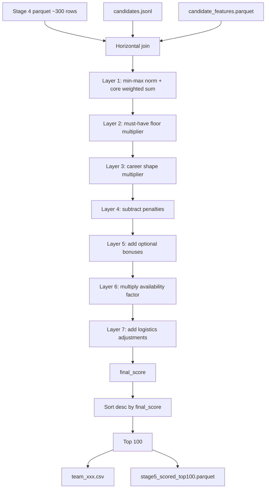

# Stage 5 Scoring Reference

Stage 5 turns ~300 Stage 4 candidates into a **top-100 submission** (`team_xxx.csv`) with `rank`, `score` (`final_score`), and `reasoning`. Scoring is a **7-layer composite** implemented in `tracks/instructor/stage5/layers.py`.

---

## 1. Inputs

Stage 5 reads three sources and merges them horizontally per candidate.

### A. Stage 4 parquet (`stage4_reranked.parquet`) — ~300 rows

**Required for scoring** (from earlier pipeline stages):

| Column | Source | Used for |
|--------|--------|----------|
| `candidate_id` | — | Identity |
| `cross_encoder_score` | Stage 4 | Core layer (45%) |
| `fused_score` | Stage 3 | Core layer (25%) |
| `q1_score` | Stage 3 | Core layer (20%) + must-have semantic coverage |
| `q2_score` | Stage 3 | Core layer (10%) |
| `q3_neg_sim` | Stage 3 | Residual anti-pattern penalty only |
| `exp_band` | Stage 2 | Career shape + near-band penalty |
| `in_sweet_spot` | Stage 2 | Career shape bonus |
| `product_company_fraction` | Stage 2 | Career shape multiplier |
| `career_type` | Stage 2 | Consulting-heavy penalty |
| `stale_coding` | Stage 2 | Career shape dampener |
| `has_any_production_role` | Stage 2 | Career shape dampener |
| `short_hop_count` | Stage 2 | Title-chasing penalty |
| `title_ambiguous` | Stage 2 | Ambiguity penalty |
| `external_validation_score` | Stage 2 | Closed-source penalty + OSS bonus gate |
| `has_github` | Stage 2 | Closed-source penalty + OSS bonus gate |
| `location_tier` | Stage 2 | Logistics adjustment |
| `notice_period_days` | Stage 2 | Logistics adjustment |

Other Stage 3/4 columns (e.g. `stage3_rank`, `stage4_rank`, `skill_score`) pass through to output parquet but are **not used in the score formula**.

### B. Candidates JSONL (`data/candidates.jsonl`) — joined per candidate

| Field | Path in record | Used for |
|-------|----------------|----------|
| `skills` | top-level | Must-have keyword coverage, optional bonuses |
| `skill_assessment_scores` | `redrob_signals` | Must-have assessment coverage |
| `last_active_date` | `redrob_signals` | Recency factor |
| `open_to_work_flag` | `redrob_signals` | Open + market factors |
| `applications_submitted_30d` | `redrob_signals` | Market activity factor |
| `recruiter_response_rate` | `redrob_signals` | Response factor |
| `avg_response_time_hours` | `redrob_signals` | Speed factor |
| `interview_completion_rate` | `redrob_signals` | Interview factor |
| `offer_acceptance_rate` | `redrob_signals` | Offer factor |
| `preferred_work_mode` | `redrob_signals` | Work-mode logistics |
| `profile.headline` | `profile` | Fallback for reasoning text |

### C. Candidate features parquet (optional)

| Column | Used for |
|--------|----------|
| `technical_summary_sentence` | Submission **reasoning** only — not in score math |

### D. Config (`config.yaml` → `stage5` block)

All weights, keyword lists, thresholds, and caps. Key defaults:

- **Core weights:** cross 0.45, fused 0.25, q1 0.20, q2 0.10
- **Must-have floor min:** 0.4
- **Top N output:** 100
- **Current date:** used for profile recency (`2026-06-22`)

---

## 2. Scoring pipeline (7 layers)

Each candidate is scored independently. Intermediate columns are written to `stage5_scored.parquet`.

```
core → core_floored → shaped → penalized → bonused → availability_adj → final_score
```

---

### Layer 1 — Normalize + core relevance

**Min-max normalize** each score column across the full Stage 4 cohort:

```
norm(x) = (x - min) / (max - min)     # 0.5 if all values equal
```

Applied to: `cross_encoder_score`, `fused_score`, `q1_score`, `q2_score`, `q3_neg_sim`

**Core score** (weighted sum — weights must sum to 1.0):

```
core = 0.45 × ce_norm
     + 0.25 × fused_norm
     + 0.20 × q1_norm
     + 0.10 × q2_norm
```

Note: `q3_neg_sim` is normalized but **not** in `core`; it only feeds the Layer 4 penalty.

---

### Layer 2 — Must-have floor multiplier

Measures how well the candidate covers JD must-have skill categories (`retrieval`, `vector_db`, `eval`, `python`).

**Keyword coverage** — fraction of must-have categories matched by skill names:

```
keyword_ratio = (# categories with at least one keyword hit) / (# categories)
```

**Assessment coverage** — average assessment score (0–100 scale) for skills in must-have categories; falls back to `q1_norm` when assessments are missing.

**Combined coverage:**

```
combined_coverage = max(keyword_ratio, q1_norm, assessment_cov)
```

**Floor multiplier** (soft floor, not a hard cut):

```
must_have_floor_multiplier = 0.4 + 0.6 × combined_coverage
core_floored = core × must_have_floor_multiplier
```

Thin coverage (e.g. 0% must-haves) scales core down to 40% of its value.

---

### Layer 3 — Career shape multiplier

```
shape_mult = 0.5 + 0.5 × product_company_fraction

if in_sweet_spot:             shape_mult ×= 1.08
elif exp_band == near_band:   shape_mult ×= 0.95

if stale_coding:              shape_mult ×= 0.85
if not has_any_production_role: shape_mult ×= 0.80

shaped = core_floored × shape_mult
```

Rewards product-company careers, JD sweet-spot experience, and production ML history; dampens stale coding and non-production profiles.

---

### Layer 4 — Penalties (subtracted)

```
title_chasing_penalty = min(0.15, short_hop_count × 0.03)

q3_residual_penalty = 0.10 × q3_norm

closed_source_penalty = 0.05  if external_validation < 0.1 AND not has_github
                        else 0

ambiguity_penalty = 0.02 × title_ambiguous + 0.02 × (exp_band == near_band)

consulting_resid_penalty = 0.04  if career_type == consulting_heavy
                           else 0

total_penalty = sum of above five

penalized = shaped − total_penalty
```

---

### Layer 5 — Optional skill bonuses (added)

Counts how many **optional bonus categories** are matched in skill names (`fine_tuning`, `learning_to_rank`, `hr_tech`, `distributed_systems`, `oss`).

OSS category requires both GitHub and `external_validation_score ≥ 0.1`.

```
optional_bonus = min(0.08, category_count × 0.02)

bonused = penalized + optional_bonus
```

---

### Layer 6 — Availability multiplier

Seven behavioral factors are multiplied, then clamped to `[0.5, 1.0]`:

| Factor | Formula (missing → 1.0) |
|--------|-------------------------|
| **Response** | `clamp(recruiter_response_rate / 0.5, 0.6, 1.0)` |
| **Speed** | `clamp(1 − max(0, avg_response_hours − 24) / 168, 0.7, 1.0)` |
| **Recency** | `1.0` if inactive ≤ 30 days; else linear decay to floor 0.6 over 180 days |
| **Open** | `1.0` if open to work; else `0.85` |
| **Interview** | `clamp(interview_completion_rate, 0.7, 1.0)` |
| **Offer** | `clamp(offer_acceptance_rate, 0.8, 1.0)` |
| **Market** | `1.0` if applications_30d > 0 or open to work; else `0.95` |

```
availability_multiplier = clamp(resp × speed × recency × open × interview × offer × market, 0.5, 1.0)

availability_adj = bonused × availability_multiplier
```

---

### Layer 7 — Logistics adjustment (additive)

```
location_adj:
  preferred      → +0.03
  acceptable     → +0.01
  outside_india  → −0.10
  unknown/other  →  0

workmode_adj:
  hybrid/flexible/onsite → +0.01
  remote                 → −0.02

notice_adj (if notice_period_days > 30):
  −min(0.08, (notice_days − 30) / 90 × 0.05)

logistics_adjustment = location_adj + workmode_adj + notice_adj
```

---

## 3. Final formula

```
final_score = availability_adj + logistics_adjustment
```

Expanded:

```
final_score = (penalized + optional_bonus) × availability_multiplier
            + location_adj + workmode_adj + notice_adj
```

Where:

```
penalized = (core × must_have_floor_multiplier × shape_mult) − total_penalty
core      = 0.45·ce_norm + 0.25·fused_norm + 0.20·q1_norm + 0.10·q2_norm
```

There is **no final sigmoid or 0–1 clamp** on `final_score` — it is a raw composite float (typical range in practice is roughly 0.4–0.7 for top candidates).

---

## 4. Outcome / outputs

After scoring all ~300 candidates:

1. **Sort** by `final_score` descending (tie-break: `candidate_id` descending)
2. **Take top 100** (`top_n` from config)
3. **Assign rank** 1–100
4. **Write outputs:**

| File | Contents |
|------|----------|
| `team_xxx.csv` | Submission: `candidate_id`, `rank`, `score` (rounded `final_score`), `reasoning` |
| `stage5_scored.parquet` | All ~300 candidates with every intermediate column |
| `stage5_scored_top100.parquet` | Top 100 with full score decomposition |
| `stage5_summary.json` | Run stats: input/output counts, score min/max/mean |

**Reasoning string** (for CSV, max 500 chars) is built from:

- `technical_summary_sentence` or headline as anchor
- Strength clause (cross-encoder, Q1, sweet spot, product mix)
- Top concern (thin must-haves, stale coding, availability, location, notice, etc.)

---

## 5. Flow diagram



---

## 6. Where to inspect a real breakdown

Every intermediate value for a ranked candidate is in `team_results.json` (from `build_team_view.py`) under:

```json
"candidates[i].pipeline.stage5_scoring": {
  "final_score", "ce_norm", "core", "shape_mult", "total_penalty",
  "availability_multiplier", "logistics_adjustment", ...
}
```

Or directly in `artifacts/runtime/stage5/stage5_scored_top100.parquet`.

---

## 7. Implementation notes

- **Source code:** `tracks/instructor/stage5/` (`score.py`, `layers.py`, `must_have.py`, `signals.py`, `io.py`, `reasoning.py`)
- **Config:** `config.yaml` → `stage5` block
- **`enable_popularity_tiebreak`** exists in config but is **not implemented** in the scoring code — tie-breaking is currently `final_score` then `candidate_id` only.
