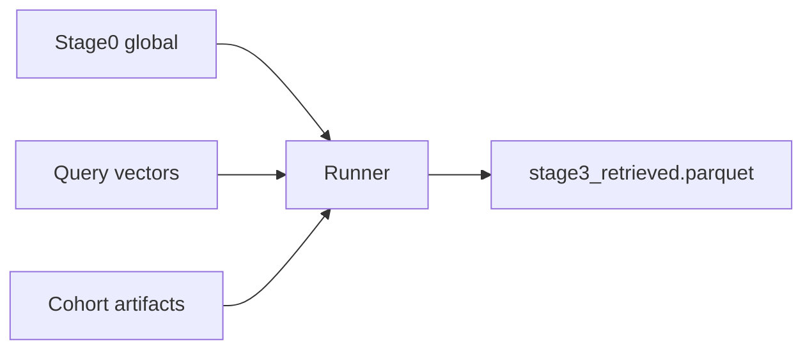

# Stage 3 Integration Guide

Diary and porting reference for moving the skill-track Stage 3 design from
`experiments/stage3/` into production `tracks/instructor/stage3/`.

Based on: [`docs/stage3_new_plan.md`](../docs/stage3_new_plan.md) (BM25 L4 → skill L3).

---

## 1. Architecture summary

Stage 3 is split into four compute tiers:

| Tier | What | Test location | Production target |
|------|------|---------------|-------------------|
| **1 — Global** | 100K dense vectors, FAISS index, id_map, global `skill_weighted_score` | External: `artifacts/runtime/stage0/` | Stage 0 + future Blocks A–D precompute |
| **2 — JD queries** | ONNX encode Q1/Q2/Q3 → 2304-d vectors | `precompute/artifacts/query_vectors/` | `artifacts/precomputed/stage3_query_vectors/` |
| **3 — Cohort** | Stage 2 survivors, skill features slice, survivor FAISS indices | `precompute/artifacts/cohort/` | `artifacts/runtime/stage2/stage2_gated.parquet` + filtered features |
| **4 — Per-run** | FAISS L1/L2, L3 top-k, RRF, Q3 penalty, fused score, adaptive cut | `runner/run.py` | `tracks/instructor/stage3/run.py` |



**Validated in test:** runner ~1.4s vs ~8.7s monolithic (ONNX moved to precompute only).

---

## 2. Test folder layout (reference)

```
experiments/stage3/
  precompute/
    config.yaml          # q texts, weights, cohort source, skill stub keys
    run.py               # one-shot: cohort + query vectors + manifest
    artifacts/           # all Tier 2+3 outputs
  runner/
    config.yaml          # fusion tunables, k values, output_dir
    run.py               # loads precompute manifest, no ONNX
    validate_output.py
    outputs/
  shared/                # library ported to production
```

**Commands:**

```bash
python experiments/stage3/precompute/run.py          # or --force to rebuild
python experiments/stage3/runner/run.py
python experiments/stage3/runner/validate_output.py
```

---

## 3. Artifact contracts

### `precompute/artifacts/manifest.json`

```json
{
  "version": 1,
  "created_at": "2026-06-26T...",
  "query_config_hash": "sha256...",
  "cohort_config_hash": "sha256...",
  "cohort_row_count": 500,
  "paths": {
    "query_vectors_dir": "experiments/stage3/precompute/artifacts/query_vectors",
    "cohort_stage2": "experiments/stage3/precompute/artifacts/cohort/stage2_gated.parquet",
    "cohort_features": "experiments/stage3/precompute/artifacts/cohort/candidate_features.parquet",
    "survivor_row_indices": "experiments/stage3/precompute/artifacts/cohort/survivor_row_indices.npy",
    "stage0_pointer": "experiments/stage3/precompute/artifacts/stage0_pointer.json"
  }
}
```

**Invalidation:**
- `query_config_hash` changes → re-run precompute (q texts or subspace weights)
- `cohort_config_hash` changes → re-run precompute (stage2 source, sample, skill stub)

### Query vectors

- Files: `q1_vec.npy`, `q2_vec.npy`, `q3_vec.npy`
- Shape: `(2304,)` float32 each
- Encoding: block L2-normalize per subspace, then multiply by subspace weights; concatenate `[retrieval|infra|eval]`
- Instructions: must match [`tracks/instructor/core/config.py`](../tracks/instructor/core/config.py) `RETRIEVAL_INSTRUCTION`, etc. — **not** the alternate strings in `stage3_new_plan.md`

### Cohort parquet

| File | Columns |
|------|---------|
| `stage2_gated.parquet` | All Stage 2 passthrough columns |
| `candidate_features.parquet` | `candidate_id`, `skill_weighted_score` |

### Runner output

Same contract as `docs/stage3_new_plan.md` output section:
- `skill_score`, `skill_rank` (not `bm25_*`)
- `q1_score`, `q2_score`, `q3_neg_sim`, `rrf_score`, `fused_score`, `stage3_rank`
- Row count in `[min_k, max_k]`

---

## 4. File porting checklist

| Test module | Production target | Notes |
|-------------|-------------------|-------|
| `shared/dense_retrieve.py` | `tracks/instructor/stage3/dense_retrieve.py` | Unchanged |
| `shared/skill_retrieve.py` | Replace `sparse_retrieve.py` | New L3 track |
| `shared/fusion.py` | `fusion.py` | `bm25_rank` → `skill_rank` |
| `shared/query_encode.py` | `query_encode.py` | Precompute-only in prod |
| `shared/io_stage0.py` | `io.py` (partial) | Drop BM25 load |
| `shared/io_runner.py` | `io.py` (partial) | Write outputs |
| `shared/retrieve.py` | `retrieve.py` | Load `.npy` query vecs in prod runner |
| `precompute/cohort.py` | New `stage3_precompute.py` or stage0 extension | Real skill scores from Blocks A–D |
| `precompute/manifest.py` | Shared manifest helper | |
| `shared/cpu_embedder.py` | Delete in prod; use `tracks/instructor/core/onnx_embedder.py` | CUDA in prod |

**Remove from production:** `sparse_retrieve.py`, `jargon.py` (if only used for BM25), `rank_bm25` dependency, `q4_tokens` config.

---

## 5. Config migration (root `config.yaml`)

Split current `stage3:` block into:

**`stage3_precompute:`** (or run once offline)
- `q1_text`, `q2_text`, `q3_text`
- `subspace_weights_q1/q2/q3`
- `stage2_source_path`, `candidate_features_path` (global skill parquet)
- `artifacts_dir` for query vectors + manifest

**`stage3:`** (runner — keep name for pipeline compatibility)
- `precomputed_manifest`
- `per_query_k_dense`, `per_query_k_skill`, `miss_penalty_*`
- `rrf_k`, `alpha_neg`, `beta_cluster`, `z_threshold`, `min_k`, `max_k`

---

## 6. Pipeline wiring

In [`tracks/instructor/run_pipeline.py`](../tracks/instructor/run_pipeline.py):

1. After Stage 2 completes → run Stage 3 precompute if manifest missing or hash stale
2. Run Stage 3 runner (current `stage3/run.py` entry)
3. Stage 4 reads `artifacts/runtime/stage3/stage3_retrieved.parquet`

Precompute skip logic (from test): compare `query_config_hash` + `cohort_config_hash` in manifest vs current config; skip ONNX if match.

---

## 7. Known gaps

| Gap | Test behavior | Production fix |
|-----|---------------|----------------|
| `skill_weighted_score` | Stub from `candidates.jsonl` skills | Implement Blocks A–D precompute globally |
| ONNX device | CPU embedder in `shared/cpu_embedder.py` | Production CUDA embedder |
| Cohort sampling | 500-row sample for speed | Full stage2 (~4K) with prod `min_k`/`max_k` 300–600 |
| Stage 0 path | `stage0_pointer.json` | Use `RUNTIME_STAGE0_DIR` constant |

---

## 8. Operator validation

After integration, run checklist from `docs/stage3_new_plan.md`:

1. Output row count 300–600 (prod) or configured bounds (test)
2. Top 10 look like senior ML/IR engineers
3. At least one top-20 with low dense + high `skill_score` (L3 rescue)
4. At least one top-20 with low `skill_score` + high dense (L1/L2 rescue)
5. High `q3_neg_sim` correlates with lower `fused_score`
6. `fused_score` consistent with `stage3_rank`
7. No duplicate `candidate_id`
8. Spot-check IDs in `candidates.jsonl`
9. `skill_weighted_score` non-null for L3 top-k candidates

---

## 9. Future optimization

**Retrieval cache** (optional): persist `l1.parquet`, `l2.parquet`, `l3.parquet` in precompute for fusion-only sweeps. Invalidates when `per_query_k_*` changes.

---

## 10. Implementation diary

| Date | Change |
|------|--------|
| 2026-06-26 | Initial `experiments/stage3/` monolithic skill-track implementation |
| 2026-06-26 | Split into `precompute/` + `runner/` + `shared/`; runner 1.4s vs 8.7s monolithic on 500-sample CPU |

**Regression baseline (500-sample test config):** union=312, output=150, triple_overlap=43, top candidate `CAND_0071974`.
