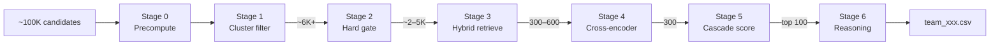

# RedRob Pipeline Guide — Overview

This handbook documents the **INSTRUCTOR Track A** candidate-ranking pipeline: a multi-stage funnel that reduces ~100,000 profiles to a validated top-100 CSV with three-sentence recruiter reasoning per candidate.

For planning artifacts and historical design notes, see [`docs/`](../docs/). This `guide/` folder is the **consolidated operator + deep-dive reference**, with implementation truth taken from code under [`tracks/instructor/`](../tracks/instructor/).

---

## Introduction

### The challenge

RedRob ranks a large anonymized candidate pool against a **senior AI engineering JD** focused on production retrieval, ranking, vector search, and evaluation infrastructure. The system must:

1. **Scale** — process ~100K candidates without scoring every profile with an expensive cross-encoder.
2. **Respect hard disqualifiers** — experience band, consulting-only trajectories, honeypot fraud, shallow-AI-only profiles.
3. **Combine semantic and tabular signals** — embeddings, skills, career shape, availability, logistics.
4. **Produce auditable output** — ranked CSV with monotonic scores and human-readable reasoning.

### Funnel architecture



**Stage 0** runs offline once per pool. **Stages 1–5** run via [`tracks/instructor/run_pipeline.py`](../tracks/instructor/run_pipeline.py). **Stage 6** is a separate post-pipeline step (not wired into `pipeline.py`).

---

## Novel approach (system-level)

| Naive baseline | RedRob design | Why it matters |
|----------------|---------------|----------------|
| Single 768-d embedding for everything | **3×768 block-weighted INSTRUCTOR** (2304-d) with instruction-faceted retrieval / infra / eval subspaces | Same model encodes different JD facets without training separate encoders |
| Top-K dense on 100K | **UMAP + HDBSCAN cluster filter** anchored to JD query vector | Cuts pool cheaply while preserving semantic neighborhoods |
| One retrieval score | **Triple-list RRF** (Q1 dense + Q2 dense + skill track) with **Q3 anti-pattern penalty** | Recalls diverse evidence; explicitly down-ranks anti-JD profiles |
| Cross-encoder on full pool | **Bi-encoder recall → CE precision** on 300–600 survivors | MS MARCO MiniLM only where it matters |
| Linear weighted sum of features | **Distribution-aware 4-tier cascade** scaled to Tier-1 variance | Tabular signals move ranks without overpowering retrieval |
| LLM-generated reasoning | **Template-first builder + CPU paraphraser** | Auditable, JD-grounded sentences; ranks frozen from Stage 5 |

The pipeline is deliberately **modular**: each stage solves one bottleneck (scale, disqualification, recall, precision, composite ranking, narrative).

---

## Technology stack

| Layer | Technology | Role |
|-------|------------|------|
| Language | Python 3.11+ | All pipeline code |
| Data frames | Polars, PyArrow | Stage I/O, scoring |
| Embeddings | INSTRUCTOR-large via ONNX (`onnxruntime-gpu`) | Stage 0 encode, FAISS index |
| Vector search | FAISS `IndexFlatIP` | Stage 1 anchor sim, Stage 3 dense lists |
| Clustering | UMAP, HDBSCAN | Stage 1 filter |
| Reranking | MS MARCO MiniLM cross-encoder (ONNX CPU) | Stage 4 |
| Paraphrase | T5 `humarin/chatgpt_paraphraser_on_T5_base` (ORT encoder + PyTorch CPU decoder) | Stage 6 |
| Config | YAML (`config.yaml`) | Per-stage parameters |
| ML utilities | NumPy, scikit-learn (clustering), Transformers | Throughout |

### GPU vs CPU split

| Phase | Hardware | Reason |
|-------|----------|--------|
| Stage 0 vector precompute | **GPU** (`onnxruntime-gpu`) | 3 encode passes × N candidates |
| Stages 1–3 | CPU (mostly) | FAISS, Polars, clustering |
| Stage 4 cross-encoder | **CPU** ONNX | Batched pairs on ~300–600 rows |
| Stage 6 paraphraser | **CPU** only | ORT encoder + PyTorch decoder; no CUDA in Stage 6 path |

Do **not** install `onnxruntime` (CPU) alongside `onnxruntime-gpu` in the same environment used for Stage 0.

---

## Requirements

### Python packages

Install from repo root:

```powershell
python -m venv env
.\env\Scripts\activate
pip install -r requirements.txt
```

Key dependencies: `onnxruntime-gpu`, `transformers`, `faiss-cpu`, `polars`, `pyarrow`, `umap-learn`, `hdbscan`, `torch`, `onnx`, `psutil`, `pyyaml`.

For Stage 6 CPU paraphrase on machines without GPU for Stage 0, also ensure `onnxruntime` (CPU) is available for the paraphraser encoder path.

### Data and artifacts

| Item | Path | Notes |
|------|------|-------|
| Candidate pool | `data/candidates.jsonl` | ~100K profiles; may be gitignored locally |
| Config | `config.yaml` | Stage blocks `stage0_skill` … `stage6` |
| INSTRUCTOR ONNX | `onnx/models/` | From `onnx/export_to_onnx.py` |
| Cross-encoder ONNX | `models/cross_encoder/` | From `run_cross_encoder.py` |
| Paraphraser ONNX | `models/paraphraser/` | From `run_paraphraser_export.py` |
| Runtime outputs | `artifacts/runtime/stage{N}/` | Generated per run |

Disk: full pool precompute can require **tens of GB** (vectors, FAISS, parquet). Stage 6 with 11 workers holds ~700 MB per paraphrase session.

---

## Setup guide

### 1. Clone and virtual environment

```powershell
cd redrob
python -m venv env
.\env\Scripts\activate
pip install -r requirements.txt
```

### 2. Export INSTRUCTOR ONNX (once per machine)

```powershell
cd onnx
pip install -r requirements.txt
python export_to_onnx.py
```

Outputs: `onnx/models/instructor-large-encoder.onnx`, tokenizer, dense projection weights.

### 3. Place candidate data

Ensure `data/candidates.jsonl` exists (or point Stage 0 `run.py` at a smaller dev file).

### 4. Edit `config.yaml`

Set `stage5.team_id` and `stage6.team_id` to your registered participant ID (e.g. `team_xxx`).

### 5. Offline precompute (once per pool)

See [stage0-precompute.md](stage0-precompute.md) for full detail.

```powershell
python tracks/instructor/stage0/run.py
python tracks/instructor/stage0/run_cluster.py
python tracks/instructor/stage0/run_cross_encoder.py
python tracks/instructor/stage0/run_paraphraser_export.py
python tracks/instructor/stage0/run_reasoning_raw_precompute.py
```

---

## Running instructions

### Full ranking (Stages 1–5)

```powershell
python tracks/instructor/run_pipeline.py
```

Or stage-by-stage:

```powershell
python tracks/instructor/stage1/run_filter.py
python tracks/instructor/stage2/run.py
python tracks/instructor/stage3/run.py
python tracks/instructor/stage4/run.py
python tracks/instructor/stage5/run.py
```

### Final submission with reasoning (Stage 6)

**After Stage 5** produces `artifacts/runtime/stage5/stage5_scored_top100.parquet`:

```powershell
python tracks/instructor/stage6/run.py
```

### Outputs

| Stage | Primary output |
|-------|----------------|
| 5 | `artifacts/runtime/stage5/team_xxx.csv` (scores + template reasoning) |
| 6 | `artifacts/runtime/stage6/team_xxx.csv` (**final submission** with 3-sentence reasoning) |

Stage 6 also writes `stage6_reasoning.parquet` (audit) and `stage6_summary.json` (timing, worker count).

### Validate submission

```powershell
python tools/validate_submission.py artifacts/runtime/stage6/team_xxx.csv
```

Checks: 100 rows, `CAND_XXXXXXX` IDs, ranks 1–100, non-increasing scores, tie-break by `candidate_id`.

---

## Config map

| `config.yaml` block | Used by |
|---------------------|---------|
| `stage0_skill` | Stage 0 skill scoring (`skill_precompute.py`) |
| `stage2` | Stage 2 hard gate |
| `stage3` | Stage 0 query precompute + Stage 3 retrieval |
| `stage4` | Stage 0 CE export + Stage 4 rerank |
| `stage5` | Stage 5 cascade scoring + Stage 4 tier-2 enrichment |
| `stage6` | Stage 0 paraphraser export + Stage 6 reasoning |

Stage 1 constants (UMAP dims, HDBSCAN, floor=100) live in [`tracks/instructor/core/config.py`](../tracks/instructor/core/config.py), not YAML.

---

## Stage index

| Doc | Stage | One-line summary |
|-----|-------|------------------|
| [stage0-precompute.md](stage0-precompute.md) | 0 | Vectors, FAISS, skills, query vectors, model exports |
| [stage1-cluster-filter.md](stage1-cluster-filter.md) | 1 | UMAP/HDBSCAN + JD-anchor cluster filter |
| [stage2-hard-gate.md](stage2-hard-gate.md) | 2 | Deterministic hard gate + honeypot |
| [stage3-hybrid-retrieval.md](stage3-hybrid-retrieval.md) | 3 | RRF fusion + Q3 penalty + adaptive cut |
| [stage4-cross-encoder.md](stage4-cross-encoder.md) | 4 | ONNX cross-encoder rerank to 300 |
| [stage5-cascade-scoring.md](stage5-cascade-scoring.md) | 5 | Distribution-aware 4-tier cascade → top 100 |
| [stage6-reasoning-builder.md](stage6-reasoning-builder.md) | 6 | Template reasoning + CPU ONNX paraphrase |

---

## Related documentation

- Operator quick-start: [`README.md`](../README.md) (note: README still describes Stage 5 as final CSV; use Stage 6 for submission)
- Repo layout: [`docs/REPO_LAYOUT.md`](../docs/REPO_LAYOUT.md)
- Historical plans: [`docs/`](../docs/) (may diverge from current code — **code wins**)
