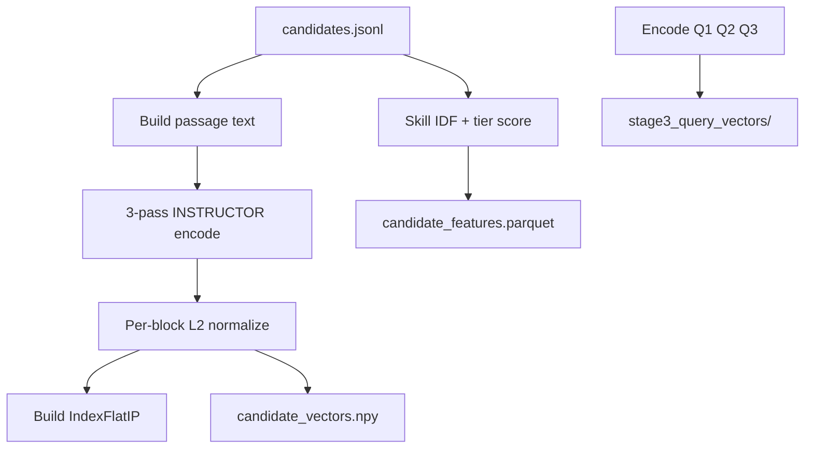

# Stage 0 — Offline Precompute

[← Overview](overview.md) | Next: [Stage 1 — Cluster Filter](stage1-cluster-filter.md)

---

## 1. Purpose and position in the funnel

**Stage 0** builds all **pool-wide artifacts** that downstream stages read but do not rebuild at runtime. Nothing in Stage 0 ranks candidates for submission; it materializes embeddings, indices, skill scores, query vectors, and optional model exports.

| Aspect | Value |
|--------|-------|
| Input pool | ~100,000 candidates (`data/candidates.jsonl`) |
| Output | Artifacts under `artifacts/runtime/stage0/`, `models/`, `artifacts/precomputed/` |
| When to rerun | Candidate pool changes, encoding logic changes, `stage3:` query text changes, model export changes |

---

## 2. Novel approach and justification

### vs naive baseline

| Naive | Stage 0 design | Justification |
|-------|----------------|---------------|
| Single 768-d sentence embedding | **3-pass INSTRUCTOR** → 2304-d block-normalized vector | JD cares about retrieval, infra, and eval facets; instruction masking separates subspaces without three models |
| BM25 / keyword skill match | **Tier-weighted skill score** with IDF rarity and depth | Structured skill JSON is richer than bag-of-words; tiers encode JD priority (vector DB > generic ML) |
| Encode queries at Stage 3 runtime | **Precomputed Q1/Q2/Q3 vectors** | Stage 3 hot path stays FAISS + Polars; no ONNX in retrieval loop |
| One monolithic precompute script | **Sub-scripts** for cluster, CE export, paraphraser, reasoning raw | Independent invalidation: change paraphraser without re-encoding 100K vectors |

---

## 3. Prerequisites and entry points

### Prerequisites

1. **INSTRUCTOR ONNX export** — `onnx/export_to_onnx.py` → `onnx/models/`
2. **Candidate pool** on disk
3. **GPU** with `onnxruntime-gpu` for vector precompute (`run.py`)

### CLI entry points

| Command | Module | Output |
|---------|--------|--------|
| `python tracks/instructor/stage0/run.py` | `precompute.py`, `skill_precompute.py`, `stage3_query_precompute.py` | Vectors, FAISS, features, query `.npy` |
| `python tracks/instructor/stage0/run_cluster.py` | `cluster_precompute.py` | UMAP + HDBSCAN → `artifacts/runtime/stage1/` |
| `python tracks/instructor/stage0/run_cross_encoder.py` | `cross_encoder_export.py` | `models/cross_encoder/` |
| `python tracks/instructor/stage0/run_paraphraser_export.py` | `paraphraser_export.py` | `models/paraphraser/` |
| `python tracks/instructor/stage0/run_reasoning_raw_precompute.py` | `reasoning_raw_precompute.py` | `artifacts/precomputed/reasoning_raw.parquet` |

---

## 4. Inputs and outputs

### Inputs

- `data/candidates.jsonl` — `candidate_id`, `profile`, `career_history`, `skills`, `redrob_signals`
- `config.yaml` — `stage0_skill`, `stage3` (for query vectors)
- INSTRUCTOR ONNX weights

### Outputs (`artifacts/runtime/stage0/`)

| Artifact | Shape / schema | Consumer |
|----------|----------------|----------|
| `candidate_vectors.npy` | `(N, 2304)` float32 | Stage 1, 3 |
| `candidate_index.faiss` | `IndexFlatIP`, dim 2304 | Stage 1, 3 |
| `id_map.json` | FAISS row → `candidate_id` | Stage 1, 3 |
| `jd_query_vec.npy` | `(2304,)` | Stage 1 cluster ranking |
| `candidate_features.parquet` | `candidate_id`, `skill_weighted_score` | Stage 3 L3 |
| `stage3_query_vectors/q{1,2,3}_vec.npy` | each `(2304,)` | Stage 3 |
| `stage3_query_manifest.json` | config hash | invalidation |
| `skill_idf.json` | optional debug | — |

Cluster artifacts land in `artifacts/runtime/stage1/` (`cluster_labels.npy`, `umap_reduced_12d.npy`).

---

## 5. Dependencies

- **Python:** `numpy`, `faiss-cpu`, `polars`, `onnxruntime-gpu`, `transformers`, `torch`, `pyyaml`
- **Prior stages:** none
- **Hardware:** CUDA GPU strongly recommended for `run.py`

---

## 6. Algorithm (conceptual)

---

## 7. Mathematics (deep)

### 7.1 Three-pass INSTRUCTOR encoding

For each candidate passage \(p\), the embedder runs three instruction-conditioned encodings:

\[
\mathbf{b}_r = \text{Enc}(\text{instr}_\text{retrieval}, p) \in \mathbb{R}^{768}
\]
\[
\mathbf{b}_i = \text{Enc}(\text{instr}_\text{infra}, p) \in \mathbb{R}^{768}
\]
\[
\mathbf{b}_e = \text{Enc}(\text{instr}_\text{eval}, p) \in \mathbb{R}^{768}
\]

**Per-block L2 normalization** (via FAISS `normalize_L2` on each 768-d slice):

\[
\hat{\mathbf{b}}_k = \frac{\mathbf{b}_k}{\|\mathbf{b}_k\|_2}, \quad k \in \{r,i,e\}
\]

**Candidate vector:**

\[
\mathbf{v} = \text{concat}(\hat{\mathbf{b}}_r, \hat{\mathbf{b}}_i, \hat{\mathbf{b}}_e) \in \mathbb{R}^{2304}
\]

Implementation: [`tracks/instructor/core/encode.py`](../tracks/instructor/core/encode.py) — `encode_candidates()`, `normalize_by_block()`.

**Why block-normalize?** Inner product on concatenated blocks would otherwise let high-norm blocks dominate. Per-block normalization makes each subspace contribute comparably before weighting.

### 7.2 JD anchor query vector

JD text is encoded per block with weights \((w_r, w_i, w_e) = (0.5, 0.3, 0.2)\):

\[
\mathbf{q}_\text{JD} = \text{concat}\left(w_r \hat{\mathbf{j}}_r,\; w_i \hat{\mathbf{j}}_i,\; w_e \hat{\mathbf{j}}_e\right)
\]

Used in Stage 1 for anchor similarity \(s_i = \mathbf{v}_i^\top \mathbf{q}_\text{JD}\).

Constants: [`tracks/instructor/core/config.py`](../tracks/instructor/core/config.py) — `QUERY_WEIGHTS`, `JD_*_TEXT`.

### 7.3 FAISS IndexFlatIP

Vectors are indexed with **inner product** on L2-normalized 2304-d vectors. For unit-norm blocks concatenated without global re-normalization, IP approximates a **weighted cosine** over subspaces.

Stage 3 restricts search to Stage 2 survivor IDs via `IDSelectorBatch`.

### 7.4 Skill weighted score

For each skill \(s\) on a candidate:

**Relevance** \(r_s\): tier lookup from `stage0_skill` keyword tiers (T1=1.0 … T5=0.05). Zero relevance skills are skipped.

**Depth** \(d_s\) from proficiency and duration ([`skill_depth.py`](../tracks/instructor/stage0/skill_depth.py)):

\[
\text{years} = \frac{\text{duration\_months}}{12}
\]
\[
\text{duration\_part} = \min\left(\frac{\log(1 + \text{years})}{\log(11)}, 1\right)
\]
\[
d_s = 0.6 \cdot \text{duration\_part} + 0.4 \cdot \text{proficiency\_score}
\]

Proficiency map: beginner=0.3, intermediate=0.6, advanced=0.85, expert=1.0.

**Rarity** (IDF over pool):

\[
\text{IDF}(s) = \log\frac{N}{1 + \text{df}(s)}
\]

**Per-skill contribution:**

\[
c_s = r_s \cdot d_s \cdot \text{IDF}(s)
\]

**Aggregation:** sort skills by \(d_s \cdot \text{IDF}(s)\), take top \(K=15\), sum contributions.

**Pool normalization:** P95 clip per raw score, then min-max to \([0,1]\). If all equal after clip, assign 0.5.

### 7.5 Stage 3 query vectors (precompute)

**Weighted single query** ([`query_encode.py`](../tracks/instructor/stage3/query_encode.py)):

For query text \(t\) and subspace weights \((w_r', w_i', w_e')\):

\[
\mathbf{q}(t) = \text{concat}\left(w_r' \hat{\mathbf{e}}_r(t),\; w_i' \hat{\mathbf{e}}_i(t),\; w_e' \hat{\mathbf{e}}_e(t)\right)
\]

**Q1 facet centroid** with facet weights \(\alpha_f\) summing to 1:

\[
\mathbf{q}_1 = \sum_f \alpha_f \, \mathbf{q}(t_f)
\]

**Q2, Q3:** single `encode_weighted_query` on `q2_text` and `q3_text` with respective subspace weights from `config.yaml`.

### 7.6 Toy example (skill score)

Candidate with one skill "Qdrant", expert, 48 months, T1 relevance=1.0, IDF=3.2:

- years = 4, duration_part ≈ log(5)/log(11) ≈ 0.69
- depth ≈ 0.6×0.69 + 0.4×1.0 ≈ 0.81
- contribution ≈ 1.0 × 0.81 × 3.2 ≈ 2.59

After pool P95 clip and min-max, this becomes `skill_weighted_score` used in Stage 3 L3 ranking.

---

## 8. Sub-scripts detail

### `run_cluster.py`

UMAP 2304-d → 12-d, HDBSCAN cluster labels. See [stage1-cluster-filter.md](stage1-cluster-filter.md).

### `run_cross_encoder.py`

Exports `cross-encoder/ms-marco-MiniLM-L-6-v2` to ONNX for Stage 4.

### `run_paraphraser_export.py`

Exports T5 encoder to `encoder.onnx`, saves tokenizer and PyTorch weights for CPU decoder fallback. See [stage6-reasoning-builder.md](stage6-reasoning-builder.md).

### `run_reasoning_raw_precompute.py`

Pool-wide `s1_raw`, `s2_raw` (no `s3_raw`) → `artifacts/precomputed/reasoning_raw.parquet`. Speeds Stage 6 by skipping Sections 1–2 at runtime.

---

## 9. Config reference

### `stage0_skill` (excerpt)

- `top_k_skills: 15`
- Tier keyword lists with rewards T1–T5

### `stage3` (for query precompute)

- `q1_facets`, `q1_facet_weights` (must sum to 1.0)
- `q2_text`, `q3_text`
- `subspace_weights_q1/q2/q3` — retrieval/infra/eval weights per query

Full values: [`config.yaml`](../config.yaml).

---

## 10. Implementation map

| File | Responsibility |
|------|----------------|
| `stage0/precompute.py` | Stream JSONL, encode, FAISS, JD vector |
| `stage0/skill_precompute.py` | IDF, raw skill score, parquet |
| `stage0/skill_idf.py` | Document frequency table |
| `stage0/tier_relevance.py` | Keyword → tier reward |
| `stage0/stage3_query_precompute.py` | Write Q1/Q2/Q3 `.npy` + manifest |
| `stage0/cluster_precompute.py` | UMAP + HDBSCAN |
| `core/onnx_embedder.py` | ONNX inference wrapper |
| `core/extraction.py` | Passage text from profile |

---

## 11. Operational notes

- **Runtime:** Stage 0 `run.py` dominates wall time (3 × N ONNX forward passes). Hours at 100K on GPU.
- **OOM:** `encode.py` retries with smaller batch sizes on CUDA OOM.
- **Invalidation:** Changing `stage3:` query texts requires re-running query precompute (and manifest hash check).
- **Dev shortcut:** Point `run.py` at `data/sample5k.json` for faster iteration.
