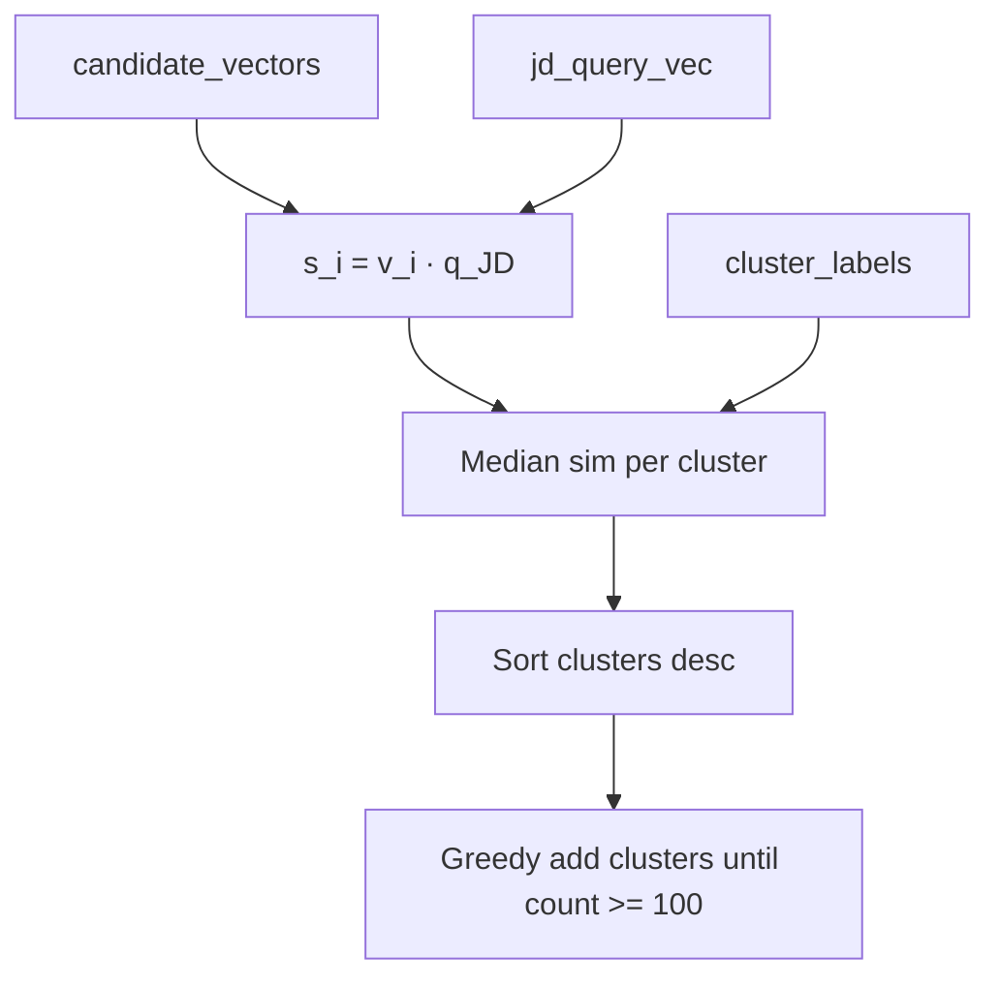

# Stage 1 — Cluster Filter

[← Stage 0](stage0-precompute.md) | [Overview](overview.md) | Next: [Stage 2 — Hard Gate](stage2-hard-gate.md)

---

## 1. Purpose and position in the funnel

**Stage 1** reduces the full encoded pool (~100K) to a **relevance floor** of at least **100 candidates** (typically ~6K+) by:

1. Clustering candidates in embedding space (UMAP + HDBSCAN, precomputed in Stage 0).
2. Ranking clusters by **median JD-anchor similarity**.
3. Greedily adding whole clusters until the floor is met.

| Aspect | Value |
|--------|-------|
| Input | ~100K vectors + cluster labels |
| Output | `filtered_ids.json` (~6K+ IDs) |
| Pool shrink | ~100K → ~6K+ |

---

## 2. Novel approach and justification

| Naive | Stage 1 design | Justification |
|-------|----------------|---------------|
| Random 6K sample | **JD-anchored cluster union** | Preserves semantic neighborhoods correlated with JD |
| Global top-6K by dot product | **Cluster-first selection** | Avoids flooding with near-duplicate profiles from one dense region |
| K-means with fixed K | **HDBSCAN density clusters** | Variable cluster count; noise label for outliers |
| Filter in 2304-d directly | **UMAP 12-d for clustering only** | Manifold learning for structure; ranking still uses full vectors |

---

## 3. Prerequisites

- Stage 0 `run.py` — `candidate_vectors.npy`, `jd_query_vec.npy`, `id_map.json`
- Stage 0 `run_cluster.py` — `cluster_labels.npy`, `umap_reduced_12d.npy` in `artifacts/runtime/stage1/`

### Entry point

```powershell
python tracks/instructor/stage1/run_filter.py
```

---

## 4. Inputs and outputs

### Inputs (`artifacts/runtime/stage0/`, `stage1/`)

- `candidate_vectors.npy` — `(N, 2304)`
- `jd_query_vec.npy` — `(2304,)`
- `id_map.json` — ordered candidate IDs
- `cluster_labels.npy` — HDBSCAN labels per row
- `umap_reduced_12d.npy` — used for centroid distance in Stage 2

### Outputs (`artifacts/runtime/stage1/`)

- `filtered_ids.json` — list of surviving `candidate_id`
- `filtered_metadata.json` — cluster stats
- `cluster_rankings.json` — ordered clusters with median similarity
- `stage1_summary.json`

---

## 5. Dependencies

- NumPy, UMAP/HDBSCAN artifacts (precomputed)
- Constants from [`core/config.py`](../tracks/instructor/core/config.py): `STAGE1_FLOOR=100`, UMAP `n_neighbors=20`, target dim 12

---

## 6. Algorithm (conceptual)



---

## 7. Mathematics (deep)

### 7.1 UMAP reduction (offline, Stage 0 cluster precompute)

High-dimensional vectors \(\mathbf{v}_i \in \mathbb{R}^{2304}\) are embedded to \(\mathbf{u}_i \in \mathbb{R}^{12}\) with UMAP (cosine metric, `n_neighbors=20`). UMAP preserves local neighborhood structure for density clustering.

### 7.2 HDBSCAN

HDBSCAN assigns cluster label \(c_i \in \{-1, 0, 1, \ldots\}\). Label **-1** is **noise** (low density). Parameters are fixed in `core/config.py`.

### 7.3 Anchor similarity

For each candidate \(i\):

\[
s_i = \mathbf{v}_i^\top \mathbf{q}_\text{JD}
\]

Implementation: [`filtering/rank.py`](../tracks/instructor/stage1/filtering/rank.py) — `compute_anchor_similarities()`.

This is **not** cosine of full 2304-d vector unless globally normalized; it matches the Stage 0 block-weighted JD construction.

### 7.4 Cluster score

For cluster \(C_k\) with member similarities \(\{s_i : c_i = k\}\):

\[
\text{score}(C_k) = \text{median}_{i \in C_k}(s_i)
\]

**Tie-break:** ascending cluster label ID.

Clusters sorted by \((-\text{score}(C_k), \text{label})\).

### 7.5 Greedy filter

Walk sorted clusters **atomically** (all members of a cluster added together). Stop when \(|S| \geq F\) with floor \(F = 100\).

**Noise handling:** label -1 skipped during walk; if floor not met, all noise points added as last resort ([`filtering/filter.py`](../tracks/instructor/stage1/filtering/filter.py)).

### 7.6 Toy example

| Cluster | Median \(s\) | Size | Cumulative |
|---------|--------------|------|------------|
| 3 | 0.82 | 1200 | 1200 ✓ |

If cluster 3 alone exceeds floor 100, output may be 1200 IDs (entire cluster kept even if >> 100). Floor is **minimum**, not exact cut.

---

## 8. Config reference

No `stage1:` YAML block. Key constants in `core/config.py`:

- `STAGE1_FLOOR = 100`
- `STAGE1_RANDOM_SEED = 42`
- UMAP/HDBSCAN hyperparameters in cluster precompute module

---

## 9. Implementation map

| File | Role |
|------|------|
| `stage1/run_filter.py` | CLI |
| `stage1/pipeline.py` | `run_stage1_filter()` orchestration |
| `stage1/filtering/rank.py` | Anchor sim + cluster ranking |
| `stage1/filtering/filter.py` | Floor-based cluster union |
| `stage0/cluster_precompute.py` | UMAP + HDBSCAN offline |

---

## 10. Operational notes

- **Typical survivors:** ~6,000–8,000 (depends on cluster sizes).
- **Failure mode:** If all clusters tiny, noise fallback inflates set.
- **Alternative:** [`docs/kmeans_clustering_implementation_guide.md`](../docs/kmeans_clustering_implementation_guide.md) documents K-means if HDBSCAN overshoots.
