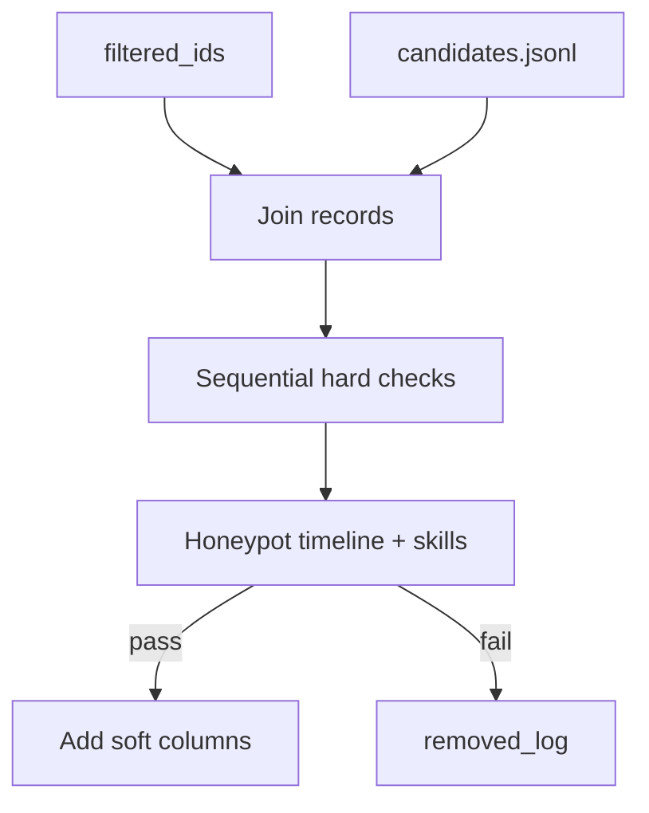

# Stage 2 — Hard Tabular Gate

[← Stage 1](stage1-cluster-filter.md) | [Overview](overview.md) | Next: [Stage 3 — Hybrid Retrieval](stage3-hybrid-retrieval.md)

---

## 1. Purpose and position in the funnel

**Stage 2** applies **deterministic hard filters** and honeypot fraud rules to Stage 1 survivors. Candidates failing any hard check are removed. Survivors are **enriched** with gate, career, and availability features for Stages 3–5.

| Aspect | Value |
|--------|-------|
| Input | ~6K+ filtered IDs |
| Output | `stage2_gated.parquet` (~2–5K rows) |
| Nature | Boolean elimination + feature engineering (no ML scoring) |

---

## 2. Novel approach and justification

| Naive | Stage 2 design | Justification |
|-------|----------------|---------------|
| Soft penalties only for disqualifiers | **Hard gate** for JD must-not-haves | Consulting-only, wrong experience band, honeypot fraud must not appear in top 100 |
| LLM judge for fraud | **Deterministic honeypot rules** | Reproducible, fast, auditable |
| Drop all fields on pass | **Retain soft signals** | `dist_to_centroid`, career fractions, logistics tiers feed Stage 5 cascade |
| Single monolithic if-chain | **Modular checks** in `stage2/checks/` | Each rule testable in isolation |

---

## 3. Prerequisites

- `artifacts/runtime/stage1/filtered_ids.json`
- `data/candidates.jsonl`
- Cluster artifacts for `dist_to_centroid` (12-d UMAP centroids)

### Entry point

```powershell
python tracks/instructor/stage2/run.py
```

---

## 4. Inputs and outputs

### Inputs

- Stage 1 filtered IDs + metadata
- Full candidate records from JSONL
- `umap_reduced_12d.npy`, `cluster_labels.npy` (centroid distance)

### Outputs (`artifacts/runtime/stage2/`)

- `stage2_gated.parquet` — **primary downstream input**
- `stage2_gated.json`, `stage2_filtered_ids.json`
- `stage2_honeypot_log.csv`, `stage2_removed_log.csv`
- `stage2_summary.json`

---

## 5. Dependencies

- Polars, YAML config (`stage2:` block)
- No GPU

---

## 6. Algorithm (conceptual)



---

## 7. Mathematics (deep)

### 7.1 Experience band

Let \(y\) = `years_of_experience`. Hard keep if:

\[
y \in [y_\min - \tau,\; y_\max + \tau]
\]

Default JD band 5–9 years with soft tolerance \(\tau=1\) → **keep** \([4, 10]\).

**Sweet spot** flag (soft, for Stage 5 bonus): \(y \in [6, 8]\).

### 7.2 Title family gate

Title classified into families (engineering vs non-engineering). Non-eng → **hard remove**.

### 7.3 Consulting / research / shallow AI

- **Consulting-only:** product company fraction below threshold → remove
- **Research-heavy:** research fraction above threshold without production ML → remove
- **Shallow AI:** LLM-framework-only or recent-AI-only patterns → remove

Each rule is a predicate \(f_k(\text{record}) \in \{\text{true}, \text{false}\}\). Removal if any hard \(f_k\) fires.

### 7.4 Honeypot rules

Deterministic checks on timeline consistency and skill fraud (see [`docs/honeypot_filter_plan.md`](../docs/honeypot_filter_plan.md)):

- Impossible date orderings
- Skill endorsement vs tenure mismatches
- Anomaly score thresholds from `redrob_signals`

\[
\text{honeypot\_pass} = \bigwedge_j \neg h_j(\text{record})
\]

### 7.5 Distance to cluster centroid

For candidate \(i\) in cluster \(c(i)\), UMAP coordinate \(\mathbf{u}_i \in \mathbb{R}^{12}\), centroid \(\bar{\mathbf{u}}_{c} = \frac{1}{|C|}\sum_{j \in C} \mathbf{u}_j\):

\[
\text{dist\_to\_centroid}_i = \|\mathbf{u}_i - \bar{\mathbf{u}}_{c(i)}\|_2
\]

Used in Stage 3 fusion when `beta_cluster > 0` (currently **0** in config — column retained for future use).

### 7.6 Survivor rate

Config `expected_survivor_min/max` (~2000–5000) documents design intent; actual count logged in `stage2_summary.json`.

---

## 8. Config reference

`stage2:` in [`config.yaml`](../config.yaml) — experience bounds, title keywords, consulting/research/shallow_ai thresholds, honeypot tolerances, logistics enums.

Full implementation report: [`docs/reports/STAGE2_REPORT.md`](../docs/reports/STAGE2_REPORT.md).

---

## 9. Implementation map

| Path | Role |
|------|------|
| `stage2/gate.py` | `run()` orchestrator |
| `stage2/checks/experience.py` | Experience band |
| `stage2/checks/title.py` | Title family |
| `stage2/checks/consulting.py` | Consulting fraction |
| `stage2/checks/research.py` | Research-heavy |
| `stage2/checks/shallow_ai.py` | Shallow AI patterns |
| `stage2/checks/career_shape.py` | Tenure, hops, progression |
| `stage2/checks/honeypot` + `honeypot_rules.py` | Fraud detection |
| `stage2/checks/logistics.py` | Location tier |
| `stage2/checks/availability.py` | Open-to-work signals |
| `stage2/io.py` | Parquet write |

---

## 10. Operational notes

- **Determinism:** Same inputs → same survivors (no randomness).
- **Logs:** `stage2_removed_log.csv` records rule name per removed ID for debugging.
- **Stage 3 constraint:** Retrieval union must stay within Stage 2 ID set (FAISS selector).
