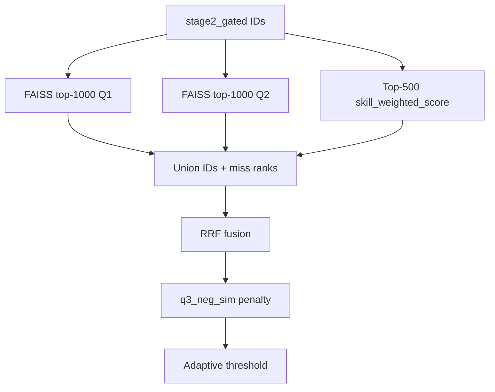

# Stage 3 — Hybrid Retrieval

[← Stage 2](stage2-hard-gate.md) | [Overview](overview.md) | Next: [Stage 4 — Cross-Encoder](stage4-cross-encoder.md)

---

## 1. Purpose and position in the funnel

**Stage 3** retrieves **300–600 candidates** from Stage 2 survivors using **three ranked lists** fused by Reciprocal Rank Fusion (RRF), minus an **anti-pattern** dense similarity (Q3), with **adaptive thresholding**.

| Aspect | Value |
|--------|-------|
| Input | ~2–5K gated candidates |
| Output | `stage3_retrieved.parquet` (300–600 rows) |
| Lists | L1=Q1 dense, L2=Q2 dense, L3=skill score |

---

## 2. Novel approach and justification

| Naive | Stage 3 design | Justification |
|-------|----------------|---------------|
| BM25 + dense hybrid | **Skill track** replaces sparse text | Structured skills + IDF tiers encode JD priorities better than keyword overlap |
| Single query embedding | **Q1 facet centroid + Q2 career query + Q3 anti-JD** | Q1 recalls operational fit; Q2 recalls career-shape language; Q3 penalizes anti-patterns |
| Fixed top-500 | **Adaptive μ − zσ cut** clamped to [300, 600] | Pool size adapts to score distribution while respecting Stage 4 budget |
| Miss = rank ∞ | **Miss penalties** (1001 dense, 501 skill) | RRF still ranks candidates missing from one list but penalizes heavily |

---

## 3. Prerequisites

- Stage 0: FAISS index, vectors, `candidate_features.parquet`, precomputed `q1/q2/q3_vec.npy`
- Stage 2: `stage2_gated.parquet`

### Entry point

```powershell
python tracks/instructor/stage3/run.py
```

---

## 4. Inputs and outputs

### Inputs

- `stage2_gated.parquet` — survivor IDs + `dist_to_centroid`
- `artifacts/runtime/stage0/candidate_index.faiss`, `id_map.json`, `candidate_vectors.npy`
- `stage3_query_vectors/q{1,2,3}_vec.npy`

### Outputs (`artifacts/runtime/stage3/`)

- `stage3_retrieved.parquet` — ranks, `q1_rank`, `q2_rank`, `skill_rank`, `rrf_score`, `q3_neg_sim`, `fused_score`, `stage3_rank`
- `stage3_score_distribution.csv`, `stage3_summary.json`

---

## 5. Dependencies

- FAISS, Polars, NumPy
- No runtime ONNX (queries precomputed)

---

## 6. Algorithm (conceptual)



---

## 7. Mathematics (deep)

### 7.1 Dense retrieval (L1, L2)

For query vector \(\mathbf{q}\) and candidate vector \(\mathbf{v}_i\), FAISS `IndexFlatIP` returns inner product scores. Restricted to Stage 2 IDs via `IDSelectorBatch`.

Top \(K_d = 1000\) per query → ranks \(r^{(q1)}_i\), \(r^{(q2)}_i\) (1 = best).

### 7.2 Skill retrieval (L3)

Sort survivors by `skill_weighted_score` descending. Top \(K_s = 500\) → rank \(r^{(skill)}_i\).

### 7.3 Union with miss penalties

If candidate \(i\) missing from a list, assign penalty rank:

- Dense miss: \(r = 1001\)
- Skill miss: \(r = 501\)

### 7.4 Reciprocal Rank Fusion

With \(k = 60\) (`rrf_k`):

\[
\text{RRF}(i) = \frac{1}{k + r^{(q1)}_i} + \frac{1}{k + r^{(q2)}_i} + \frac{1}{k + r^{(skill)}_i}
\]

**Properties:** Higher when candidate ranks well on multiple lists; bounded; no score calibration needed across lists.

Implementation: [`stage3/fusion.py`](../tracks/instructor/stage3/fusion.py) — `compute_rrf()`.

### 7.5 Q3 anti-pattern penalty

Let \(\mathbf{q}_3\) be the precomputed anti-JD query vector:

\[
\text{q3\_neg\_sim}_i = \mathbf{v}_i^\top \mathbf{q}_3
\]

High similarity to Q3 = profile matches **negative** patterns (title chasing, consulting-only language, etc.).

**Fused score:**

\[
\text{fused}_i = \text{RRF}(i) - \alpha_{\text{neg}} \cdot \text{q3\_neg\_sim}_i + \beta_{\text{cluster}} \cdot \frac{1}{1 + \text{dist\_to\_centroid}_i}
\]

Default \(\alpha_{\text{neg}} = 0.5\), \(\beta_{\text{cluster}} = 0\) (cluster term disabled).

### 7.6 Adaptive cut

Let \(\mu = \mathbb{E}[\text{fused}]\), \(\sigma = \text{std}(\text{fused})\) over union:

\[
\tau = \mu - z \cdot \sigma, \quad z = 1.5
\]

- If \(|\{i : \text{fused}_i \geq \tau\}| > 600\): take top 600 by fused score
- If \(< 300\): take top 300 regardless of threshold
- Else: keep all above \(\tau\)

**Tie-break:** `(fused_score desc, candidate_id asc)`.

Assign `stage3_rank` = 1 … output_count.

### 7.7 Toy RRF example

\(k=60\), candidate A: ranks (5, 10, 20) on three lists:

\[
\text{RRF} = \frac{1}{65} + \frac{1}{70} + \frac{1}{80} \approx 0.0154 + 0.0143 + 0.0125 = 0.0422
\]

Candidate B: ranks (1, 1001, 1) — strong on Q1 and skill, missed Q2:

\[
\text{RRF} = \frac{1}{61} + \frac{1}{1061} + \frac{1}{61} \approx 0.0337
\]

B wins despite missing dense Q2 due to dual-list strength.

---

## 8. Config reference

`stage3:` in [`config.yaml`](../config.yaml):

| Key | Default | Meaning |
|-----|---------|---------|
| `per_query_k_dense` | 1000 | L1/L2 depth |
| `per_query_k_skill` | 500 | L3 depth |
| `rrf_k` | 60 | RRF constant |
| `alpha_neg` | 0.5 | Q3 penalty weight |
| `beta_cluster` | 0.0 | Centroid bonus (off) |
| `z_threshold` | 1.5 | Adaptive cut |
| `min_k` / `max_k` | 300 / 600 | Output bounds |

Q1 facets and subspace weights affect precomputed vectors (Stage 0).

---

## 9. Implementation map

| File | Role |
|------|------|
| `stage3/retrieve.py` | Orchestrator |
| `stage3/dense_retrieve.py` | FAISS L1/L2 |
| `stage3/skill_retrieve.py` | L3 skill sort |
| `stage3/fusion.py` | RRF, Q3, adaptive cut |
| `stage3/query_encode.py` | Query encoding (precompute) |

---

## 10. Operational notes

- **Expected output:** 300–600 rows; enforced by `adaptive_cut` or hard min/max.
- **Tuning:** Increase `alpha_neg` to aggressively down-rank anti-pattern profiles.
- **Historical note:** [`docs/stage3_plan.md`](../docs/stage3_plan.md) described BM25; production uses skill track per [`docs/stage3_new_plan.md`](../docs/stage3_new_plan.md).
