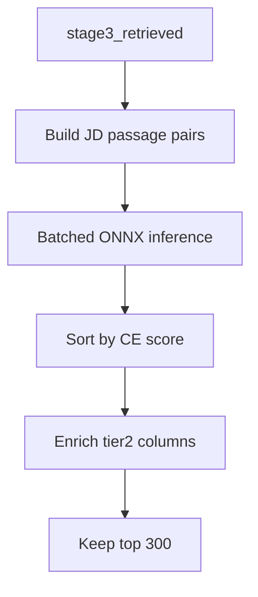

# Stage 4 — Cross-Encoder Reranking

[← Stage 3](stage3-hybrid-retrieval.md) | [Overview](overview.md) | Next: [Stage 5 — Cascade Scoring](stage5-cascade-scoring.md)

---

## 1. Purpose and position in the funnel

**Stage 4** reranks Stage 3 survivors (~300–600) with a **cross-encoder** that jointly encodes (JD, candidate passage) pairs. Outputs **top 300** with `cross_encoder_score` and **Tier-2 enrichment columns** for Stage 5.

| Aspect | Value |
|--------|-------|
| Input | 300–600 retrieved candidates |
| Output | 300 rows in `stage4_reranked.parquet` |
| Model | `cross-encoder/ms-marco-MiniLM-L-6-v2` (ONNX CPU) |

---

## 2. Novel approach and justification

| Naive | Stage 4 design | Justification |
|-------|----------------|---------------|
| Bi-encoder score only | **Cross-encoder** on shortlist | Joint attention captures query-passage interaction; MS MARCO trained for relevance |
| CE on full 100K | **CE on 300–600** | ~1000× cheaper; Stage 3 bi-encoder recall provides candidates |
| GPU inference | **CPU ONNX** with batched pairs | Portable; N small enough for CPU throughput |
| Score-only output | **Tier-2 penalty/bonus columns** computed here | Stage 5 cascade consumes pre-derived career signals |

---

## 3. Prerequisites

- Stage 3 `stage3_retrieved.parquet`
- `models/cross_encoder/model.onnx` + tokenizer (from `run_cross_encoder.py`)
- `data/candidates.jsonl` for passage text

### Entry point

```powershell
python tracks/instructor/stage4/run.py
```

---

## 4. Inputs and outputs

### Inputs

- Stage 3 parquet (candidate IDs + upstream columns)
- JD text from `stage4.jd_text` in config
- Candidate passages built from JSONL (career + summary)

### Outputs (`artifacts/runtime/stage4/`)

- `stage4_reranked.parquet` — top 300, sorted by `cross_encoder_score` desc
- `stage4_reranked.json`, `stage4_rank_delta.csv`, `stage4_summary.json`

**Key new columns:** `cross_encoder_score`, `stage4_rank`, `title_chasing_penalty`, `ambiguity_penalty`, `closed_source_penalty`, `optional_bonus`, plus retained Stage 3 scores (`q1_score`, `q2_score`, etc.).

---

## 5. Dependencies

- `onnxruntime` (CPU), `transformers` tokenizer
- Polars

---

## 6. Algorithm (conceptual)



---

## 7. Mathematics (deep)

### 7.1 Cross-encoder score

For JD query \(q\) and candidate passage \(p_i\), the model outputs a scalar logit:

\[
s_i^\text{CE} = f_\theta(q, p_i) \in \mathbb{R}
\]

Higher = more relevant per MS MARCO training. Implementation batches pairs with max token limits (`max_jd_tokens`, `max_candidate_tokens`, `max_pair_tokens`).

Empty passages receive `empty_score` (config default, typically low).

### 7.2 Ranking

Dense rank by \(s_i^\text{CE}\) descending (method=`dense`):

\[
\text{stage4\_rank}_i = \text{rank}(s_i^\text{CE})
\]

**Keep** candidates with \(\text{stage4\_rank} \leq 300\).

### 7.3 Rank delta diagnostic

\[
\Delta_i = |\text{stage3\_rank}_i - \text{stage4\_rank}_i|
\]

Logged when \(\Delta_i > 50\) (`rank_delta_threshold`) — large rerank swings.

### 7.4 Tier-2 enrichment (inputs to Stage 5)

Computed in [`shared/tier2_inputs.py`](../tracks/instructor/shared/tier2_inputs.py):

**Title chasing penalty:**

\[
\text{penalty}_\text{tc} = \min(\text{coef} \cdot \text{short\_hop\_count},\; \text{cap})
\]

Default coef=0.03, cap=0.15.

**Ambiguity penalty:**

\[
\text{penalty}_\text{amb} = w_t \cdot \mathbb{1}[\text{title\_ambiguous}] + w_n \cdot \mathbb{1}[\text{near\_band}]
\]

**Closed-source penalty:**

\[
\text{penalty}_\text{cs} = \begin{cases}
\text{value} & \text{if } \text{ext\_val} < \theta \land \neg\text{has\_github} \\
0 & \text{otherwise}
\end{cases}
\]

**Optional bonus:** count matched skill categories (fine-tuning, LTR, HR-tech, distributed systems, OSS) × `per_category`, capped at `cap` (0.08).

**Sweet spot** (`in_sweet_spot`) applied in Stage 5, not Stage 4.

### 7.5 Why CE scores are unbounded

MS MARCO logits are not probabilities. Stage 5 uses **ranks** of CE scores in Borda tier, not raw logits — calibration happens via rank aggregation.

---

## 8. Config reference

`stage4:` in [`config.yaml`](../config.yaml):

| Key | Typical | Meaning |
|-----|---------|---------|
| `keep_n` | 300 | Output size |
| `batch_size` | 16 | ONNX batch |
| `num_threads` | 4 | ORT intra-op threads |
| `rank_delta_threshold` | 50 | Diagnostic logging |

Tier-2 coefficients live under `stage5.tier2` but are applied in Stage 4 enrichment.

---

## 9. Implementation map

| File | Role |
|------|------|
| `stage4/rerank.py` | Orchestrator |
| `stage4/score.py` | ONNX session, `score_pairs()` |
| `stage4/pairs.py` | Passage construction |
| `stage4/io.py` | Read/write parquet |
| `shared/tier2_inputs.py` | Penalty/bonus columns |

---

## 10. Operational notes

- **Preflight:** Missing ONNX → clear error pointing to `run_cross_encoder.py`.
- **CPU-only:** `CPUExecutionProvider` only — no CUDA requirement for Stage 4.
- **Throughput:** batch_size × num_threads tuning on large Stage 3 unions.
