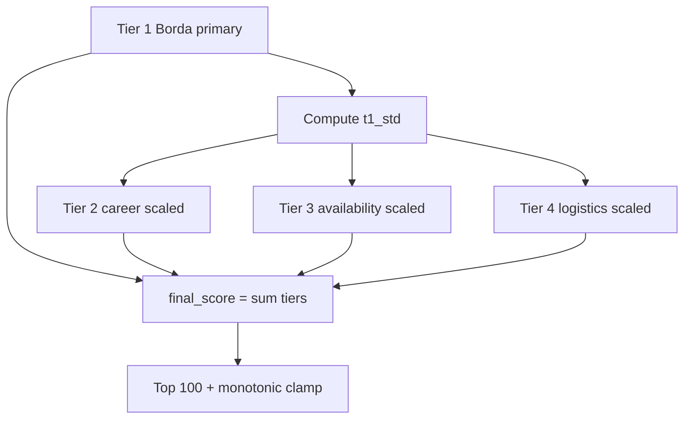

# Stage 5 — Distribution-Aware Cascade Scoring

[← Stage 4](stage4-cross-encoder.md) | [Overview](overview.md) | Next: [Stage 6 — Reasoning Builder](stage6-reasoning-builder.md)

---

## 1. Purpose and position in the funnel

**Stage 5** produces the **final ranking** of the Stage 4 pool (300 candidates) using a **4-tier cascade**. Outputs top-100 with `final_score` and a basic template `reasoning` column (superseded by Stage 6 for submission).

| Aspect | Value |
|--------|-------|
| Input | 300 reranked candidates |
| Output | `stage5_scored_top100.parquet`, `team_xxx.csv` |
| Formula | **v2 distribution-aware cascade** ([`scoring.py`](../tracks/instructor/stage5/scoring.py)) |

> **Note:** [`docs/reports/stage5_report.md`](../docs/reports/stage5_report.md) documents an older 7-layer formula. **Code wins** — this guide describes v2 per `stage5_impact_calibration.md`.

---

## 2. Novel approach and justification

| Naive | Stage 5 v2 design | Justification |
|-------|-------------------|---------------|
| Fixed weights on raw features | **Tiers scaled to Tier-1 std** | Tabular signals move ranks proportionally to retrieval spread — avoids logistics swamping CE |
| Raw CE logit in sum | **Borda on ranks** with Q amplification | Robust to uncalibrated CE scale; exponent 1.4 emphasizes top Q1/Q2 positions |
| Single composite score | **Four interpretable tiers** | Auditable decomposition in parquet columns |
| Arbitrary score scale | **Monotonic clamp** on submission CSV | Satisfies challenge rule: scores non-increasing by rank |

---

## 3. Prerequisites

- `artifacts/runtime/stage4/stage4_reranked.parquet`
- `data/candidates.jsonl` (behavioral join)
- Optional: `candidate_features.parquet`

### Entry point

```powershell
python tracks/instructor/stage5/run.py
# or full pipeline:
python tracks/instructor/run_pipeline.py
```

---

## 4. Inputs and outputs

### Outputs (`artifacts/runtime/stage5/`)

- `stage5_scored_top100.parquet` — top 100 with full decomposition
- `stage5_scored.parquet`, `stage5_full_scores.parquet`
- `{team_id}.csv` — rank, score, reasoning (template)
- `stage5_summary.json`

Stage 6 reads `stage5_scored_top100.parquet` for ranks/scores and behavioral columns.

---

## 5. Dependencies

- Polars, NumPy
- Config `stage5:` block

---

## 6. Algorithm (conceptual)



---

## 7. Mathematics (deep)

### 7.1 Tier 1 — Borda on amplified ranks

For each candidate \(i\), compute dense ranks (1 = best):

- \(r_i^{ce}\) from `cross_encoder_score`
- \(r_i^{q1}\) from `q1_score`
- \(r_i^{q2}\) from `q2_score`

**Amplified Q ranks** with exponent \(\gamma = 1.4\):

\[
\tilde{r}_i^{q1} = (r_i^{q1})^\gamma, \quad \tilde{r}_i^{q2} = (r_i^{q2})^\gamma
\]

**Borda sum** (weights \(w_{ce}=0.25\), \(w_{q1}=0.35\), \(w_{q2}=0.40\)):

\[
B_i = w_{ce} \cdot r_i^{ce} + w_{q1} \cdot \tilde{r}_i^{q1} + w_{q2} \cdot \tilde{r}_i^{q2}
\]

Lower \(B_i\) is better. **Primary score:**

\[
\text{borda\_primary}_i = 1 - \text{minmax}(B_i)
\]

where min-max is over the Stage 4 pool.

**Anchor variance:**

\[
\sigma_1 = \text{std}(\text{borda\_primary})
\]

All later tiers scale relative to \(\sigma_1\).

### 7.2 Tier 2 — Career bonuses and penalties

\[
\text{tier2\_raw}_i = \text{sweet\_bonus}_i + \text{optional\_bonus}_i - \text{title\_chasing}_i - \text{ambiguity}_i - \text{closed\_source}_i
\]

Sweet bonus: \(+0.04\) if `in_sweet_spot`.

**Scaling** with target ratio \(\rho_2 = 0.25\):

\[
\text{tier2\_scaled}_i = \text{tier2\_raw}_i \cdot \frac{\rho_2 \cdot \sigma_1}{\text{std}(\text{tier2\_raw})}
\]

If \(\text{std}(\text{tier2\_raw}) = 0\), tier2_scaled = 0 (warning logged).

### 7.3 Tier 3 — Availability units

Classify each candidate into tier A/B/C → unit \(u_i^{(3)} \in \{+1, 0, -1\}\):

| Tier | Conditions (simplified) |
|------|-------------------------|
| C (−1) | Low interview rate OR stale > 180 days |
| A (+1) | High interview + recent + offer acceptance |
| B (0) | otherwise |

**Scaling** with \(\rho_3 = 0.15\):

\[
\text{tier3\_scaled}_i = u_i^{(3)} \cdot \frac{\rho_3 \cdot \sigma_1}{\text{std}(u^{(3)})}
\]

### 7.4 Tier 4 — Logistics units

\[
u_i^{(4)} = u_i^{\text{loc}} + u_i^{\text{workmode}} + u_i^{\text{notice}}
\]

Location units: preferred=+1, acceptable=0, outside_india=−2, unknown=0.

Notice: short (≤30d)=+1, medium=0, long (>90d)=−1.

**Scaling** with \(\rho_4 = 0.05\):

\[
\text{tier4\_scaled}_i = u_i^{(4)} \cdot \frac{\rho_4 \cdot \sigma_1}{\text{std}(u^{(4)})}
\]

### 7.5 Final score

\[
\text{final\_score}_i = \text{borda\_primary}_i + \text{tier2\_scaled}_i + \text{tier3\_scaled}_i + \text{tier4\_scaled}_i
\]

Sort descending → assign `rank` 1…100 for top 100.

### 7.6 Monotonic clamp (submission)

For submission CSV (Stage 5 and Stage 6), enforce:

\[
\text{score}_{r} \leq \text{score}_{r-1} \quad \forall r > 1
\]

If violated, set \(\text{score}_r \leftarrow \text{score}_{r-1}\).

### 7.7 Toy cascade example

Pool \(\sigma_1 = 0.08\). Candidate X:

- borda_primary = 0.72
- tier2_raw = 0.06, std(tier2_raw)=0.04 → tier2_scaled = 0.06 × (0.02/0.04) = 0.03
- avail unit = +1, std=1 → tier3_scaled = 1 × (0.012/1) = 0.012
- logistics unit = +1, std=0.8 → tier4_scaled ≈ 0.005

final_score ≈ 0.72 + 0.03 + 0.012 + 0.005 = **0.767**

---

## 8. Config reference

`stage5:` in [`config.yaml`](../config.yaml):

```yaml
borda:
  w_ce: 0.25
  w_q1: 0.35
  w_q2: 0.40
  q_amplification_exponent: 1.4
cascade:
  tier2_ratio: 0.25
  tier3_ratio: 0.15
  tier4_ratio: 0.05
```

Availability and logistics thresholds under `stage5.availability` and `stage5.logistics`.

---

## 9. Implementation map

| File | Role |
|------|------|
| `stage5/score.py` | Orchestrator, monotonic clamp |
| `stage5/scoring.py` | `apply_scoring()` — all tier math |
| `stage5/normalize.py` | min-max helper |
| `stage5/io.py` | Parquet + CSV write |
| `stage5/reasoning.py` | Template reasoning (basic) |
| `stage5/validate.py` | CSV contract |

---

## 10. Operational notes

- **`current_date: auto`** — uses run date for `days_since_active`.
- **Flat borda_sum** — warning + borda_primary=0.5 for all if no spread.
- **Stage 6** copies ranks/scores from top-100 parquet; only replaces reasoning text.
