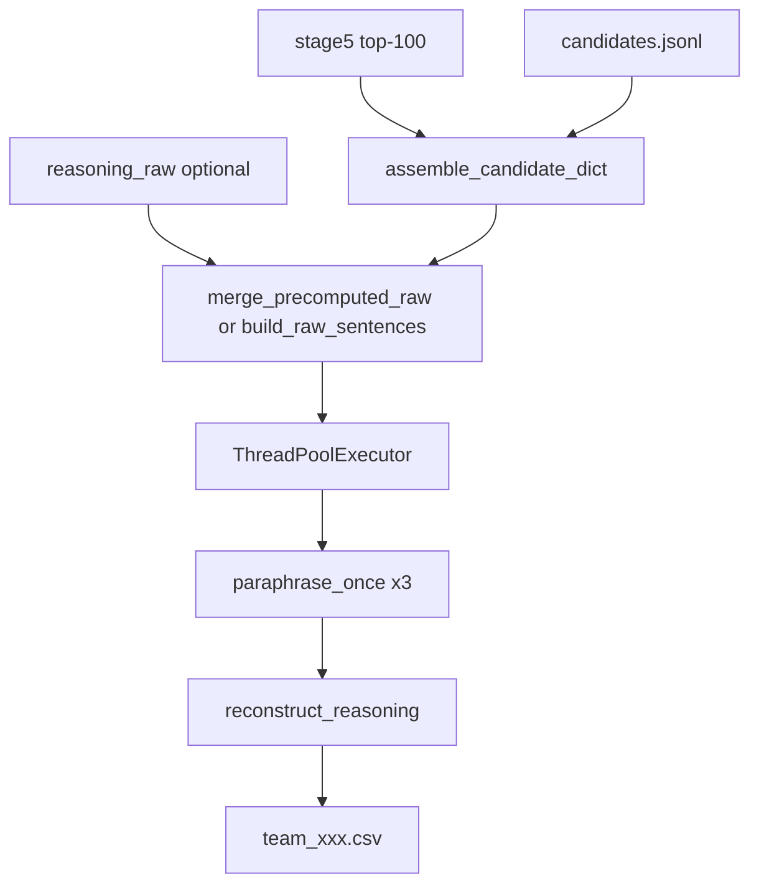

# Stage 6 — Reasoning Builder

[← Stage 5](stage5-cascade-scoring.md) | [Overview](overview.md)

---

## 1. Purpose and position in the funnel

**Stage 6** generates **three-sentence recruiter reasoning** for the Stage 5 top-100. It does **not** change ranks or scores (except monotonic clamp on CSV export). Produces the **final submission CSV**.

| Aspect | Value |
|--------|-------|
| Input | Top 100 from Stage 5 + JSONL profiles + optional raw cache |
| Output | `artifacts/runtime/stage6/team_xxx.csv` |
| Runtime | CPU-only ONNX paraphraser, parallel workers |

**Not in `run_pipeline.py`** — run explicitly after Stage 5.

---

## 2. Novel approach and justification

| Naive | Stage 6 design | Justification |
|-------|----------------|---------------|
| LLM writes full reasoning | **Template assembly + paraphrase** | Every claim traceable to structured evidence; paraphrase only polishes prose |
| GPU transformers at runtime | **ORT encoder + PyTorch CPU decoder** | No CUDA dependency; deployable on CPU submission box |
| Rebuild all sentences live | **Precompute s1/s2**, refresh **s3** only | s3 depends on Stage 5 behavioral columns (days_since_active, etc.) |
| Parallel paraphrase per sentence | **One candidate per thread** (s1→s2→s3 sequential) | ORT sessions not thread-safe; avoids safetensors load races |
| Regenerate scores | **Frozen Stage 5 ranks/scores** | Scoring and narrative decoupled |

---

## 3. Prerequisites

1. `artifacts/runtime/stage5/stage5_scored_top100.parquet`
2. `data/candidates.jsonl`
3. `models/paraphraser/` — from `run_paraphraser_export.py`
4. Optional: `artifacts/precomputed/reasoning_raw.parquet` — from `run_reasoning_raw_precompute.py`

### Entry point

```powershell
python tracks/instructor/stage6/run.py
```

---

## 4. Inputs and outputs

### Outputs (`artifacts/runtime/stage6/`)

| File | Content |
|------|---------|
| `{team_id}.csv` | `candidate_id,rank,score,reasoning` — **final submission** |
| `stage6_reasoning.parquet` | Audit: raw + paraphrased sentences, temperatures |
| `stage6_summary.json` | Workers, timing, throughput |

Validate:

```powershell
python tools/validate_submission.py artifacts/runtime/stage6/team_xxx.csv
```

---

## 5. Dependencies

- `onnxruntime` (CPU), `torch`, `transformers` (decoder only)
- `polars`, `psutil` (optional, for memory cap)
- No GPU

---

## 6. Algorithm (conceptual)



---

## 7. Mathematics and logic (deep)

### 7.1 Tech depth category

From cross-encoder score \(s^{CE}\):

\[
\text{tech\_cat} = \begin{cases}
\text{DEEP} & s^{CE} \geq 3.5 \\
\text{STRONG} & s^{CE} \geq 2.5 \\
\text{MODERATE} & s^{CE} \geq 1.5 \\
\text{SURFACE} & \text{otherwise}
\end{cases}
\]

Controls evidence depth in sentence 1 (metrics, named tech, caveats).

### 7.2 Evidence extraction (sentence 1)

**Metric priority** (first match wins):

1. Verb pattern: `(improved|increased|…) (noun) by (X%)`
2. Scale: `10M+ users`, `500K documents`, etc.
3. Latency: `120ms to 45ms`
4. Plain percentage

**Tech extraction:** named skills from profile vs description regex (FAISS, Qdrant, sentence-transformers, …).

**Verb selection:** deterministic from `md5(candidate_id:verb) mod |VERB_POOL|`.

### 7.3 Sentence 2 — career / disqualifiers

Assembles product-company fraction, tenure stability, pre-LLM production ML ownership, consulting/research clearance — template slots filled from `pipeline.gates_and_career`.

### 7.4 Sentence 3 — availability (always refreshed)

Inputs from Stage 5 row + `redrob_signals`:

- `days_since_active` — from `last_active_date` vs `current_date`
- `notice_period_days`, `open_to_work_flag`, `applications_submitted_30d`, `offer_acceptance_rate`

**Availability assessment** (decision tree — order matters):

1. `open_to_work` ∧ active ≤30d ∧ notice ≤30d → immediate availability
2. `open_to_work` ∧ (stale >60d ∨ notice >60d) → **moderate friction** (before SERIOUS_MOVER)
3. apps ≥10 ∧ offer ≥0.80 → active job-seeking
4. … (see `calculate_availability_assessment()`)

**Outreach recommendation** couples `tech_cat` with assessment string.

### 7.5 Paraphrase

Model: `humarin/chatgpt_paraphraser_on_T5_base`.

**Prompt:** `paraphrase: {raw_sentence}`

**Temperature** per slot — deterministic:

\[
T = \text{TEMPERATURES}\big[\text{md5}(\text{cid}:\text{slot}:\text{temp}) \bmod 5\big]
\]

Pool: `[0.3, 0.5, 0.7, 0.9, 1.0]`.

**Inference stack:**
1. ONNX Runtime **CPU** encoder → `last_hidden_state`
2. PyTorch **CPU** `T5ForConditionalGeneration.generate()` with `encoder_outputs`
3. Thread-local `ParaphraseSession`; model load serialized with lock (avoids safetensors race)

Decode params: `top_p=0.92`, `repetition_penalty=1.3`, `max_new_tokens=128`.

### 7.6 Reconstruction

\[
\text{reasoning} = \text{trim}(s_1) + \text{`. `} + \text{trim}(s_2) + \text{`. `} + \text{trim}(s_3) + \text{`.`}
\]

### 7.7 Precompute / runtime split

| Field | Precomputed? | Why |
|-------|--------------|-----|
| `s1_raw`, `s2_raw` | Yes (optional) | Stable from profile/career |
| `s3_raw` | **No** — always rebuilt | Depends on fresh behavioral cols |
| Paraphrase output | Never | 300 decode loops — bottleneck |

`merge_precomputed_raw()` joins cache by `candidate_id` or falls back to full `build_raw_sentences()`.

### 7.8 Worker count

\[
N_w = \min(N_{\text{candidates}},\; N_{\text{cpu\_cap}},\; N_{\text{mem\_cap}},\; N_{\text{max\_override}})
\]

\[
N_{\text{cpu\_cap}} = \max\left(1,\; \left\lfloor\frac{\text{cpus}-1}{\text{ort\_intra\_op\_threads}}\right\rfloor\right)
\]

\[
N_{\text{mem\_cap}} = \left\lfloor\frac{\text{available\_MB} \cdot (1 - \text{reserve})}{\text{estimated\_session\_MB}}\right\rfloor
\]

Default `estimated_session_mb=700`, `memory_reserve_ratio=0.25`.

---

## 8. Config reference

`stage6:` in [`config.yaml`](../config.yaml):

| Key | Meaning |
|-----|---------|
| `team_id` | Output CSV filename |
| `stage5_top100_path` | Input parquet |
| `reasoning_raw_path` | Optional s1/s2 cache |
| `paraphraser_dir` | ONNX + tokenizer + pytorch weights |
| `ort_intra_op_threads` | Per-session ORT threads |
| `max_workers` | `null` = dynamic |
| `top_p`, `repetition_penalty` | Decode params |

---

## 9. Implementation map

| File | Role |
|------|------|
| `stage6/run.py` | CLI |
| `stage6/score.py` | Orchestrator |
| `stage6/reasoning_builder.py` | Templates, evidence, `build_raw_sentences`, `merge_precomputed_raw` |
| `stage6/paraphrase_onnx.py` | ORT + PyTorch paraphrase |
| `stage6/assemble.py` | Stage5 row + JSONL → pipeline dict |
| `stage6/pool.py` | `ThreadPoolExecutor` |
| `stage6/workers.py` | `resolve_worker_count()` |
| `stage6/io.py` | Load/write artifacts |
| `stage6/validate.py` | CSV contract (delegates to stage5) |

Design spec: [`experiments/vectorSteering/reasoning_builder_plan.md`](../experiments/vectorSteering/reasoning_builder_plan.md).

Regression harness: [`experiments/vectorSteering/tech_reasoning_test/run_test.py`](../experiments/vectorSteering/tech_reasoning_test/run_test.py).

---

## 10. Operational notes

- **Typical runtime:** ~7 min for 100 candidates with 11 workers (~0.24 candidates/s).
- **Tuning:** Lower `max_workers` if RAM pressure; increase `ort_intra_op_threads` when few workers.
- **Re-run safe:** Idempotent given same Stage 5 input; paraphrase stochasticity bounded by seeded temperatures.
- **Stage 5 CSV:** Still written with template reasoning; **submit Stage 6 CSV** for final reasoning.
