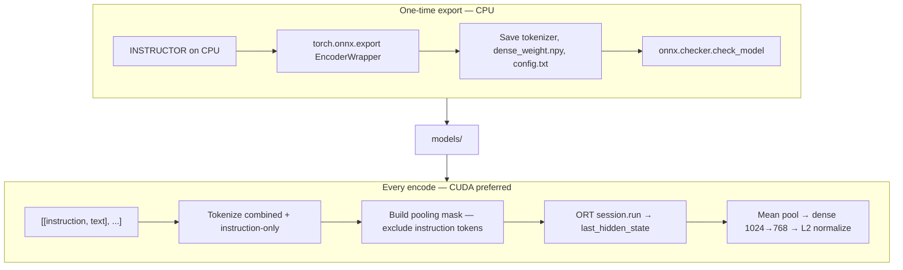

# INSTRUCTOR-large ONNX — implementation guide

Skill file for this repo. Read this before touching ONNX export, inference, or wiring into the main precompute pipeline.

**Scope:** `hkunlp/instructor-large` only. No MiniLM, no BERT, no generic sentence-transformers optimum export.

**Reference:** Full background in [../documents/instructor-large-onnx-setup.md](../documents/instructor-large-onnx-setup.md).

---

## 1. What this project needs

Track A precompute ([`precompute.py`](../precompute.py)) encodes each candidate with **three different instructions** (retrieval, infra, eval), L2-normalizes each 768-d block, concatenates to **2304-d**, and builds a FAISS index. [`rank.py`](../rank.py) is CPU-only and never loads a model.

The speed goal is **GPU ONNX Runtime** for the heavy forward passes during precompute — not PyTorch, not `InstructorEmbedding` at inference time.

The working approach in this folder proves:

1. Export only the **T5 encoder** to ONNX.
2. Run **instruction-aware pooling + dense projection + L2 normalize** in NumPy around ORT.
3. Use the real INSTRUCTOR API: `[[instruction, text], ...]` pairs.

---

## 2. Why INSTRUCTOR is not a normal ONNX export

`hkunlp/instructor-large` is **not** a plain `AutoModel`. It is a customized stack:

| Stage | Component | In ONNX graph? |
|-------|-----------|--------------|
| 0 | `INSTRUCTORTransformer` (T5 encoder backbone) | **Yes** — this is what we export |
| 1 | `INSTRUCTORPooling` (mean pool, **exclude instruction tokens**) | **No** — Python/NumPy |
| 2 | `Dense` (1024 → 768, no bias) | **No** — saved as `dense_weight.npy`, applied in NumPy |
| 3 | `Normalize` (L2) | **No** — NumPy |

The instruction still affects embeddings via self-attention inside the encoder, but instruction tokens are **not averaged** into the final vector. That masking logic is plain Python — it cannot be traced as part of a naive `torch.onnx.export` on the full `INSTRUCTOR` object.

### Approaches that fail (do not retry)

| Approach | Why it fails |
|----------|--------------|
| `optimum-cli export onnx --model hkunlp/instructor-large` | Not a registered AutoModel task; traces wrong graph |
| `SentenceTransformer(..., backend="onnx", export=True)` | Exports full `T5Model` encoder-decoder → `KeyError: 'decoder_input_ids'` at encode |
| `sentence-transformers` `prompt=` API on ONNX | Same optimum/T5 export path; not equivalent to INSTRUCTOR pair encoding |
| MiniLM / tiny profile smoke tests | Wrong model family; proves nothing about instructor-large |
| Export whole `INSTRUCTOR` with `torch.onnx.export` | Pooling/masking not in graph; wrong semantics or trace errors |

### Approach that works

**Encoder-only export** + reimplement pooling and dense in [`instructor_onnx.py`](instructor_onnx.py). This matches the design in `documents/instructor-large-onnx-setup.md`, extended with the **768-d dense layer** (the setup doc omitted it; without it output is 1024-d).

---

## 3. End-to-end process



### Step A — Install (once per environment)

```powershell
cd onnx
pip install -r requirements.txt
```

Requirements: `InstructorEmbedding` (export only), `torch`, `transformers`, `onnx`, `onnxruntime-gpu`, `numpy`, `protobuf>=3.20,<5`.

**Provider rule:** Install **only** `onnxruntime-gpu` OR `onnxruntime`, never both.

### Step B — Export (once per model version)

```powershell
python export_to_onnx.py
```

What it does:

1. Loads `INSTRUCTOR("hkunlp/instructor-large")` and moves to **CPU** (required — CUDA weights + CPU dummy tensors cause export crash).
2. Wraps `transformer_module.auto_model` (`T5EncoderModel`) in `EncoderWrapper`.
3. Exports to `models/instructor-large-encoder.onnx` with dynamic batch/sequence axes, opset 17.
4. Saves `models/tokenizer/`, `models/config.txt` (`max_seq_length=512`), `models/dense_weight.npy` (768×1024).
5. Runs `onnx.checker.check_model`.

Expect ~1.2 GB ONNX file, ~40s–10 min depending on disk/CPU.

### Step C — Encode (test)

```powershell
python run_encode.py
```

Success: `ORT providers: ['CUDAExecutionProvider', ...]` and `shape: (3, 768)` with no errors.

### Step D — Integrate into main project (future sprint)

Do **not** copy the failed [`pipeline/onnx_encode.py`](../pipeline/onnx_encode.py) optimum path. Instead:

1. Promote `InstructorONNX` from [`instructor_onnx.py`](instructor_onnx.py) into `pipeline/` (or import from `onnx/` during transition).
2. Replace `encode_with_prompt` with `encode([[instruction, text], ...])` using the three instructions from [`pipeline/config.py`](../pipeline/config.py).
3. Keep `normalize_by_block`, FAISS build, and artifact paths unchanged.
4. Point model artifacts at `onnx/models/` or copy to a shared `models/instructor_onnx/` location.
5. Leave [`rank.py`](../rank.py) untouched.

---

## 4. File map

| File | Role |
|------|------|
| [`export_to_onnx.py`](export_to_onnx.py) | One-time export; needs `InstructorEmbedding` + PyTorch |
| [`instructor_onnx.py`](instructor_onnx.py) | `InstructorONNX` class — production inference wrapper |
| [`run_encode.py`](run_encode.py) | Smoke test on 3 inline pairs |
| [`requirements.txt`](requirements.txt) | Sprint dependencies |
| [`models/`](models/) | Generated artifacts (gitignored) |

### Artifacts (all required at inference)

```
models/
  instructor-large-encoder.onnx   # T5 encoder graph
  dense_weight.npy                # (768, 1024) linear weights
  tokenizer/                      # saved from INSTRUCTOR export
  config.txt                      # max_seq_length=512
```

Missing any file → `run_encode.py` fails at load time.

---

## 5. Inference API contract

```python
from instructor_onnx import InstructorONNX

model = InstructorONNX()
pairs = [
    [instruction_str, text_str],
    ...
]
embeddings = model.encode(pairs, batch_size=32, normalize=True)
# shape: (N, 768), float32, L2-normalized if normalize=True
```

### Encoding steps (do not change without re-validation)

1. **Combine** `instruction + text` (string concat, no separator).
2. **Tokenize** combined sequence and instruction-only sequence (`padding="longest"`, `truncation="longest_first"`, `max_length=512`).
3. **Instruction length** = `instr_attention_mask.sum() - 1` (exclude instruction's EOS from count).
4. **Pooling mask** = attention_mask × (1 − is_instruction_position).
5. **ORT run** with `input_ids`, `attention_mask` → `last_hidden_state` (batch, seq, 1024).
6. **Mean pool** over text tokens only.
7. **Dense** `embeddings @ dense_weight.T` → 768-d.
8. **L2 normalize** if `normalize=True`.

### Main pipeline mapping

For each candidate passage, precompute needs **three** calls (or one batched call with three instruction prefixes):

| Pass | Instruction constant | Config key |
|------|---------------------|------------|
| Retrieval | `RETRIEVAL_INSTRUCTION` | `pipeline/config.py` |
| Infra | `INFRA_INSTRUCTION` | |
| Eval | `EVAL_INSTRUCTION` | |

Then `normalize_by_block` on the concatenated `(N, 2304)` matrix — same as current [`pipeline/index.py`](../pipeline/index.py).

---

## 6. Problems encountered and fixes

| Problem | Symptom | Fix |
|---------|---------|-----|
| CUDA/CPU device mismatch on export | `Expected all tensors on same device, cuda:0 and cpu` | `model.cpu()` before export; dummy tensors on CPU |
| Optimum/sbert ONNX encode | `KeyError: 'decoder_input_ids'` | Do not use; use encoder-only export in this folder |
| Output 1024-d instead of 768-d | `shape: (N, 1024)` | Apply `dense_weight.npy` after pooling (already in `instructor_onnx.py`) |
| `InstructorEmbedding` encode broken on new sbert | `AttributeError: _text_length` | Use `InstructorONNX` for inference; only use `InstructorEmbedding` in `export_to_onnx.py` |
| CPU ORT shadows GPU | Slow encode, CPU provider first | `pip uninstall onnxruntime` then `pip install onnxruntime-gpu` |
| protobuf version clash | `Descriptors cannot be created directly` | `pip install "protobuf>=3.20,<5"` |
| Both onnxruntime packages installed | Odd provider behavior | Uninstall both, install one |

---

## 7. Precautions (mandatory)

### Export

- Always export on **CPU**. Never trace with model on CUDA.
- Run `onnx.checker.check_model` after every export.
- Re-export if `hkunlp/instructor-large` revision changes.
- `InstructorEmbedding` is **export-only** — do not use it in precompute or rank.

### Inference

- Assert `CUDAExecutionProvider` is active for GPU precompute; fail fast if only CPU.
- Use `padding="longest"` per batch — do not pad every sequence to 512 (wastes compute).
- Strip instruction and text with `.strip()` before concat (matches export behavior).
- Pass **exact** instruction strings from `pipeline/config.py` — paraphrasing changes vectors.
- `max_seq_length` must match `models/config.txt` (512).

### Main project

- **Never import encode modules from `rank.py`** — rank stays artifact-only.
- Do not mix optimum ONNX artifacts (`models/instructor_large_onnx/`) with this encoder export — different format, broken for INSTRUCTOR.
- Do not use `prompt=` sentence-transformers API for INSTRUCTOR-large — it is not the same encoding path as `[[instruction, text]]` pairs.
- Keep artifact filenames unchanged: `candidate_index.faiss`, `id_map.json`, `jd_query_vec.npy`.

### Dependencies

- Python 3.10 or 3.11 recommended (prebuilt wheels for `sentencepiece`, etc.).
- Pin `protobuf>=3.20,<5` when export/checker errors appear.
- Cursor/IDE interpreter must match the venv where packages are installed.

---

## 8. Integration checklist (main precompute)

Use this when promoting from `onnx/` sprint to production:

- [ ] `run_encode.py` passes: `(3, 768)`, CUDA provider active
- [ ] Copy or symlink `onnx/models/` to a stable path referenced by config
- [ ] Replace [`pipeline/onnx_encode.py`](../pipeline/onnx_encode.py) torch/optimum backend with `InstructorONNX`
- [ ] Wire three instruction passes in `encode_candidates`
- [ ] Wire JD query as three single-pair encodes + weighted block normalize
- [ ] Set `ONNX_BATCH_SIZE` (probe 64 → 128 on RTX 4050; OOM fallback ladder)
- [ ] Sample precompute (50 candidates) → `rank.py` smoke
- [ ] Full 100K precompute timing logged
- [ ] Remove dead code: optimum export, `ENCODE_BACKEND=torch` fallback, old `models/instructor_large_onnx/`

### Suggested `pipeline/onnx_encode.py` shape (minimal)

```python
# load_model() → InstructorONNX(providers=["CUDAExecutionProvider", "CPUExecutionProvider"])
# encode_with_prompt(model, texts, instruction, batch_size)
#     pairs = [[instruction, t] for t in texts]
#     return model.encode(pairs, batch_size=batch_size, normalize=False)
# encode_candidates / build_jd_query_vector / normalize_by_block — unchanged logic
```

Use `normalize=False` during candidate encode if `normalize_by_block` handles L2 per 768-d block afterward (matches current pipeline).

---

## 9. Troubleshooting

**Export hangs or OOM**  
Close other apps; need ~4 GB RAM free. Model is ~1.2 GB fp32 plus ONNX writer buffer.

**`ModuleNotFoundError: InstructorEmbedding`**  
Run from `onnx/` with `pip install -r requirements.txt`. Confirm Cursor interpreter is project venv.

**ORT loads CPU only**  
```powershell
pip uninstall onnxruntime onnxruntime-gpu -y
pip install onnxruntime-gpu
```

**`FileNotFoundError: dense_weight.npy`**  
Re-run `export_to_onnx.py` or save manually from `INSTRUCTOR[2].linear.weight`.

**Embeddings look wrong after integration**  
Check instruction strings byte-for-byte against config. Check pooling mask logic was not altered. Verify `normalize` flag matches when block normalization runs.

**Agent suggests optimum-cli or sentence-transformers ONNX**  
Reject. Point agent at this file and `documents/instructor-large-onnx-setup.md` §1.

---

## 10. Quick command reference

```powershell
# Setup
cd onnx
pip install -r requirements.txt

# Export (one-time, CPU)
python export_to_onnx.py

# Test encode (CUDA)
python run_encode.py

# Expected output
# ORT providers: ['CUDAExecutionProvider', 'CPUExecutionProvider']
# shape: (3, 768)
```

---

## 11. What success looks like

| Stage | Criterion |
|-------|-----------|
| Sprint (this folder) | `run_encode.py` → `(N, 768)`, CUDA ORT, no errors |
| Main integration | 50-candidate precompute + `rank.py` top-10 scores |
| Production | 100K precompute faster than PyTorch `InstructorEmbedding` baseline |

Speed comes from ORT graph optimizations + `padding="longest"` + larger batch sizes — not from changing the model or instruction semantics.
