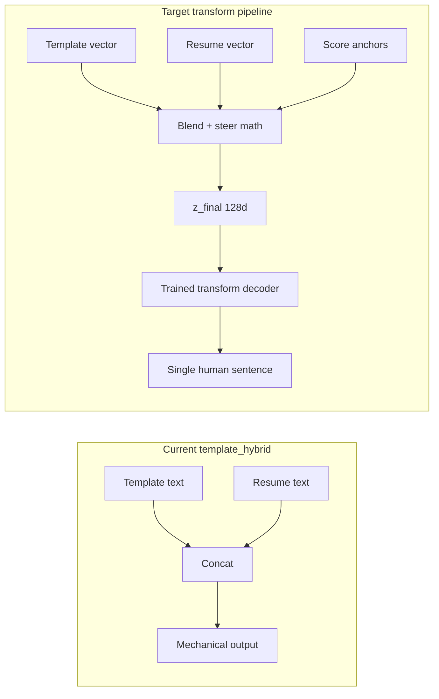
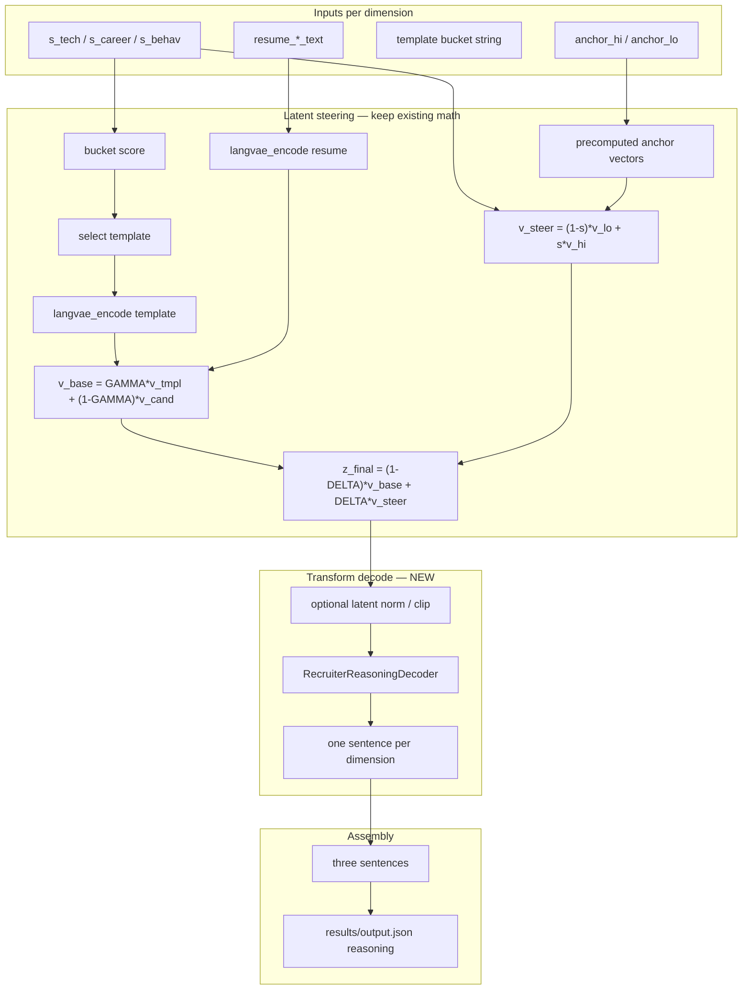

# Human Reasoning Pipeline — Design Plan

**Goal:** Transform bucket-selected templates + candidate signals into **one fluent reasoning passage per dimension** that reads as if a senior recruiter wrote it — not template text with resume values pasted on.

**Scope:** All work stays inside `vector_reasoning_test/`. No edits to `tracks/` or repo pipeline until this experiment validates.

**Status:** Design only. Supersedes `template_hybrid` as the target architecture. Current `compose.py` output is a **debug fallback**, not the end state.

---

## What is wrong today

| Approach | What it does | Why it fails your requirement |
|----------|--------------|-------------------------------|
| `template_hybrid` | `prompt + "Backed by…" + resume_text` | **Concatenation / slot fill**, not transformation |
| Raw LangVAE decode | `z_final → decode_sentences` | Vector math is fine; decoder is wrong domain + broken env → garbage |
| Original GPT-2 plan | Template as literal prefix + sample | Vector does not condition text; hallucinates |

You want: **the template’s meaning steers generation**, candidate facts and scores **shape** the wording, and the output is **one rewritten sentence** — not two chunks glued together.



---

## Design principle

**Templates are latent anchors, not copy-paste strings.**

1. A template string is encoded once → `v_tmpl` (reviewer tone + dimension semantics).
2. Candidate resume snippet → `v_cand` (specific evidence).
3. Score-driven anchors → `v_steer` (direction: strong fit vs concern).
4. **Blend + steer (unchanged math)** produces `z_final` — a single point in latent space that *already* mixes tone, evidence, and score direction.
5. A **transform decoder** maps `z_final` → **one** natural-language sentence. The literal template words never appear in output unless the model chooses to paraphrase them.

Steps 1–3E from [docs/vector_steering_plan_2_final.md](../docs/vector_steering_plan_2_final.md) remain the semantic core. **Only Step 4–5 change.**

---

## Target output (example)

**Inputs:** `s_tech=0.88`, Meesho/FAISS resume, high tech bucket.

**Bad (today):**
> Strong production-grade technical alignment… **Backed by concrete profile evidence: Built two-stage FAISS…**

**Good (target):**
> They’ve clearly operated at production scale—owning a two-stage FAISS catalog pipeline at Meesho that cut P99 latency from 340ms to 22ms—which lines up well with the retrieval-heavy scope of this role.

One sentence. Reviewer voice. Specifics woven in. No visible template skeleton.

---

## Pipeline architecture



Three dimensions run **in parallel** (same as today). Never merge tech/career/behav vectors.

---

## Transform decoder — three viable options (ranked)

### Option A — Recommended: Latent-conditioned small LM (train in-folder)

Train a lightweight decoder that **only** sees `z_final` (128d) and generates one sentence.

| Component | Choice | Rationale |
|-----------|--------|-----------|
| Encoder for vectors | LangVAE μ (128d) | Already in pipeline; same space as `z_final` |
| Decoder backbone | GPT-2-small or DistilGPT-2 | Fast to fine-tune locally; fits experiment folder |
| Conditioning | Prefix tuning or linear projection of `z_final` → soft prompt embeddings (8–32 tokens) prepended to GPT-2 | Standard latent-to-text; no literal template in context |
| Training target | Human-written gold sentences (see dataset below) | Teaches recruiter tone + natural weaving of facts |
| Loss | Causal LM on gold sentence tokens | Simple, reproducible |

**Why this meets “transform”:** The model never receives the template string at inference. It receives **only** the steered latent, which encodes template tone + resume + score direction. Generation is ab initio from that representation.

**Training pairs:**
```
(z_final_tech,   "They've operated at production scale—owning a two-stage FAISS…")
(z_final_career, "Career trajectory reads senior: promoted to Senior MLE in 18 months…")
(z_final_behav,  "Engagement is a concern—47 days since last login and an 18% response rate…")
```

Gold text is written **once** by a human (or high-quality LLM offline for bootstrap) from `(template bucket, resume, score)` — not copied from template.

### Option B — Seq2seq with latent cross-attention (higher quality, more work)

| Component | Choice |
|-----------|--------|
| Backbone | FLAN-T5-base or T5-small |
| Input | Project `z_final` to cross-attention memory (not token ids) |
| Output | Single sentence |

Better fluency and controllability; heavier deps and training loop.

### Option C — Retrieval + paraphrase (no training, weaker)

1. Pre-index 200+ human recruiter sentences with LangVAE embeddings.
2. At inference: nearest neighbor to `z_final` → retrieve exemplar → optional light paraphrase model.

**Pros:** Quick prototype. **Cons:** Not true transformation; limited novelty; paraphrase still needed for candidate-specific names.

**Recommendation:** Prototype C for week-1 sanity check; **ship A** for the real experiment.

---

## Gold dataset (required before training)

File: `vector_reasoning_test/data/gold_reasoning.jsonl`

Each row:
```json
{
  "dimension": "tech",
  "s": 0.88,
  "bucket": "high",
  "resume_text": "...",
  "template_id": "tech_high",
  "reasoning_gold": "They've clearly operated at production scale—owning a two-stage FAISS..."
}
```

**Minimum v1:** 30 rows (10 per dimension × 3 buckets) for hardcoded test case variations.  
**Target v2:** 150+ rows with paraphrased resumes and score sweeps.

**Gold writing rules:**
- One sentence per dimension (40–120 tokens).
- Reviewer voice (“they”, “profile suggests”, “concern here”).
- Must mention ≥1 concrete fact from resume when score ≥ 0.65 or ≤ 0.35.
- Must **not** start with the literal template opening phrase.
- Behav low scores must sound like concern, not neutral bullet.

Script to add: `vector_reasoning_test/build_gold_pairs.py` — computes `z_final` for each row and writes `(z_final.npy path, reasoning_gold)` for training.

---

## Training pipeline (Option A detail)

### Phase T1 — Environment

- Python 3.11 venv
- `requirements-train.txt`: torch, transformers, langvae, pythae, datasets, peft (optional LoRA)

### Phase T2 — Precompute training latents

```bash
python precompute.py                    # 15 anchor/template vectors
python build_gold_pairs.py              # z_final + gold text for each training row
```

Output: `vector_reasoning_test/training/latents/*.npy` + `training/manifest.jsonl`

### Phase T3 — Train RecruiterReasoningDecoder

New module: `vector_reasoning_test/train_decoder.py`

```
Input batch:  z_final (B, 128)
              → Linear(128, d_model * n_prefix_tokens)
              → reshape to (B, n_prefix, d_model) soft prompts
              → GPT-2 generates gold sentence tokens
Loss:         cross-entropy on gold tokens only (prefix masked)
Epochs:       10–30 on CPU/GPU
Checkpoint:   vector_reasoning_test/checkpoints/reasoning_decoder/
```

### Phase T4 — Inference

New module: `vector_reasoning_test/transform_decode.py`

```python
def transform_decode(z_final: np.ndarray, max_tokens: int = 80) -> str:
    """Single human sentence from steered latent. No template string input."""
```

Wire into `run_experiment.py` as `--decode transform` (replaces `template_hybrid` and raw `langvae`).

### Phase T5 — Step 5 assembly

```python
reasoning = (
    sent_tech.strip().rstrip(".") + ". "
    + sent_career.strip().rstrip(".") + ". "
    + sent_behav.strip().rstrip(".") + "."
)
```

**No** separate `prompts` field in final user-facing string. Optional debug fields in JSON only.

---

## Inference-only path (before training completes)

If gold data or training is not ready, use a **structured generation prompt** only for bootstrap evaluation — clearly labeled `--decode bootstrap_llm` and **not** the production path:

- Input to LLM: `{dimension, score, resume_snippet, anchor_direction}` + instruction: “Write one recruiter sentence; do not copy the template.”
- Still compute `z_final` in parallel for logging/correlation.

This is **not** latent transform; it validates gold data quality and evaluation rubric only.

---

## Evaluation rubric (human or LLM-as-judge)

Score each dimension 1–5:

| Criterion | 5 = pass |
|-----------|----------|
| **Fluency** | Reads as natural prose; no template skeleton |
| **Specificity** | Names at least one resume fact (FAISS, Meesho, 18 months, etc.) |
| **Direction** | Tone matches score (tech 0.88 positive; behav 0.19 concern) |
| **Independence** | Three sentences cover three distinct aspects |
| **Non-copy** | Does not contain >8 consecutive words from template or raw resume |

Automate in `vector_reasoning_test/eval_reasoning.py` with regex + optional sentence-transformer similarity to template (similarity should be **moderate**, not near-duplicate).

**Pass bar for v1:** average ≥ 4.0 on fluency + non-copy; ≥ 3.5 on specificity.

---

## File layout (planned)

```
vector_reasoning_test/
├── HUMAN_REASONING_PIPELINE_PLAN.md   ← this document
├── data/
│   └── gold_reasoning.jsonl           ← human target sentences
├── training/
│   ├── latents/                       ← z_final per gold row
│   ├── manifest.jsonl
│   └── train_decoder.py
├── checkpoints/
│   └── reasoning_decoder/             ← trained transform decoder
├── transform_decode.py                ← inference: z_final → sentence
├── build_gold_pairs.py                ← gold + z_final builder
├── eval_reasoning.py                  ← rubric automation
├── encode.py                          ← langvae_encode (unchanged)
├── precompute.py                      ← unchanged
├── run_experiment.py                  ← add --decode transform
└── compose.py                         ← deprecate; keep as --decode template_hybrid fallback
```

---

## Execution phases

| Phase | Deliverable | Depends on |
|-------|-------------|------------|
| **H0** | `gold_reasoning.jsonl` with ≥30 human sentences | Manual or one-time LLM assist for gold only |
| **H1** | `build_gold_pairs.py` + training latents | H0, existing precompute |
| **H2** | `train_decoder.py` + checkpoint | H1, Python 3.11 |
| **H3** | `transform_decode.py` + `--decode transform` | H2 |
| **H4** | `eval_reasoning.py` + pass bar on hardcoded test case | H3 |
| **H5** | Wire real stage-5 scores + batch candidates (optional) | Main pipeline artifacts |

**Do not** invest further in raw LangVAE `decode_sentences` for recruiter text until domain adapter (Option A) is trained. EntailmentBank pretraining is the wrong prior.

---

## What we keep vs replace

| Keep | Replace |
|------|---------|
| GAMMA, DELTA, bucket(), anchor pairs | `compose.py` slot filling |
| LangVAE μ encoding + 128d vector math | Raw LangVAE GPT-2 decode |
| Three independent dimensions | `prompts` + `clauses` concatenation in final reasoning |
| `constants.py` templates as **encoding inputs only** | Publishing template literal text in output |

---

## Success definition

For the hardcoded test case (`s_tech=0.88`, `s_career=0.81`, `s_behav=0.19`), `reasoning` in `output.json` should read like a single recruiter note, e.g.:

> Strong technical fit: they've shipped a two-stage FAISS pipeline at Meesho with a 340ms→22ms P99 improvement, which maps directly to our retrieval stack. Seniority checks out—promoted to Senior MLE in 18 months and led four engineers on ML infra. The main flag is engagement: 47 days since last login and a low response rate, so outreach may be slow despite the strong profile.

Three sentences. No pasted template headers. No “Backed by concrete profile evidence:”. Human cadence.

---

## Immediate next step

1. Author `data/gold_reasoning.jsonl` (start with the one hardcoded candidate + 2–3 score variants per dimension).
2. Implement `build_gold_pairs.py` and `train_decoder.py` per Option A.
3. Set `--decode transform` as default once eval passes.

Until H3 ships, run with `--decode template_hybrid` only for plumbing tests — not as the product output.
